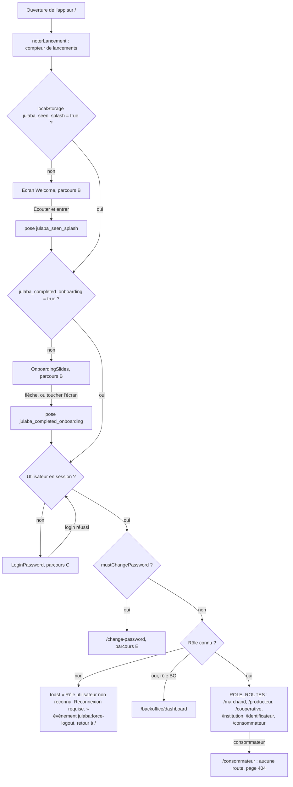
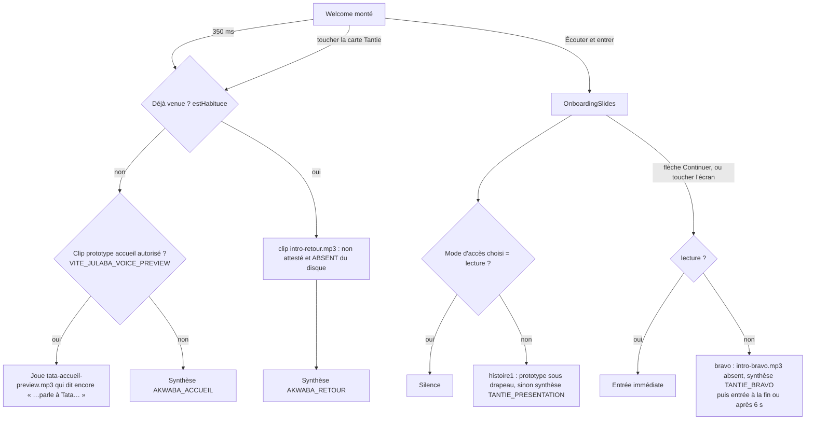
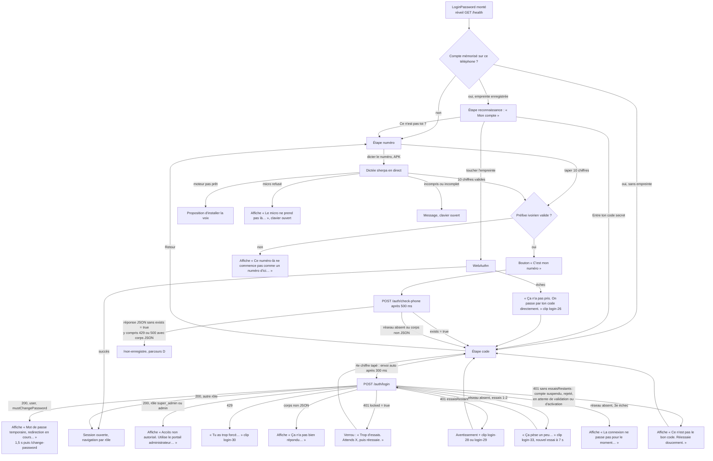
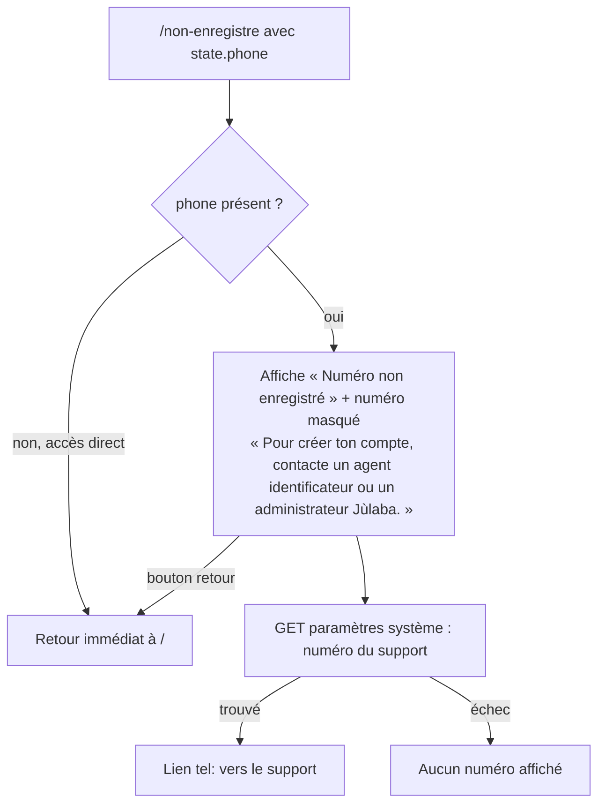
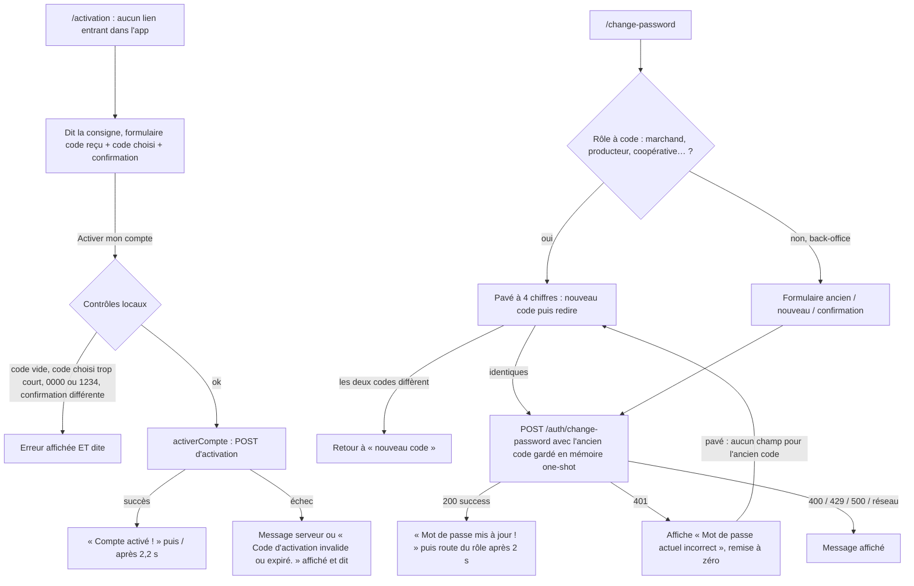
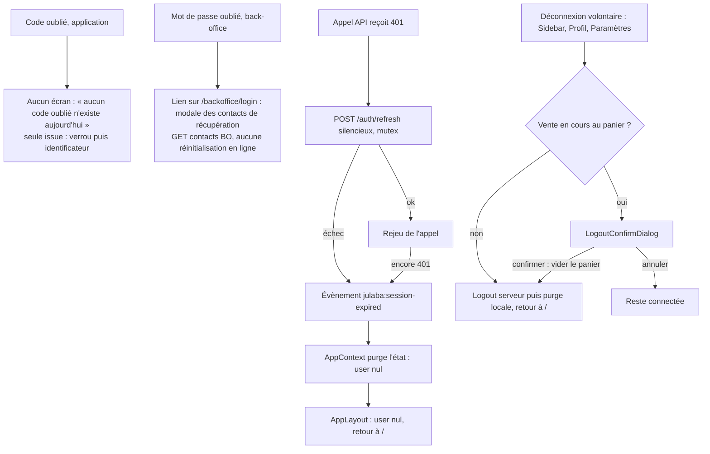
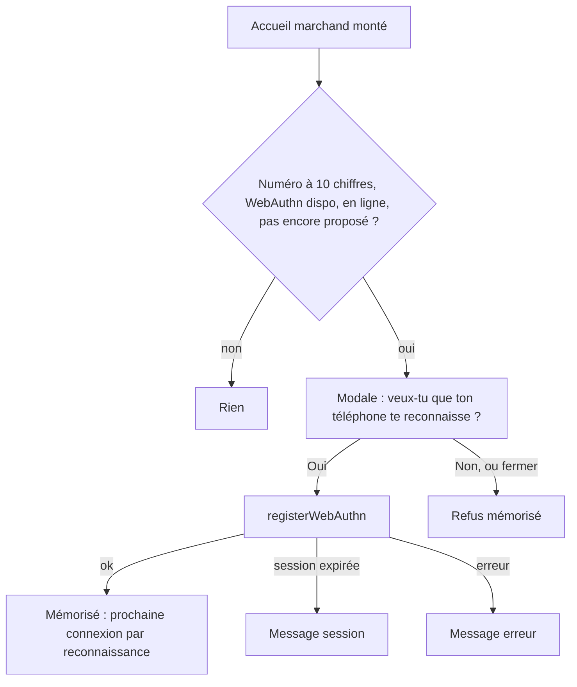

# 00 — Entrée, authentification, verrou, activation, déconnexion

> Code de `main@9fb4655`. Chemins relatifs à `frontend_src/src/app/` sauf mention. Canaux voix P1…P6 : voir [`07-voix-transverse.md`](07-voix-transverse.md) §1. Rappel décisif pour tout ce fichier : **avant connexion, `AppContext.speak` (P1) est muet** (`contexts/AppContext.tsx:729-730`, rôle nul) ; seules parlent les portes P4 (`services/paroleEntree.ts`, `services/entreeVoix.ts`) et P5 (`speakClipOrText` direct).

## Écrans couverts

| Route | Composant | Source |
|---|---|---|
| `/` | `EntryGate` → `Welcome` / `OnboardingSlides` / `LoginPassword` / écran « Chargement… » | `routes.tsx:39`, `components/auth/EntryGate.tsx` |
| `/welcome`, `/login` | redirection vers `/` | `routes.tsx:53-54` |
| `/non-enregistre` | `UnregisteredPhone` | `routes.tsx:40`, `components/auth/UnregisteredPhone.tsx` |
| `/change-password` | `ChangePasswordScreen` | `routes.tsx:55` |
| `/activation` | `ActivationScreen` | `routes.tsx:56` |
| `/backoffice/login` | `BOLogin` (voir [`06-backoffice.md`](06-backoffice.md)) | `routes.tsx:188` |
| `*` | `pages/NotFound` | `routes.tsx:230` |

## Parcours A — Porte d'entrée unique (`EntryGate`)

Sources : `EntryGate.tsx:39-55` (drapeaux), `:79` (`noterLancement`), `:82-110` (redirections), `:117-148` (rendu) ; `types/constants.ts:75-88` (`ROLE_ROUTES`, dont `consommateur → /consommateur`), `:93-114` (`BO_ROLES`, `isKnownRole`) ; aucune route `/consommateur` dans `routes.tsx`.

## Parcours B — Accueil « Akwaba » et présentation de Tantie

Sources : `components/auth/Welcome.tsx:24-45` (accueil, `commencer`), `services/entreeVoixAvantConnexion.ts` (`direEntreeAvantConnexion`), `services/onboardingVoix.ts:28-91` (`INTRO_CLIPS`), `components/auth/OnboardingSlides.tsx:13-17,33-60` ; manifeste prototype `frontend_src/public/voix/fr-CI/prototype/manifest.json` (champ `reenregistrementRequis`).

**Voix — parcours B**

| Étape | Déclencheur | Phrase EXACTE dite | Texte affiché au même moment | Condition |
|---|---|---|---|---|
| Akwaba (1re fois) | montage + 350 ms, ou toucher la carte | clé `AKWABA_ACCUEIL` : « Akwaba. Pour vendre, touche un produit, ou parle à Tantie Nanti Lou. On est ensemble. » (`i18n/voice/catalog.ts:172`) | « Ton commerce, dans ta main. » / « Vends. Compte. Avance. » / « Akwaba, je suis Tantie Nanti Lou. Touche ici pour écouter ma voix. » (`Welcome.tsx`) | synthèse (drapeau éteint) ; **drapeau allumé** : clip prototype qui dit « …ou parle à Tata… » (`manifest.json`, `texteExact` ≠ `texteCible`) |
| Akwaba (retour) | idem, `estHabituee()` | `AKWABA_RETOUR` : « Re-bonjour ! On y va. » (`catalog.ts:173`) | idem | synthèse (clip `intro-retour.mp3` inexistant) |
| Présentation | montage onboarding, ou haut-parleur | `TANTIE_PRESENTATION` : « Je serai avec toi chaque jour dans ton commerce. Tu peux toucher l'écran. Tu peux aussi écouter. On est ensemble. » (`catalog.ts:209`) | « Moi, c'est Tantie Nanti Lou. » / « Tu peux toucher, parler et écouter. Je reste avec toi. » (`OnboardingSlides.tsx`) | sauf mode `lecture` ; clip prototype sous drapeau |
| Fin d'onboarding | flèche ou toucher | `TANTIE_BRAVO` : « Bravo ! Nous sommes prêtes. Ouvrons ta boutique. » (`catalog.ts:210`) | — | sauf mode `lecture` |

## Parcours C — Connexion (numéro, code, empreinte, verrou)

Sources (`components/auth/LoginPassword.tsx`) : étape initiale `:204` ; réveil `/health` `:430-438` ; saisie clavier `:979-1010` (préfixe `:992`, envoi auto du code `:1006`) ; bouton « C'est mon numéro » `:1366-1368` ; `check-phone` `:440-517` (pas de test de `res.ok`, `:471-501`) ; dictée `:545-623` ; empreinte `:689-720` ; `handleLogin` `:735-944` (429 `:784-786`, verrou `:793-812`, essais `:817-836`, `mustChangePassword` `:860-879`, refus BO `:858,882-886`, réseau `:925-937`). Back-end : `backend/src/auth/auth.service.ts:255-295` (verrou, `essaisRestants`, statuts de compte), `backend/src/auth/verrou-pin.ts` (paliers : 3 échecs → 5 min, 6 → 15 min, 9 et plus → 1 h ; notification des identificateurs au palier d'une heure, `auth.service.ts:271`).

**Voix — parcours C** (porte P4 : `parle()` = clip seul, sinon silence ; `direConsigne()` = clip autorisé sinon synthèse de la clé)

| Étape | Déclencheur | Phrase EXACTE dite | Clip / clé | Texte affiché si différent | Condition |
|---|---|---|---|---|---|
| Consigne numéro | arrivée sur l'étape, ou « Écouter Tantie » | « Dis ton numéro, ou tape les chiffres un par un. Les ronds en haut vont se remplir. » (dictée dispo) / « Tape les chiffres de ton numéro, un par un. Les ronds en haut vont se remplir. » | `ENTREE_NUMERO_VOIX` / `ENTREE_NUMERO` ; clip prototype sous drapeau sinon synthèse (`LoginPassword.tsx:76-85,637-641`) | titre « Ton numéro » | guidage vocal actif (mode effectif ≠ lecture, `:210`) |
| Consigne code | arrivée sur l'étape code | « Entre ton code secret à quatre chiffres. » | `ENTREE_CODE` (`:374-386`) | « Ton code secret » | idem |
| Consigne reconnaissance | arrivée, compte avec empreinte | « Touche le grand bouton. Ton téléphone va te reconnaître. » | `ENTREE_RECONNAISSANCE` (`:396-406`) | « Mon compte » | idem |
| Numéro invalide (dictée) | 10 chiffres, préfixe faux | « Regarde bien, y'a un chiffre qui n'est pas bon dedans. Si tu veux, tape ton numéro directement ici. » | clip `login-12-14.mp3` (`:526`) | identique | — |
| Numéro invalide (clavier) | 10 chiffres tapés, préfixe faux | **rien** (aucun clip pour ce texte) | — | « Ce numéro-là ne commence pas comme un numéro d'ici. Regarde bien le début. » (`:992`) | écart : même faute, deux textes, un seul est dit |
| Dictée incomprise | dictée finie sans numéro | « Je n'ai pas compris. Tape ton numéro, ou réessaie. » | clip `ui-058.mp3` (`:610,623`) | « Je n'ai pas compris. Touche le micro pour redire, ou tape 👇 » (`:609`) | APK |
| Dictée incomplète | moins de 10 chiffres | « Il manque encore des chiffres dedans. Continue. » | clip `login-11.mp3` (`:604`) | idem | — |
| Micro refusé | permission refusée | « Problème avec le micro — réessaie » | clip `ui-100.mp3` (`:622`) | « Le micro ne prend pas là. Faut taper ton numéro ici. » | dit ≠ affiché |
| Moteur pas prêt | dictée demandée | **rien** : « Pour que je puisse t'écouter, je vérifie ma voix. Touche le bouton, ou tape ton numéro. » n'a pas de clip (`:617`) | — | carte d'installation | silence S7 |
| Micro prêt | après installation | « C'est bon maintenant. Appuie sur le micro et puis parle. » | clip `login-17.mp3` (`:1330`) | — | — |
| Effacer | touche effacer | « C'est effacé net. » | clip `login-24.mp3` (`:1032`) | — | guidage |
| Pavé en images | bascule | « Voilà les photos qui sont sorties à la place des chiffres. Ton code n'a pas changé. » / « Voilà les chiffres maintenant. Mets ton code comme d'habitude. » | clips `login-21` / `login-22` (`:243-245`) | — | guidage |
| Proposition d'adaptation | montage, mode auto + préférence franche | `suggestion.texte` (ex. « J'ai remarqué que tu préfères me parler. Veux-tu que Julaba s'adapte ? », `utils/accessMode.ts:100`) → **rien** (pas de clip) | — | même texte | silence S7 |
| Réponse à la proposition | Oui / Non | « D'accord, c'est calé comme ça. » / « D'accord, on continue comme d'habitude. » | clips `login-35` / `login-36` (`:418,421`) | — | — |
| Empreinte échouée | WebAuthn refusé | « Ça n'a pas pris. On passe par ton code directement. » | clip `login-26.mp3` (`:714,718` via `:370`) | identique | — |
| Code vide | envoi sans code | « Bon, mets les quatre chiffres de ton code secret. » | clip `login-19.mp3` (`:739`) | identique | — |
| Mauvais code, 2 essais restants | 401 `essaisRestants=2` | « Le numéro ou le code n'est pas bon, deh. Regarde bien avant de reprendre. » | clip `login-28.mp3` (`:831-835`) | « Ce n'est pas le bon code. Attention : encore 2 essais, après il faudra attendre. » (`:818-820`) | dit ≠ affiché |
| Mauvais code, dernier essai | 401 `essaisRestants=1` | « Attention, hein ! Il te reste une seule chance. Prends bien ton temps. » | clip `login-29.mp3` | « …encore 1 essai, après il faudra attendre. » | dit ≠ affiché |
| Verrou 5 min | 401 `locked`, 5 min | « Trop de tentatives incorrectes. Réessaie dans 5 minutes. » | clip `ui-125.mp3` (`:811`) | « Trop d'essais. Attends 5 minutes, puis réessaie. » | dit ≠ affiché |
| Verrou 15 min / 1 h | 401 `locked` | « Tu as trop forcé. Patiente un peu d'abord avant de réessayer. » | clip `login-30.mp3` (`:811`) | « Trop d'essais. Attends 15 minutes / 1 heure, puis réessaie. » | **la durée n'est pas dite** |
| Trop de requêtes | HTTP 429 | « Tu as trop forcé. Patiente un peu d'abord avant de réessayer. » | `login-30.mp3` (`:785`) | identique | — |
| Compte suspendu / rejeté / non activé / en attente | 401 sans `essaisRestants` | « Ce n'est pas le bon code. Réessaie doucement. » si drapeau ; **rien** sinon (clip prototype) | `ENTREE_VOICE_CLIPS.codeErreur` (`:820,834`) | « Ce n'est pas le bon code. Réessaie doucement. » | **message faux** : le serveur dit « Compte suspendu », « Compte pas encore activé… » (`auth.service.ts:292-295`), ignoré |
| Réponse illisible | JSON invalide | **rien** | — | « Ça n'a pas bien répondu. Attends un petit moment, puis reprends. » (`:777`) | silence S7 |
| Réseau lent | `TypeError`, essais 1-2 | « Ça pèse un peu. Patiente, je suis en train de relancer. » | clip `login-33.mp3` (`:932`) | identique | — |
| Réseau absent | 3e échec | « La connexion ne passe pas pour le moment. Attends un peu, puis réessaie. » si drapeau ; **rien** sinon | prototype `tata-entree-connexion.mp3` (`:936`) | identique | — |
| Mot de passe temporaire | `mustChangePassword` | **rien** | — | « Mot de passe temporaire, redirection en cours... » (`:861`) | silence S7 |
| Admin sur l'app | rôle `super_admin`/`admin` | **rien** | — | « Accès non autorisé. Utilise le portail administrateur sur julaba.online/backoffice/login » (`:884`) | — |
| Version | toucher la version (mode dev) | **rien** (pas de clip) | — | « Version … » | `:1516` |

## Parcours D — Numéro non enregistré

Sources : `components/auth/UnregisteredPhone.tsx:26-55` (garde, `getSystemSettings`), rendu `:57-126`.

**Voix — parcours D** : **aucune** (zéro appel vocal dans `UnregisteredPhone.tsx`). Écran d'erreur d'entrée, avant connexion, entièrement écrit.

## Parcours E — Activation du compte et changement de code

Sources : `components/auth/ActivationScreen.tsx:11-16` (P5), `:31-50` (voix), `:51-66` (contrôles, `activerCompte`) ; aucun `navigate('/activation')` ni lien dans le code (recherche `'/activation'` : seulement `routes.tsx:56`) ; `components/auth/ChangePasswordScreen.tsx:51-52` (ancien code one-shot `lireCodeActuel`), `:76-84` (`direSuite`), `:110-178` (envoi et codes HTTP), `:200-227` (pavé), `:229-232` (consigne), `:265` (écran pavé sans champ « ancien code ») ; rechargement forcé vers `/change-password` à la restauration de session : `contexts/AppContext.tsx:592-602`.

**Voix — parcours E**

| Étape | Déclencheur | Phrase EXACTE dite | Clip | Texte affiché si différent | Condition |
|---|---|---|---|---|---|
| Activation, consigne | montage, ou premier geste (`useAudioUnlockFallback`) | « Tape le code que tu as reçu, puis choisis ton code secret à quatre chiffres. Personne d'autre ne doit le connaître. » (`ActivationScreen.tsx:32`) | aucun → synthèse (P5) | « Saisis le code d'activation, puis choisis TON code secret. Personne d'autre ne doit le connaître. » | `guidageVocal()` |
| Activation, erreur | contrôle ou serveur | le texte de l'erreur, ex. « Saisis le code d'activation. », « Ton code doit avoir au moins 4 chiffres. », « Ce code est trop simple. Choisis-en un autre. », « Les deux codes ne sont pas pareils. », « Code d'activation invalide ou expiré. » (`:40-44,53-56,63`) | aucun | identique | guidage |
| Activation réussie | succès | « Compte activé ! Tu peux maintenant te connecter avec ton code. » (`:46-49`) | aucun | écran de succès | guidage |
| Nouveau code, consigne | montage (rôle à code) | « Entre ton code secret à 4 chiffres » puis « Choisis ton nouveau code, celui que tu utiliseras tous les jours. » (`ChangePasswordScreen.tsx:229-232`) | `ui-035.mp3` puis synthèse | « Ton nouveau code » / « Quatre chiffres, ceux que tu utiliseras tous les jours. » | guidage |
| Redire le code | 4 chiffres tapés | « Entre ton code secret à 4 chiffres » puis « Redis le même code, pour être sûre. » (`:215`) | `ui-035.mp3` puis synthèse | « Redis ton code » / « Une deuxième fois, pour être sûre. » | guidage |
| Codes différents | confirmation ≠ | « Erreur, réessaie » puis « Les deux codes ne sont pas les mêmes. Choisis à nouveau ton code. » (`:222`) | `ui-048.mp3` puis synthèse | « Les deux codes sont différents. Recommence 👇 » | guidage |
| Erreur serveur (401, 400, 429, 500, réseau) | réponse | **rien** | — | « Mot de passe actuel incorrect » / message serveur / « Trop de tentatives… » / « Ça n'a pas marché… » / « Erreur de connexion » (`:136-178`) | aucun appel vocal sur `error` dans cet écran |
| Succès | 200 | **rien** | — | « Mot de passe mis à jour ! » « Redirection en cours... » | — |

## Parcours F — Mot de passe oublié, session expirée, déconnexion

Sources : `ChangePasswordScreen.tsx:200-203` (commentaire « aucun « code oublié » n'existe ») ; `components/backoffice/BOLogin.tsx:135-140,394-397,554` (modale « Mot de passe oublié ? ») ; `services/api/api-client.ts:157-189` (401, refresh, `julaba:session-expired`) ; `contexts/AppContext.tsx:653-666` (purge) ; `components/layout/AppLayout.tsx:47-51` (retour à `/`) ; `hooks/useVoluntaryLogout.ts` (confirmation panier) ; appelants `components/layout/Sidebar.tsx:32`, `components/shared/UniversalProfil.tsx:508`, `components/shared/UniversalParametres.tsx:503` ; purge `AppContext.tsx:684-704`.

**Voix — parcours F** : **aucune** phrase dite sur l'expiration de session ni sur la déconnexion (le clip `ui-032.mp3` « Déconnexion en cours » et `ui-137.mp3` « À bientôt sur Jùlaba » existent mais ne sont référencés par aucun chemin, voir [`annexe-clips.md`](annexe-clips.md)).

## Parcours G — Proposition de reconnaissance biométrique (après connexion, accueil marchand)

Sources : `components/auth/PropositionReconnaissance.tsx` (conditions `:60-70`, voix `:75,90,96,116,183`), `services/accueilMarchandVoix.ts` (clips `reconnaissance*`, tous `prototype: true`).

**Voix — parcours G** : les cinq phrases (« Veux-tu que ton téléphone te reconnaisse la prochaine fois ? Ce sera plus rapide. », « C'est fait. La prochaine fois, ton téléphone te reconnaîtra. », « Ta session est terminée. Reconnecte-toi, puis on réessaiera. », « Ça n'a pas marché ici. Tu pourras réessayer plus tard dans les réglages. », « D'accord. On ne change rien. ») ne sont dites **que** si `VITE_JULABA_VOICE_PREVIEW=true` : `direAccueilMarchand` rend `doitDireLeTexte: true` sans clip, et `PropositionReconnaissance` ignore ce retour (`void direAccueilMarchand(...)`). Build livré : modale muette.

## Annexe — Tous les appels vocaux du périmètre « entrée » (extraction mécanique)

Canal : voir [`07-voix-transverse.md`](07-voix-transverse.md) §1. Le texte affiché à l'écran pour ces écrans est dans les tableaux ci-dessus.

#### `components/auth/ActivationScreen.tsx` — 5 appel(s) vocal(aux)

| Source | Appel | Phrase dite (texte exact / clé catalogue fr-ci) | Clip Tata au texte identique | Canal et condition |
|---|---|---|---|---|
| `frontend_src/src/app/components/auth/ActivationScreen.tsx:18` | `speakClipOrText` | *(expression)* `{ clipUrl: clip ?? undefined, text: texte }` | — | speakClipOrText : clip ui-* si texte exact, sinon synthèse ; pas de garde de rôle |
| `frontend_src/src/app/components/auth/ActivationScreen.tsx:52` | `parle` | « Tape le code que tu as reçu, puis choisis ton code secret à quatre chiffres. Personne d'autre ne doit le connaître. » | — | speakClipOrText : clip ui-* si texte exact, sinon synthèse ; pas de garde de rôle |
| `frontend_src/src/app/components/auth/ActivationScreen.tsx:57` | `direConsigne` | *(expression)* `` | — | AppContext.speak : dit SEULEMENT si rôle = marchand et non muet ; synthèse (jamais le clip ui-*) |
| `frontend_src/src/app/components/auth/ActivationScreen.tsx:66` | `parle` | *(expression)* `error` | — | speakClipOrText : clip ui-* si texte exact, sinon synthèse ; pas de garde de rôle |
| `frontend_src/src/app/components/auth/ActivationScreen.tsx:72` | `parle` | « Compte activé ! Tu peux maintenant te connecter avec ton code. » | — | speakClipOrText : clip ui-* si texte exact, sinon synthèse ; pas de garde de rôle |

#### `components/auth/ChangePasswordScreen.tsx` — 4 appel(s) vocal(aux)

| Source | Appel | Phrase dite (texte exact / clé catalogue fr-ci) | Clip Tata au texte identique | Canal et condition |
|---|---|---|---|---|
| `frontend_src/src/app/components/auth/ChangePasswordScreen.tsx:101` | `speakClipOrText` | *(expression)* `{ clipUrl: clip ?? undefined, text: texte }` | — | speakClipOrText : clip ui-* si texte exact, sinon synthèse ; pas de garde de rôle |
| `frontend_src/src/app/components/auth/ChangePasswordScreen.tsx:215` | `direSuite` | « Entre ton code secret à 4 chiffres » | `ui-035.mp3` | speakClipOrText : clip ui-* si texte exact, sinon synthèse ; pas de garde de rôle |
| `frontend_src/src/app/components/auth/ChangePasswordScreen.tsx:222` | `direSuite` | « Erreur, réessaie » | `ui-048.mp3` | speakClipOrText : clip ui-* si texte exact, sinon synthèse ; pas de garde de rôle |
| `frontend_src/src/app/components/auth/ChangePasswordScreen.tsx:235` | `direSuite` | « Entre ton code secret à 4 chiffres » | `ui-035.mp3` | speakClipOrText : clip ui-* si texte exact, sinon synthèse ; pas de garde de rôle |

#### `components/auth/LoginPassword.tsx` — 24 appel(s) vocal(aux)

| Source | Appel | Phrase dite (texte exact / clé catalogue fr-ci) | Clip Tata au texte identique | Canal et condition |
|---|---|---|---|---|
| `frontend_src/src/app/components/auth/LoginPassword.tsx:78` | `direEntree` | *(expression)* `key` | — | avant connexion : clip si autorisé, sinon synthèse (paroleEntree.ts) |
| `frontend_src/src/app/components/auth/LoginPassword.tsx:83` | `parlerAvantConnexion` | « connexion » | — | avant connexion : clip si autorisé, sinon synthèse (paroleEntree.ts) |
| `frontend_src/src/app/components/auth/LoginPassword.tsx:243` | `parle` | *(expression)* `next ? 'Voilà les photos qui sont sorties à la place des chiffres. Ton code n\'a pas changé.' : 'Voilà les chiffres maintenant. Mets ton cod` | — | parle()/direEntreeTexte : CLIP SEUL (index ENTREE_VOICE_CLIPS) ; sans clip exact → SILENCE |
| `frontend_src/src/app/components/auth/LoginPassword.tsx:278` | `direConsigne` | *(expression)* `key` | — | direConsigne : clip ENTREE si autorisé (lot A / attesté / prototype+drapeau), sinon synthèse de la clé catalogue |
| `frontend_src/src/app/components/auth/LoginPassword.tsx:301` | `parlerAvantConnexion` | « connexion » | — | avant connexion : clip si autorisé, sinon synthèse (paroleEntree.ts) |
| `frontend_src/src/app/components/auth/LoginPassword.tsx:310` | `direEntreeTexte` | *(expression)* `texte` | — | avant connexion : clip si autorisé, sinon synthèse (paroleEntree.ts) |
| `frontend_src/src/app/components/auth/LoginPassword.tsx:370` | `parle` | *(expression)* `error` | — | parle()/direEntreeTexte : CLIP SEUL (index ENTREE_VOICE_CLIPS) ; sans clip exact → SILENCE |
| `frontend_src/src/app/components/auth/LoginPassword.tsx:377` | `direConsigne` | « code » | — | direConsigne : clip ENTREE si autorisé (lot A / attesté / prototype+drapeau), sinon synthèse de la clé catalogue |
| `frontend_src/src/app/components/auth/LoginPassword.tsx:398` | `direConsigne` | *(expression)* `compteConnu.biometrie ? 'reconnaissance' : 'code'` | — | direConsigne : clip ENTREE si autorisé (lot A / attesté / prototype+drapeau), sinon synthèse de la clé catalogue |
| `frontend_src/src/app/components/auth/LoginPassword.tsx:410` | `parle` | *(expression)* `suggestion.texte` | — | parle()/direEntreeTexte : CLIP SEUL (index ENTREE_VOICE_CLIPS) ; sans clip exact → SILENCE |
| `frontend_src/src/app/components/auth/LoginPassword.tsx:418` | `parle` | « D'accord, c'est calé comme ça. » | `login-35.mp3` | parle()/direEntreeTexte : CLIP SEUL (index ENTREE_VOICE_CLIPS) ; sans clip exact → SILENCE |
| `frontend_src/src/app/components/auth/LoginPassword.tsx:421` | `parle` | « D'accord, on continue comme d'habitude. » | `login-36.mp3` | parle()/direEntreeTexte : CLIP SEUL (index ENTREE_VOICE_CLIPS) ; sans clip exact → SILENCE |
| `frontend_src/src/app/components/auth/LoginPassword.tsx:604` | `parleSuite` | *(expression)* `num.length >= 10 ? "Je n'ai pas compris. Tape ton numéro, ou réessaie." : 'Il manque encore des chiffres dedans. Continue.'` | — | parle()/direEntreeTexte : CLIP SEUL (index ENTREE_VOICE_CLIPS) ; sans clip exact → SILENCE |
| `frontend_src/src/app/components/auth/LoginPassword.tsx:610` | `parleSuite` | « Je n'ai pas compris. Tape ton numéro, ou réessaie. » | `ui-058.mp3` | parle()/direEntreeTexte : CLIP SEUL (index ENTREE_VOICE_CLIPS) ; sans clip exact → SILENCE |
| `frontend_src/src/app/components/auth/LoginPassword.tsx:617` | `parle` | « Pour que je puisse t'écouter, je vérifie ma voix. Touche le bouton, ou tape ton numéro. » | — | parle()/direEntreeTexte : CLIP SEUL (index ENTREE_VOICE_CLIPS) ; sans clip exact → SILENCE |
| `frontend_src/src/app/components/auth/LoginPassword.tsx:622` | `parleSuite` | « Problème avec le micro — réessaie » | `ui-100.mp3` | parle()/direEntreeTexte : CLIP SEUL (index ENTREE_VOICE_CLIPS) ; sans clip exact → SILENCE |
| `frontend_src/src/app/components/auth/LoginPassword.tsx:623` | `parleSuite` | « Je n'ai pas compris. Tape ton numéro, ou réessaie. » | `ui-058.mp3` | parle()/direEntreeTexte : CLIP SEUL (index ENTREE_VOICE_CLIPS) ; sans clip exact → SILENCE |
| `frontend_src/src/app/components/auth/LoginPassword.tsx:640` | `direConsigne` | *(expression)* `voixEcouteDispo ? 'numeroVoix' : 'numero'` | — | direConsigne : clip ENTREE si autorisé (lot A / attesté / prototype+drapeau), sinon synthèse de la clé catalogue |
| `frontend_src/src/app/components/auth/LoginPassword.tsx:811` | `parle` | *(expression)* `minutes === 5 ? ENTREE_VOICE_CLIPS.verrouCinqMinutes.texte : ENTREE_VOICE_CLIPS.tropDEssais.texte` | — | parle()/direEntreeTexte : CLIP SEUL (index ENTREE_VOICE_CLIPS) ; sans clip exact → SILENCE |
| `frontend_src/src/app/components/auth/LoginPassword.tsx:831` | `parle` | *(expression)* `restants === 1 ? ENTREE_VOICE_CLIPS.dernierEssai.texte : restants === 2 ? ENTREE_VOICE_CLIPS.mauvaisCodeAttention.texte : ENTREE_VOICE_CLIPS` | — | parle()/direEntreeTexte : CLIP SEUL (index ENTREE_VOICE_CLIPS) ; sans clip exact → SILENCE |
| `frontend_src/src/app/components/auth/LoginPassword.tsx:1032` | `parle` | « C'est effacé net. » | `login-24.mp3` | parle()/direEntreeTexte : CLIP SEUL (index ENTREE_VOICE_CLIPS) ; sans clip exact → SILENCE |
| `frontend_src/src/app/components/auth/LoginPassword.tsx:1330` | `parle` | « C'est bon maintenant. Appuie sur le micro et puis parle. » | `login-17.mp3` | parle()/direEntreeTexte : CLIP SEUL (index ENTREE_VOICE_CLIPS) ; sans clip exact → SILENCE |
| `frontend_src/src/app/components/auth/LoginPassword.tsx:1417` | `direConsigne` | « code » | — | direConsigne : clip ENTREE si autorisé (lot A / attesté / prototype+drapeau), sinon synthèse de la clé catalogue |
| `frontend_src/src/app/components/auth/LoginPassword.tsx:1516` | `parle` | « Version ${__APP_VERSION__}, ${__BUILD_ID__} » *(gabarit)* | — | parle()/direEntreeTexte : CLIP SEUL (index ENTREE_VOICE_CLIPS) ; sans clip exact → SILENCE |

#### `components/auth/OnboardingSlides.tsx` — 5 appel(s) vocal(aux)

| Source | Appel | Phrase dite (texte exact / clé catalogue fr-ci) | Clip Tata au texte identique | Canal et condition |
|---|---|---|---|---|
| `frontend_src/src/app/components/auth/OnboardingSlides.tsx:58` | `direEntreeAvantConnexion` | *(expression)* `cle` | — | avant connexion : clip si autorisé, sinon synthèse (paroleEntree.ts) |
| `frontend_src/src/app/components/auth/OnboardingSlides.tsx:60` | `parlerAvantConnexion` | « onboarding » | — | avant connexion : clip si autorisé, sinon synthèse (paroleEntree.ts) |
| `frontend_src/src/app/components/auth/OnboardingSlides.tsx:91` | `direOuLire` | « histoire1 » | — | avant connexion : clip si autorisé, sinon synthèse (paroleEntree.ts) |
| `frontend_src/src/app/components/auth/OnboardingSlides.tsx:112` | `direOuLire` | « histoire1 » | — | avant connexion : clip si autorisé, sinon synthèse (paroleEntree.ts) |
| `frontend_src/src/app/components/auth/OnboardingSlides.tsx:125` | `direOuLire` | « bravo » | — | avant connexion : clip si autorisé, sinon synthèse (paroleEntree.ts) |

#### `components/auth/PropositionReconnaissance.tsx` — 7 appel(s) vocal(aux)

| Source | Appel | Phrase dite (texte exact / clé catalogue fr-ci) | Clip Tata au texte identique | Canal et condition |
|---|---|---|---|---|
| `frontend_src/src/app/components/auth/PropositionReconnaissance.tsx:75` | `direAccueilMarchand` | « reconnaissanceProposition » | — | clip prototype (drapeau VITE_JULABA_VOICE_PREVIEW) sinon clé catalogue |
| `frontend_src/src/app/components/auth/PropositionReconnaissance.tsx:90` | `direAccueilMarchand` | « reconnaissanceReussie » | — | clip prototype (drapeau VITE_JULABA_VOICE_PREVIEW) sinon clé catalogue |
| `frontend_src/src/app/components/auth/PropositionReconnaissance.tsx:96` | `direAccueilMarchand` | « reconnaissanceSession » | — | clip prototype (drapeau VITE_JULABA_VOICE_PREVIEW) sinon clé catalogue |
| `frontend_src/src/app/components/auth/PropositionReconnaissance.tsx:101` | `direAccueilMarchand` | « reconnaissanceErreur » | — | clip prototype (drapeau VITE_JULABA_VOICE_PREVIEW) sinon clé catalogue |
| `frontend_src/src/app/components/auth/PropositionReconnaissance.tsx:105` | `direAccueilMarchand` | « reconnaissanceErreur » | — | clip prototype (drapeau VITE_JULABA_VOICE_PREVIEW) sinon clé catalogue |
| `frontend_src/src/app/components/auth/PropositionReconnaissance.tsx:116` | `direAccueilMarchand` | « reconnaissanceRefus » | — | clip prototype (drapeau VITE_JULABA_VOICE_PREVIEW) sinon clé catalogue |
| `frontend_src/src/app/components/auth/PropositionReconnaissance.tsx:183` | `direAccueilMarchand` | « reconnaissanceProposition » | — | clip prototype (drapeau VITE_JULABA_VOICE_PREVIEW) sinon clé catalogue |

#### `components/auth/Welcome.tsx` — 2 appel(s) vocal(aux)

| Source | Appel | Phrase dite (texte exact / clé catalogue fr-ci) | Clip Tata au texte identique | Canal et condition |
|---|---|---|---|---|
| `frontend_src/src/app/components/auth/Welcome.tsx:55` | `direEntreeAvantConnexion` | *(expression)* `habituee ? 'retour' : 'accueil'` | — | avant connexion : clip si autorisé, sinon synthèse (paroleEntree.ts) |
| `frontend_src/src/app/components/auth/Welcome.tsx:63` | `parlerAvantConnexion` | « akwaba » | — | avant connexion : clip si autorisé, sinon synthèse (paroleEntree.ts) |

#### `services/entreeVoix.ts` — 2 appel(s) vocal(aux)

| Source | Appel | Phrase dite (texte exact / clé catalogue fr-ci) | Clip Tata au texte identique | Canal et condition |
|---|---|---|---|---|
| `frontend_src/src/app/services/entreeVoix.ts:399` | `playClip` | *(expression)* `{ url: clipUrl }` | — | clip direct |
| `frontend_src/src/app/services/entreeVoix.ts:448` | `direEntree` | *(expression)* `key, deps` | — | avant connexion : clip si autorisé, sinon synthèse (paroleEntree.ts) |

#### `services/entreeVoixAvantConnexion.ts` — 1 appel(s) vocal(aux)

| Source | Appel | Phrase dite (texte exact / clé catalogue fr-ci) | Clip Tata au texte identique | Canal et condition |
|---|---|---|---|---|
| `frontend_src/src/app/services/entreeVoixAvantConnexion.ts:104` | `playClip` | *(expression)* `{ url: clipUrl }` | — | clip direct |

#### `services/onboardingVoix.ts` — 1 appel(s) vocal(aux)

| Source | Appel | Phrase dite (texte exact / clé catalogue fr-ci) | Clip Tata au texte identique | Canal et condition |
|---|---|---|---|---|
| `frontend_src/src/app/services/onboardingVoix.ts:109` | `playClip` | *(expression)* `{ url: clipUrl }` | — | clip direct |
