# 01 — Profil MARCHAND (accueil, caisse tactile et vocale, journée, ventes, stock, dépenses, modules)

> Code de `main@9fb4655`. Chemins relatifs à `frontend_src/src/app/` sauf mention. Canaux voix P1…P6 : [`07-voix-transverse.md`](07-voix-transverse.md) §1. Le marchand est le **seul** rôle pour lequel `AppContext.speak` parle (`contexts/AppContext.tsx:729-730`). Les phrases gardées par `guidageVocal()` se taisent en profil « Je lis et j'écris » (`utils/accessMode.ts:123-131`). Toutes les phrases des écrans (P1/P2) sont dites par **synthèse** (Piper « siwis » sur l'APK, voix du navigateur sur le web), jamais par un clip Tata, même quand un clip au texte identique existe.

## 0. Écrans et navigation

Gabarit commun : `AppLayout` (`components/layout/AppLayout.tsx`) — garde de rôle `checkRouteAccess` (`:47-71`, `types/constants.ts:145-176`), bandeau « Mode hors ligne » (`:119-134`, affiché, jamais dit), barre basse **Accueil · Commandes · Moi** (`config/roleConfig.ts:103-107`), masquée sur `cahier`, `ventes-passees`, `commandes`, `support`, `alertes`, `academy` (`AppLayout.tsx:106-107`) ; bouton Tantie (modale `TantieSagesseModal`) **masqué sur `/marchand/caisse`** (`:26`, `:143-147`).

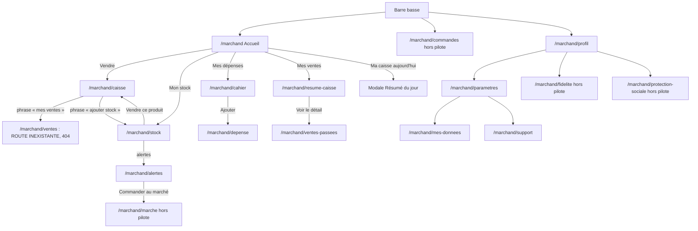

Sources : tuiles `components/marchand/MarchandAccueilVoice.tsx:193-195`, bouton Vendre `:344-350` ; `components/marchand/ResumeCaisse.tsx:510` ; `components/marchand/MarchandDepenses.tsx:473` ; `components/marchand/GestionStock.tsx:636,1259` ; `components/marchand/MarchandAlertes.tsx:229-306` ; navigation vocale `components/marchand/MicroVenteCaisse.tsx:409-412` ; `components/shared/UniversalProfil.tsx` (liens fidélité, protection sociale) ; `components/shared/UniversalParametres.tsx` (support, mes données).

Inventaire des routes (généré depuis `routes.tsx`) :

| Route | Composant | Fichier | routes.tsx | Appels vocaux dans le fichier |
|---|---|---|---|---|
| `/marchand` | AppLayout (layout) | — | `routes.tsx:67` |  |
| `/marchand` | MarchandHome | `frontend_src/src/app/components/marchand/MarchandHome.tsx` | `routes.tsx:68` | 0 |
| `/marchand/caisse` | POSCaisse | `frontend_src/src/app/components/marchand/POSCaisse.tsx` | `routes.tsx:69` | 29 |
| `/marchand/cahier` | MarchandDepenses | `frontend_src/src/app/components/marchand/MarchandDepenses.tsx` | `routes.tsx:70` | 4 |
| `/marchand/depense` | DepenseForm | `frontend_src/src/app/components/marchand/DepenseForm.tsx` | `routes.tsx:71` | 7 |
| `/marchand/stock` | GestionStock | `frontend_src/src/app/components/marchand/GestionStock.tsx` | `routes.tsx:72` | 14 |
| `/marchand/marche` | MarcheVirtuel | `frontend_src/src/app/components/marchand/MarcheVirtuel.tsx` | `routes.tsx:73` | 12 |
| `/marchand/recoltes-prevues` | RecoltesPrevues | `frontend_src/src/app/components/marchand/RecoltesPrevues.tsx` | `routes.tsx:74` | 0 |
| `/marchand/profil` | MarchandProfil | `frontend_src/src/app/components/marchand/MarchandProfil.tsx` | `routes.tsx:75` | 0 |
| `/marchand/ventes-passees` | VentesPassees | `frontend_src/src/app/components/marchand/VentesPassees.tsx` | `routes.tsx:76` | 8 |
| `/marchand/resume-caisse` | ResumeCaisse | `frontend_src/src/app/components/marchand/ResumeCaisse.tsx` | `routes.tsx:77` | 2 |
| `/marchand/commandes` | MesCommandes | `frontend_src/src/app/components/marchand/MesCommandes.tsx` | `routes.tsx:78` | 26 |
| `/marchand/alertes` | MarchandAlertes | `frontend_src/src/app/components/marchand/MarchandAlertes.tsx` | `routes.tsx:79` | 1 |
| `/marchand/parametres` | Parametres | `frontend_src/src/app/components/marchand/Parametres.tsx` | `routes.tsx:80` | 0 |
| `/marchand/mes-donnees` | MesDonnees | `frontend_src/src/app/pages/marchand/MesDonnees.tsx` | `routes.tsx:81` | 5 |
| `/marchand/cooperative` | MaCooperative | `frontend_src/src/app/components/marchand/MaCooperative.tsx` | `routes.tsx:82` | 1 |
| `/marchand/cooperative/besoin` | BesoinMarchand | `frontend_src/src/app/components/marchand/BesoinMarchand.tsx` | `routes.tsx:83` | 1 |
| `/marchand/tontines` | Tontines | `frontend_src/src/app/components/marchand/Tontines.tsx` | `routes.tsx:84` | 1 |
| `/marchand/tontines/:id` | TontineDetail | `frontend_src/src/app/components/marchand/TontineDetail.tsx` | `routes.tsx:85` | 2 |
| `/marchand/protection-sociale` | ProtectionSociale | `frontend_src/src/app/components/marchand/ProtectionSociale.tsx` | `routes.tsx:86` | 1 |
| `/marchand/fidelite` | Fidelite | `frontend_src/src/app/components/marchand/Fidelite.tsx` | `routes.tsx:87` | 3 |
| `/marchand/academy` | UniversalAcademy | `frontend_src/src/app/components/academy/UniversalAcademy.tsx` | `routes.tsx:88` | 2 |
| `/marchand/keiwa` | WalletPage | `frontend_src/src/app/components/wallet/WalletPage.tsx` | `routes.tsx:89` | 0 |
| `/marchand/keiwa/transfert` | TransfertPage | `frontend_src/src/app/components/wallet/TransfertPage.tsx` | `routes.tsx:90` | 0 |
| `/marchand/keiwa/paiements` | PaiementsPage | `frontend_src/src/app/components/wallet/PaiementsPage.tsx` | `routes.tsx:91` | 0 |
| `/marchand/keiwa/banque` | BanquePage | `frontend_src/src/app/components/wallet/BanquePage.tsx` | `routes.tsx:92` | 0 |
| `/marchand/keiwa/carte` | CartePage | `frontend_src/src/app/components/wallet/CartePage.tsx` | `routes.tsx:93` | 0 |
| `/marchand/keiwa/historique` | HistoriquePage | `frontend_src/src/app/components/wallet/HistoriquePage.tsx` | `routes.tsx:94` | 0 |
| `/marchand/support` | SupportPage | `frontend_src/src/app/components/shared/SupportPage.tsx` | `routes.tsx:95` | 0 |

Les routes portefeuille (`keiwa/*`), `parametres`, `profil`, `support`, `recoltes-prevues` n'ont **aucun appel vocal** dans leur propre fichier (des composants enfants peuvent parler : voir l'annexe).

## M1 — Accueil marchand (`/marchand`)

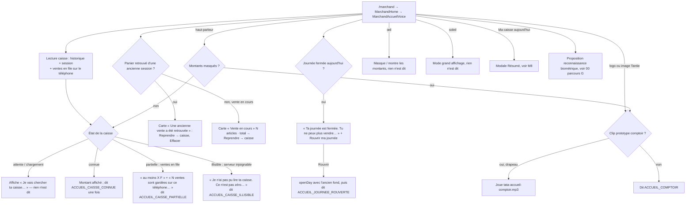

Sources : `MarchandAccueilVoice.tsx:67-73` (`etatCaisseAccueil`), `:128-142` (`direBonjour`, `direCaisse`), `:161-171` (dit à l'arrivée si `caisseDigneDEtreDite` et guidage), `:303-342` (anciennes ventes), `:369-389` (journée fermée), `:406-434` (modales) ; règle d'état `services/etatCaisseAccueil.ts:112-119,183-185` ; `services/accueilMarchandVoix.ts` (clip prototype).

| Étape | Déclencheur | Phrase EXACTE dite | Texte affiché si différent | Condition |
|---|---|---|---|---|
| Caisse connue | arrivée (une fois) ou haut-parleur | `ACCUEIL_CAISSE_CONNUE` « Ta caisse aujourd'hui : {caisse} francs » (forme parlée en mots) (`catalog.ts:218`) | « Ma caisse aujourd'hui » + montant `12 500 F` | guidage ; montants visibles |
| Caisse partielle | idem | `ACCUEIL_CAISSE_PARTIELLE` « Ta caisse aujourd'hui : au moins {caisse}. Ce n'est pas tout : des ventes attendent encore sur ton téléphone. » (`:219`) | « au moins … F » + « N ventes sont gardées sur ce téléphone, pas encore envoyées. » | idem |
| Caisse illisible | idem | `ACCUEIL_CAISSE_ILLISIBLE` « Je n'ai pas pu lire ta caisse. Ce n'est pas zéro : je n'ai pas pu demander. Ton argent est là. » (`:220`) | « Je n'ai pas pu lire ta caisse. Ce n'est pas zéro : ton argent est là. » | idem |
| Bonjour | logo / image Tantie / haut-parleur montants masqués | `ACCUEIL_COMPTOIR` « Ton comptoir est prêt. On vend ensemble aujourd'hui. » (`:217`) | « Ton comptoir est prêt » / salutation / « On vend ensemble aujourd'hui. » | clip prototype si drapeau, sinon synthèse |
| Journée rouverte | bouton « Rouvrir ma journée » | `ACCUEIL_JOURNEE_ROUVERTE` « Ta journée est rouverte. Tu peux vendre. » (`:216`) | « Ta journée est fermée. » disparaît | toujours (P2) |
| Journée fermée | arrivée | **rien** | « Ta journée est fermée. » / « Tu ne peux plus vendre. Rouvre-la si une cliente arrive. » | — |
| Ancienne vente / vente en cours | arrivée | **rien** | cartes « Une ancienne vente a été retrouvée » / « Vente en cours » | — |
| Objectif 50 % / 80 % / 100 % | progression des ventes | « Félicitations ! Tu as atteint 50% de ton objectif. Continue ma chère, tu es sur la bonne voie ! » / `OBJECTIF_80` / « Incroyable ! Tu as atteint ton objectif du jour ! Tu es trop forte ma chère ! » (`contexts/ObjectifContext.tsx:23,92,102`) | — | `speakAuto` (P6, sans garde de rôle, abandonnée si autre voix) |

## M2 — Caisse tactile et encaissement au doigt (`/marchand/caisse`)

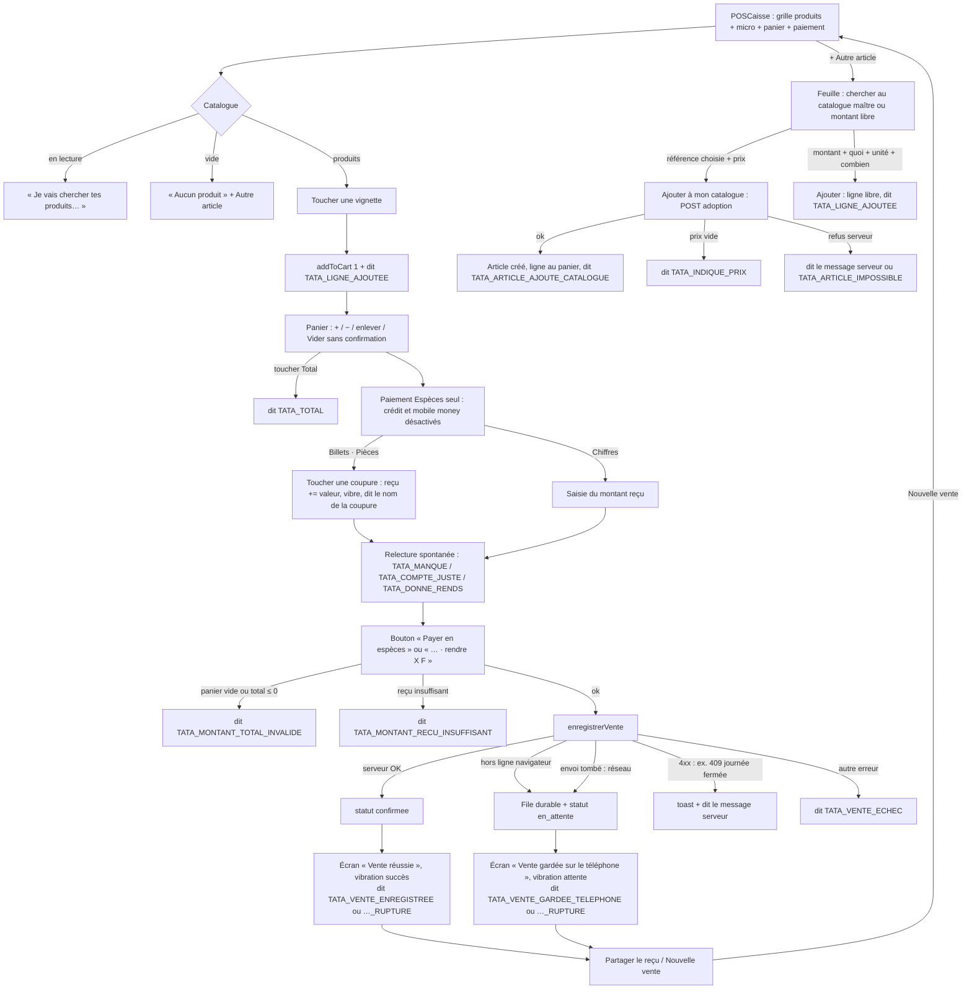

Sources (`components/marchand/POSCaisse.tsx`) : drapeaux pilote `:53,60` ; `dire`/`direMessage` gardés `:85,93` ; ajout vignette `:214-227`, vignettes `:1361` ; feuille « Autre article » `:1297,1348`, adoption `:329-368`, montant libre `:372-391` ; Vider `:1420,1454` (aucune confirmation, aucune voix) ; coupures `:402-406` ; relecture spontanée `:684-694` (`services/relectureSpontanee.ts:91-103`) ; `handlePay` `:430-556` ; écran de fin `:1840-1872` ; contexte `contexts/CaisseContext.tsx:576-640` (statuts `en_attente` / `confirmee`, `doitEnfiler`) ; règle serveur journée fermée `backend/src/caisse-rest/journee-ouverte.ts` (409 « Ta journée de caisse est fermée. Rouvre-la pour continuer. »).

| Étape | Déclencheur | Phrase EXACTE dite | Texte affiché si différent | Condition |
|---|---|---|---|---|
| Ligne ajoutée | vignette, montant libre | `TATA_LIGNE_AJOUTEE` « {quantite}, {montantLigne} francs. Total : {totalPanier} francs. » avec `{quantite}` = « 3 tas de tomate » ou « 2 tomates » (`relectureSpontanee.ts:141-149`) | ligne du panier | guidage (`dire`) |
| Coupure touchée | billet / pièce | `TATA_MONTANT_DEVISE` « {nom de la coupure} francs », ex. « cinq mille francs » (`utils/fcfa.ts:87-93`, lexique `i18n/voice/locales/fr-ci/lexicon.ts:65-69`) | « Reçu : 5 000 » | guidage |
| Il manque | reçu < total | `TATA_MANQUE` « Il manque {montant} francs. » | « Montant reçu insuffisant » (alerte rouge) | guidage ; tu si la machine vocale relit déjà |
| Compte juste | reçu = total | `TATA_COMPTE_JUSTE` « Compte juste. » | « Monnaie : 0 » | idem |
| Rendre | reçu > total | `TATA_DONNE_RENDS` « Elle t'a donné {recu} francs. Tu rends {monnaie} francs. » | « Monnaie : X F » + coupures | idem |
| Total touché | bouton total | `TATA_TOTAL` « Total : {total} francs » | « Total » + montant | guidage |
| Monnaie touchée | bouton monnaie | `TATA_MONNAIE_A_RENDRE` « Monnaie à rendre : {monnaie} francs » | — | guidage |
| Payer refusé | total ≤ 0 | `TATA_MONTANT_TOTAL_INVALIDE` « Montant total invalide » | — | guidage (le clip `ui-081` au même texte n'est pas joué, P2) |
| Payer refusé | reçu insuffisant | `TATA_MONTANT_RECU_INSUFFISANT` « Montant reçu insuffisant » | identique | guidage |
| Vente confirmée | 2xx serveur | `TATA_VENTE_ENREGISTREE` « Vente enregistrée. {total} francs » ou `…_RUPTURE` « … {avertissement} » | « Vente réussie » + reçu | guidage |
| Vente gardée | hors ligne ou envoi tombé | `TATA_VENTE_GARDEE_TELEPHONE` « Vente gardée sur le téléphone. {total} francs. Elle n'est pas encore envoyée. Je l'envoie dès que le réseau revient. » | « Vente gardée sur le téléphone » | guidage |
| Refus métier | 4xx (ex. journée fermée) | le message du serveur, ex. « Ta journée de caisse est fermée. Rouvre-la pour continuer. » (`:544-551`) | toast identique | guidage |
| Échec | 5xx / inconnu | `TATA_VENTE_ECHEC` « La vente n'a pas pu être enregistrée. Réessaie. » | — | guidage |
| Adoption | ajout au catalogue | `TATA_ARTICLE_AJOUTE_CATALOGUE` « {produit} ajouté à ton catalogue et au panier » / `TATA_INDIQUE_PRIX` « Il faut indiquer ton prix » / `TATA_ARTICLE_IMPOSSIBLE` « Impossible d'ajouter cet article » | « Il faut indiquer ton prix de vente. » (`:333`) | guidage |
| Vider | bouton Vider | **rien** | panier vidé | — |

## M3 — Vente à la voix : de la phrase au panier (`MicroVenteCaisse` dans la caisse)

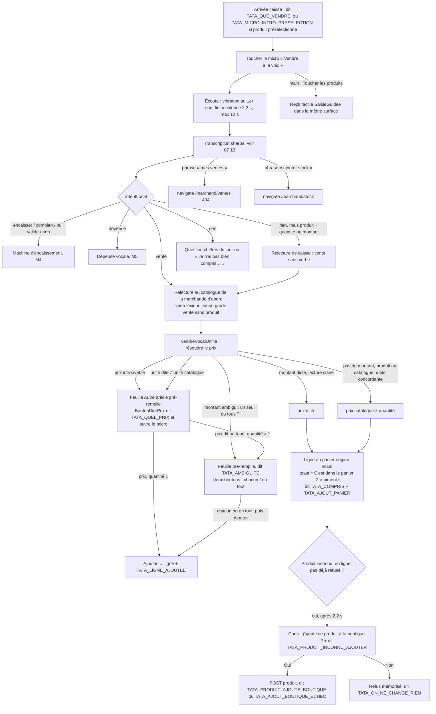

Sources : `components/marchand/MicroVenteCaisse.tsx:200-225` (ajout guidé), `:238-272` (`vendreUnifie` et ses dépendances), `:274-420` (`useVoiceCore` : bypass `:307-308`, `onAction` `:309-418`, navigation `:409-412`), `:426-437` (intro), `:482-603` (fin d'écoute au silence, vibration `:579-583`), `:616-664` (relecture de caisse), `:668-687` (création produit) ; `services/vendreVocalUnifie.ts:179-352` (prix `:209-216`, refus `:218-276`, ajout `:279-333`, toast `:320`, proposition `:335-351`) ; `services/dialoguesTata.ts:82-102` (`phraseCompris`) ; `components/marchand/POSCaisse.tsx:252-307` (`ouvrirPrixManquant`), `:1642-1658` (`BoutonDirePrix ouvrirToutSeul`), `:1734-1738` (chacun / en tout) ; `components/marchand/BoutonDirePrix.tsx` (question puis micro, 12 s).

| Étape | Déclencheur | Phrase EXACTE dite | Texte affiché au même moment | Condition |
|---|---|---|---|---|
| Arrivée | montage de la caisse | `TATA_QUE_VENDRE` « Que veux-tu vendre ? » / `TATA_MICRO_INTRO_PRESELECTION` « Appuie sur le micro, et dis ce que tu as vendu de {produit}. » | bulle « Dis-moi ce que tu vends » / « Dis ce que tu as vendu de {produit} » (`MicroVenteCaisse.tsx:735-740`) | guidage |
| Écoute | micro ouvert | **rien** (bip 880 Hz + vibration « tic » au premier son) | bulle « Je t'écoute » | — |
| Réflexion | transcription | **rien** | « Un instant… » | — |
| Vente comprise | prix résolu | `TATA_COMPRIS` « J'ai compris : {quantite} pour {montant} francs. C'est dans le panier. Tu ajoutes autre chose, ou tu encaisses ? » (forme parlée, `dialoguesTata.ts:102`) | toast **« C'est dans le panier : 2 × piment »** (`vendreVocalUnifie.ts:320`) — sans l'unité, alors que la voix dit « 2 tas de piment » | guidage |
| Prix manquant / unité | `demanderPrix` | `TATA_QUEL_PRIX` « {produit}. Quel est ton prix ? » (dit par `BoutonDirePrix`) puis micro ouvert | feuille « Chercher un autre produit » pré-remplie | guidage (sinon feuille muette, clavier) |
| Ambiguïté | montant sur quantité > 1 | `TATA_AMBIGUITE` « {montant} francs, c'est le prix d'un seul, ou de tous les {quantite} ? » | deux boutons « chacun » / « en tout » avec leurs totaux | guidage |
| Refus sans feuille | caisse sans fournisseur (`TantieSagesseModal`) | `TATA_UNITE_INCOMPATIBLE` / `TATA_PRIX_INCONNU_PRODUIT` / `TATA_PRIX_INCOMPRIS` (formes parlées) | toast avec la forme écran | guidage |
| Produit inconnu | 2,2 s après l'ajout | `TATA_PRODUIT_INCONNU_AJOUTER` « Je ne connais pas {produit} dans ta boutique. Je l'ajoute ? » (forme écran `t`, `vendreVocalUnifie.ts:344`) | carte Oui / Non | en ligne, guidage |
| Création | Oui / Non | `TATA_PRODUIT_AJOUTE_BOUTIQUE` « C'est fait. {produit} est dans ta boutique. » / `TATA_AJOUT_BOUTIQUE_ECHEC` « Ça n'a pas marché. Tu pourras l'ajouter depuis Mon stock. » / `TATA_ON_NE_CHANGE_RIEN` « D'accord, on ne change rien. » | — | guidage |
| Incompris | rien reconnu | « Je n'ai pas bien compris. Redis-moi ça autrement, s'il te plaît. » (P3, synthèse) | bulle « Je n'ai pas compris » si erreur | — |
| Réécouter | bouton réécouter | la dernière phrase retenue, sinon l'intro (`:834`) | — | — |
| Micro sur le web | exception moteur | « La dictée n'est disponible que dans l'application. Ici, touche les produits. » | carte d'erreur + bulle **« Je n'ai pas compris. Touche le micro et redis-moi. »** (`:738`) | web |

## M4 — Encaissement à la voix (machine `services/machineEncaissement.ts`)

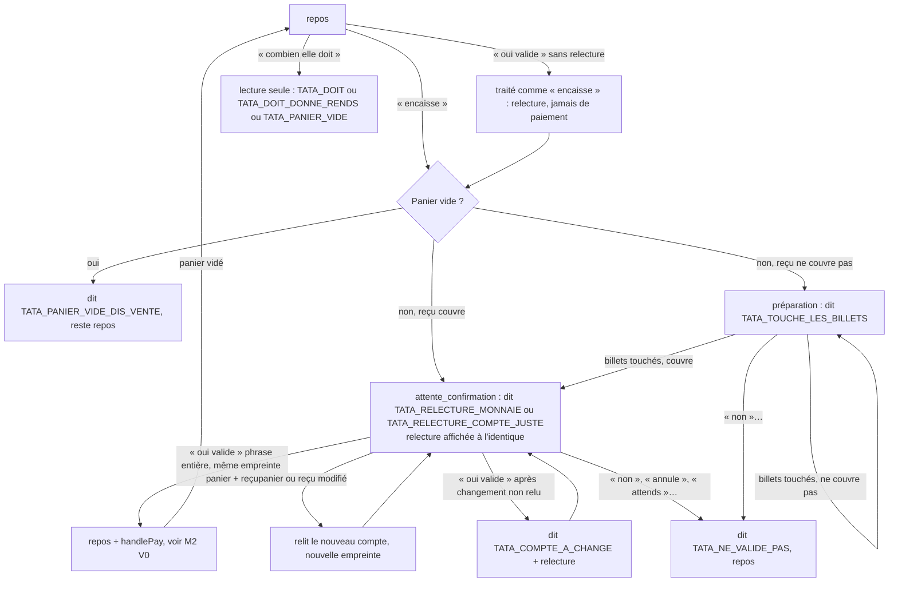

Sources : `services/machineEncaissement.ts:160-195` (relecture, préparation), `:202-301` (`reduire`) ; `voice-offline/grammaireEncaissement.ts:137-156` (détection, annulation d'abord) ; câblage écran `POSCaisse.tsx:573-631` (état financier, `traiterIntentionEncaissement`, paiement `:630`), `:652-665` (relecture d'elle-même quand le reçu couvre) ; `MicroVenteCaisse.tsx:314` (transmission à la caisse).

| Étape | Déclencheur | Phrase EXACTE dite (forme parlée) | Texte affiché | Condition |
|---|---|---|---|---|
| Panier vide | « encaisse » | `TATA_PANIER_VIDE_DIS_VENTE` « Ton panier est vide. Dis-moi d'abord ce que tu vends. » | identique (bandeau relecture) | **toujours** (`speak` direct, `POSCaisse.tsx:629`, pas de garde guidage) |
| Billets à toucher | « encaisse », reçu insuffisant | `TATA_TOUCHE_LES_BILLETS` « Elle doit {total} francs. Touche les billets qu'elle te donne. » | identique | toujours |
| Relecture | reçu couvre | `TATA_RELECTURE_MONNAIE` « Elle doit {total} francs. Elle t'a donné {recu}. Tu rends {monnaie}. Je valide ? » / `TATA_RELECTURE_COMPTE_JUSTE` « Elle doit {total} francs. Elle t'a donné {recu}. Compte juste. Je valide ? » | identique, forme écran (chiffres) | toujours |
| Compte changé | « oui valide » sur compte modifié | `TATA_COMPTE_A_CHANGE` « Le compte a changé. » + relecture | identique | toujours |
| Annulation | « non », « annule », « attends », « laisse »… | `TATA_NE_VALIDE_PAS` « D'accord, je ne valide pas. » | bandeau effacé | toujours |
| Combien | « combien elle doit », « total » | `TATA_DOIT` « Elle doit {total} francs. » / `TATA_DOIT_DONNE_RENDS` « Elle doit {total} francs. Elle t'a donné {recu}. Tu rends {monnaie}. » / `TATA_PANIER_VIDE` « Ton panier est vide. » | identique | toujours |
| Paiement | « oui valide » accepté | phrases de M2 (`TATA_VENTE_ENREGISTREE`…) | écran de fin | guidage |
| Rappel | panier non vide | **rien** | « Dis « encaisser » pour terminer » (`MicroVenteCaisse.tsx:905-915`) | — |

## M5 — Dépense vocale et questions du jour

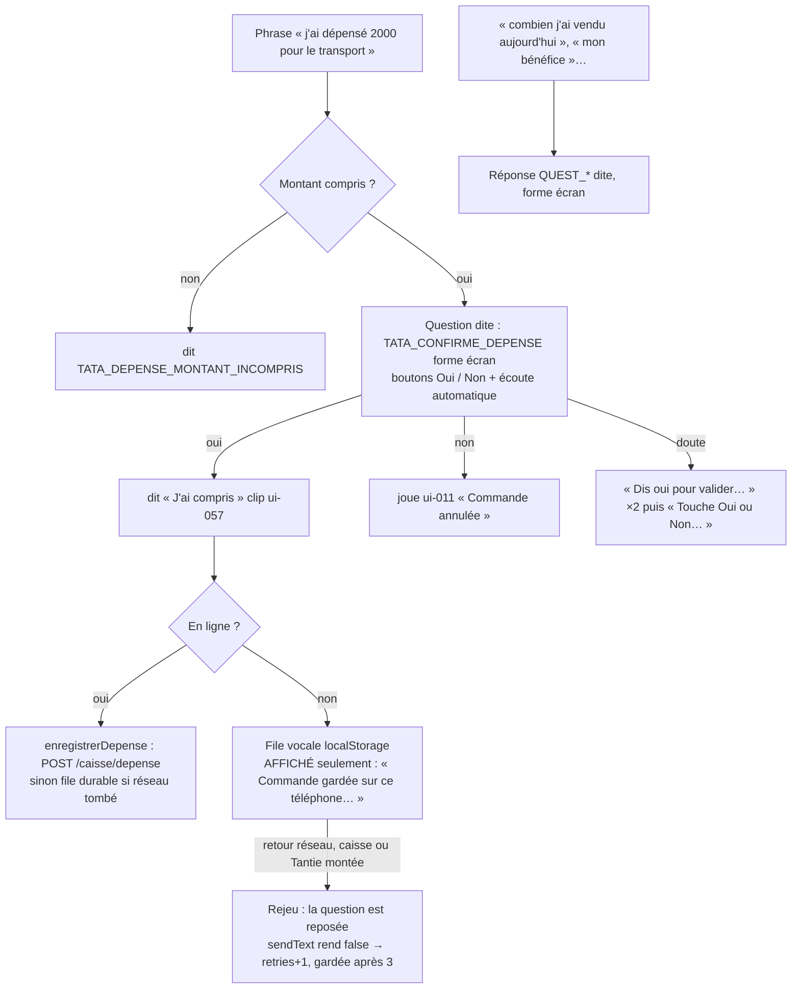

Sources : `voice-offline/localIntent.ts:150-283` (`TATA_CONFIRME_DEPENSE`, `needsConfirmation: true`) ; `MicroVenteCaisse.tsx:397-408` ; `hooks/useVoiceCore.ts:728-768,773-801,689-712` ; `voice-offline/offlineVoiceDispatch.ts` ; `hooks/useOfflineVoiceQueue.ts` (rejeu) ; `contexts/CaisseContext.tsx:651-676` (`enregistrerDepense`) ; questions `services/intentionsCaisse.ts:97-122`, `useVoiceCore.ts:818-836`.

| Étape | Déclencheur | Phrase EXACTE dite | Texte affiché | Condition |
|---|---|---|---|---|
| Montant absent | dépense sans chiffre | `TATA_DEPENSE_MONTANT_INCOMPRIS` « Je n'ai pas compris combien tu as dépensé. Redis-moi le montant. » | — | P2 |
| Confirmation | dépense comprise | `TATA_CONFIRME_DEPENSE` « Dépense de {montant} francs{ pour {produit}}, c'est bien ça ? » — **forme écran** `t()` envoyée à la synthèse (`localIntent.ts:273`, `useVoiceCore.ts:755`) : montant avec espace fine, épelable « 2 zéro zéro zéro » (défaut décrit `i18n/voice/runtime.ts:179-189`) | même texte en machine à écrire + Oui/Non | P3 |
| Oui | « oui » / bouton | « J'ai compris » (clip `ui-057`) | — | P3 |
| Non | « non » / bouton | clip `ui-011` « Commande annulée » (texte demandé « D'accord, j'annule. Pas de souci. ») | — | P3 |
| Hors ligne | dépense confirmée sans réseau | **rien** | « Commande gardée sur ce téléphone. Elle sera synchronisée quand le réseau reviendra. » | écart voice-first |
| Questions | « mes ventes », « mon solde »… | `QUEST_VENTES_JOUR`, `QUEST_DEPENSES_JOUR`, `QUEST_SOLDE_CAISSE`, `QUEST_BENEFICE_POSITIF`… (voir annexe catalogue, domaine `questions_caisse`), forme écran | — | P3 |

## M6 — Hors ligne, rejeu et annonces de synchronisation

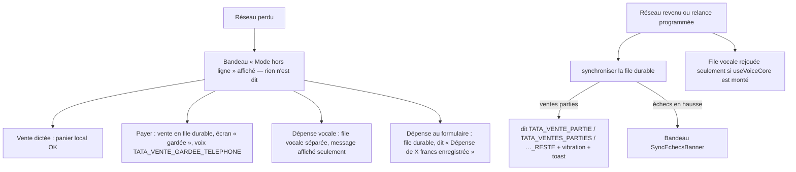

Sources : `AppLayout.tsx:119-134` ; `AppContext.tsx:784-795` (annonces réseau commentées) ; `contexts/CaisseContext.tsx:440-480` (relances, `annonceVentesParties`), `services/annonceVentesParties.ts` ; `components/marchand/SyncEchecsBanner.tsx` ; `components/marchand/DepenseForm.tsx:107-121` (succès dit même quand la dépense part en file).

| Étape | Phrase EXACTE dite | Condition |
|---|---|---|
| 1 vente partie | `TATA_VENTE_PARTIE` « Ta vente gardée sur le téléphone est partie. Le serveur l'a reçue. » | P2 (guidage, sinon résolue sans être dite, `CaisseContext.tsx:352-357`) |
| N ventes parties | `TATA_VENTES_PARTIES` « {nombre} ventes gardées sur le téléphone sont parties. Le serveur les a reçues. » | idem |
| Reste en file | `TATA_VENTE_PARTIE_RESTE` / `TATA_VENTES_PARTIES_RESTE` « … Il en reste {reste} à envoyer. » | idem |
| Perte / retour réseau | **rien** (`AppContext.tsx:788,792` commentés) | — |

## M7 — Mes ventes et annulation d'une vente

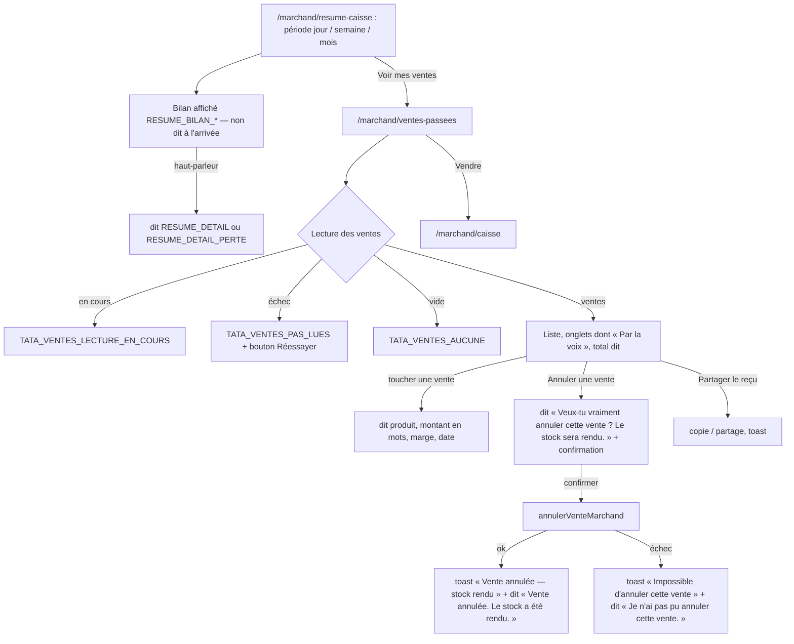

Sources : `components/marchand/ResumeCaisse.tsx:280-300,403-407,510` ; `components/marchand/VentesPassees.tsx:96-122` (annulation), `:141` (lecture d'une vente), `:420-440,540-548,850-870` (`annonceTotal`, `annonceFile`, `annonceEtat`), `:889` ; `services/etatVentesPassees.ts` ; crédit masqué `VentesPassees.tsx:43-45,349`.

Écart : sur `resume-caisse`, le bilan **affiché** (`RESUME_BILAN_GAGNE` « {periode}, tu as gagné {ventes} francs. Tu as dépensé {depenses} francs. ») et la phrase **dite** au toucher (`RESUME_DETAIL` « Résumé {complement}. Ventes : … Dépenses : … Solde actuel : … Heure de pointe : … ») sont deux textes différents ; rien n'est dit à l'arrivée.

## M8 — Journée : fond de caisse, clôture, réouverture

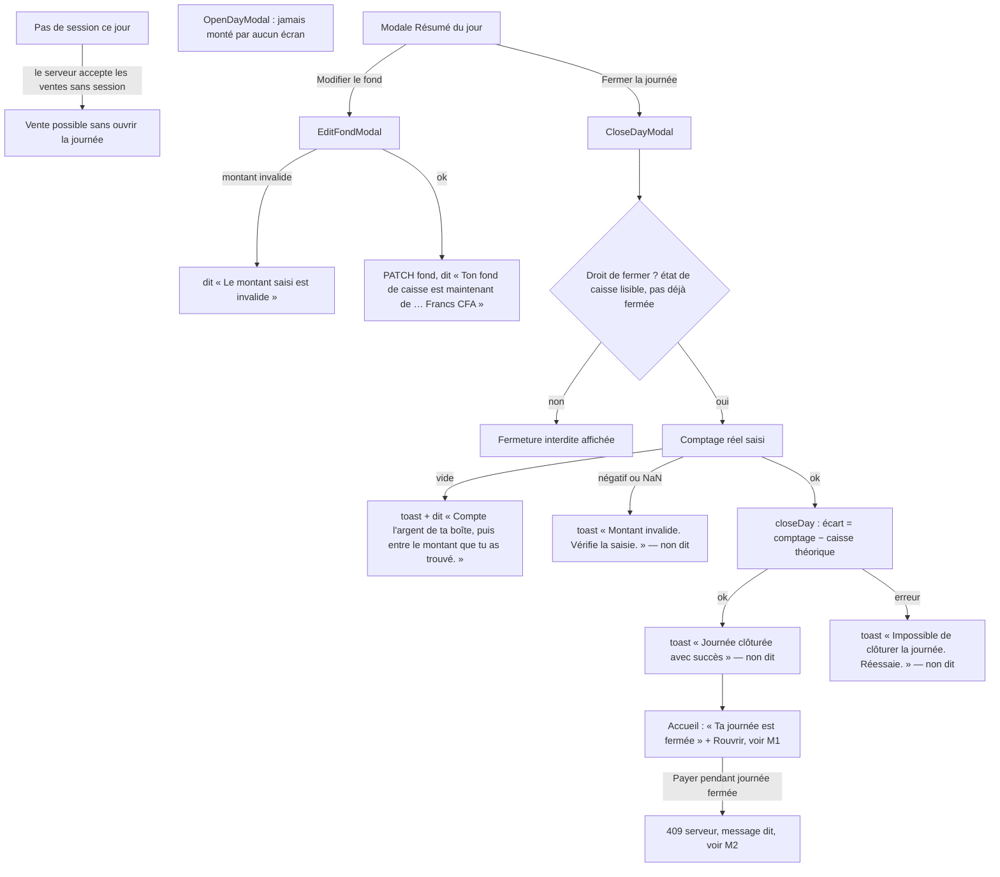

Sources : `backend/src/caisse-rest/journee-ouverte.ts` (pas de session ⇒ pas de refus) ; `components/marchand/MarchandModals.tsx:329-381` (`OpenDayModal`, aucun import ailleurs : recherche `OpenDayModal` → seule sa définition) , `:461-495` (`EditFondModal`), `:566-613` (`CloseDayModal`), `:1081-1160` (`ResumeModal`) ; `contexts/AppContext.tsx:905-1020` (`openDay`, `closeDay`, `updateFondInitial`, phrase « Ta journée est déjà ouverte avec … francs… » `:923-925`).

| Étape | Phrase EXACTE dite | Texte affiché si différent | Condition |
|---|---|---|---|
| Fond modifié | « Ton fond de caisse est maintenant de {nombre en mots} Francs CFA » (`MarchandModals.tsx:492`) | toast éventuel | P1 |
| Fond invalide | « Le montant saisi est invalide » (`:488`) | — | P1 (clip `ui-066` non joué) |
| Ajout de coupure au fond | « {montant en mots} Francs CFA ajoutés. Total : {total en mots} Francs CFA » (`:475,482`) | — | P1 |
| Clôture sans montant | « Compte l'argent de ta boîte, puis entre le montant que tu as trouvé. » (`:590`) | « Compte ton argent et entre le montant trouvé. » | P1 |
| Clôture réussie / échouée / montant invalide | **rien** | toasts | écart voice-first |
| Fond déjà déclaré (réouverture) | « Ta journée est déjà ouverte avec {fond} francs. Pour changer ce montant, touche Modifier le fond. » (`AppContext.tsx:923-925`) | — | P1 |

## M9 — Dépenses (`/marchand/cahier`, `/marchand/depense`)

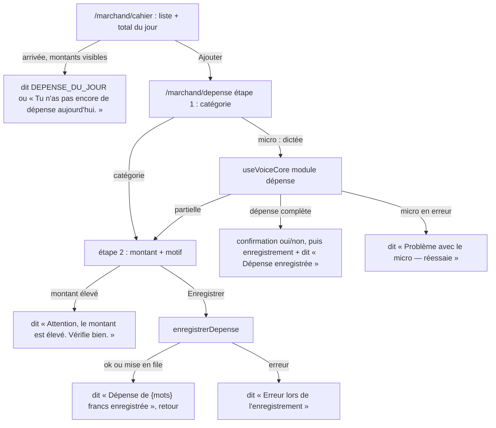

Sources : `components/marchand/MarchandDepenses.tsx:215-236,473` ; `components/marchand/DepenseForm.tsx:69-100` (voix), `:107-121` (enregistrement), `:131` (montant élevé), `:229,287,351` (étapes).

Écart : en hors-ligne, `enregistrerDepense` met la dépense en file sans erreur (`CaisseContext.tsx:654-658`) et l'écran dit « Dépense de … francs enregistrée » — alors que la vente distingue « enregistrée » et « gardée sur le téléphone ».

## M10 — Stock, ajout guidé, alertes

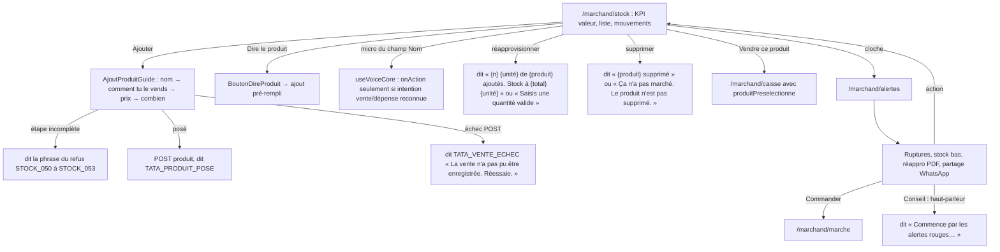

Sources : `components/marchand/GestionStock.tsx:252` (`dire`), `:360-412` (dictée), `:401-408` (synthèse stock), `:487-544` (mise à jour, réappro, suppression), `:609-613`, `:1259` ; `components/marchand/AjoutProduitGuide.tsx:150-218` (dont `:209-210` échec → `TATA_VENTE_ECHEC`) ; `services/premierProduit.ts` (refus) ; `components/marchand/MarchandAlertes.tsx:166-306,476-484`.

Écarts : (1) échec de création d'un produit → phrase de **vente** (`AjoutProduitGuide.tsx:210`) ; (2) dictée du nom d'un produit (`GestionStock.tsx:360-380`) : `onAction` n'est appelé que si `intentLocal` reconnaît une vente ou une dépense (`useVoiceCore.ts:686-690`) — un nom seul (« gombo ») tombe dans « Je n'ai pas bien compris… » et le champ n'est pas rempli (déduction du code, non testée sur appareil).

## M11 — Profil, paramètres, support, mes données

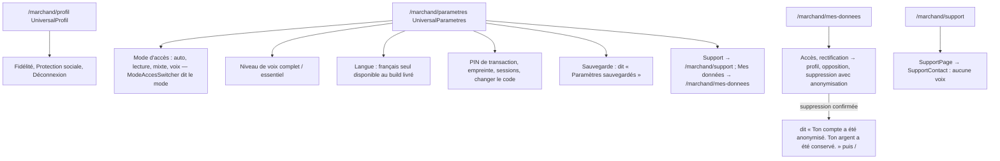

Sources : `components/shared/UniversalProfil.tsx:508,750` ; `components/shared/UniversalParametres.tsx:500-690,981` ; `components/shared/ModeAccesSwitcher.tsx:21-22` (P6, sans garde) ; `components/shared/VoiceLevelSelector.tsx` ; `pages/marchand/MesDonnees.tsx:157-192,431-446,657` ; `components/shared/SupportPage.tsx` (13 lignes, aucune voix).

## M12 — Modules hors pilote accessibles

Aucun garde « pilote » n'empêche ces routes : elles sont montées par `routes.tsx` et atteignables par la barre basse (Commandes), le profil (Fidélité, Protection sociale), les alertes (Marché), ou l'URL directe (Keiwa, Tontines, Coopérative, Academy, Récoltes prévues). Seuls le **crédit** et le **mobile money** de la caisse sont coupés par constante (`POSCaisse.tsx:53,60`, `VentesPassees.tsx:45`).

| Module | Route | Entrée(s) dans l'interface | Appels vocaux (fichier) | Remarques |
|---|---|---|---|---|
| Mes commandes | `/marchand/commandes` | barre basse « Commandes » (`roleConfig.ts:105`) | 26 (`MesCommandes.tsx:189-279`) | phrases d'échec réseau par `direEchecReseau`, hors ligne refusé (`t('MARCHAND_HORS_LIGNE_ACTION')`) |
| Marché virtuel | `/marchand/marche` | alertes « Commander » | 12 (`MarcheVirtuel.tsx:400-890`, via `useVoiceCore.speak` P3) | paiement wallet + PIN (`PinConfirmModal`) ; 9 phrases hors catalogue (voir README, écart) |
| Récoltes prévues | `/marchand/recoltes-prevues` | `MarcheVirtuel` | 0 | réessai désactivé hors ligne (`RecoltesPrevues.tsx:84-120`) |
| Ma coopérative / Besoin | `/marchand/cooperative`, `/cooperative/besoin` | profil / URL | 1 + 1 | `CROSS_ROLE_ROUTES` : `/cooperative/stock` ouvert au marchand membre (`types/constants.ts:128-130`) |
| Tontines | `/marchand/tontines`, `/:id` | URL | 1 + 2 | — |
| Protection sociale | `/marchand/protection-sociale` | profil | 1 | — |
| Fidélité | `/marchand/fidelite` | profil | 3 | — |
| Academy | `/marchand/academy` | URL / tableau de bord | 2 | barre basse masquée |
| Keiwa (portefeuille) | `/marchand/keiwa/*` (6 routes) | URL | 0 dans les pages ; 14 + 15 + 5 dans les modales `RechargeWalletModal`, `WithdrawWalletModal`, `WalletCard` | clips `ui-084`, `ui-088`… jamais joués (P1) |

## Annexe M — Tous les appels vocaux du périmètre marchand (extraction mécanique)

Inclut les services, contextes, hooks et `voice-offline/` appelés par la caisse. Canal : [`07-voix-transverse.md`](07-voix-transverse.md) §1.

#### `components/marchand/AjoutProduitGuide.tsx` — 11 appel(s) vocal(aux)

| Source | Appel | Phrase dite (texte exact / clé catalogue fr-ci) | Clip Tata au texte identique | Canal et condition |
|---|---|---|---|---|
| `frontend_src/src/app/components/marchand/AjoutProduitGuide.tsx:92` | `speak` | *(expression)* `t` | — | AppContext.speak : dit SEULEMENT si rôle = marchand et non muet ; synthèse (jamais le clip ui-*) |
| `frontend_src/src/app/components/marchand/AjoutProduitGuide.tsx:153` | `direMessage` | *(expression)* `PHRASE_DU_REFUS[refus]` | — | clé catalogue → speakMessage → AppContext.speak (rôle marchand seulement) → synthèse ; tue en niveau « essentiel » si non-argent ; gardé par guidageVocal() (silence en profil « je lis ») |
| `frontend_src/src/app/components/marchand/AjoutProduitGuide.tsx:171` | `direMessage` | `STOCK_047` « Quel produit tu veux ajouter ? » | — | clé catalogue → speakMessage → AppContext.speak (rôle marchand seulement) → synthèse ; tue en niveau « essentiel » si non-argent ; gardé par guidageVocal() (silence en profil « je lis ») |
| `frontend_src/src/app/components/marchand/AjoutProduitGuide.tsx:172` | `direMessage` | `STOCK_048` « {nom}, tu le vends comment ? » | — | clé catalogue → speakMessage → AppContext.speak (rôle marchand seulement) → synthèse ; tue en niveau « essentiel » si non-argent ; gardé par guidageVocal() (silence en profil « je lis ») |
| `frontend_src/src/app/components/marchand/AjoutProduitGuide.tsx:173` | `direMessage` | `STOCK_049` « Le {unite}, à combien ? » | — | clé catalogue → speakMessage → AppContext.speak (rôle marchand seulement) → synthèse ; tue en niveau « essentiel » si non-argent ; gardé par guidageVocal() (silence en profil « je lis ») |
| `frontend_src/src/app/components/marchand/AjoutProduitGuide.tsx:174` | `direMessage` | `STOCK_054` « Tu en as combien ? Si tu ne sais pas, passe. » | — | clé catalogue → speakMessage → AppContext.speak (rôle marchand seulement) → synthèse ; tue en niveau « essentiel » si non-argent ; gardé par guidageVocal() (silence en profil « je lis ») |
| `frontend_src/src/app/components/marchand/AjoutProduitGuide.tsx:198` | `direMessage` | *(expression)* `PHRASE_DU_REFUS[refus]` | — | clé catalogue → speakMessage → AppContext.speak (rôle marchand seulement) → synthèse ; tue en niveau « essentiel » si non-argent ; gardé par guidageVocal() (silence en profil « je lis ») |
| `frontend_src/src/app/components/marchand/AjoutProduitGuide.tsx:207` | `direMessage` | `TATA_PRODUIT_POSE` « {produit}, {montant} {devise} le {unite}. C'est sur ton étal. » | — | clé catalogue → speakMessage → AppContext.speak (rôle marchand seulement) → synthèse ; tue en niveau « essentiel » si non-argent ; gardé par guidageVocal() (silence en profil « je lis ») |
| `frontend_src/src/app/components/marchand/AjoutProduitGuide.tsx:210` | `direMessage` | `TATA_VENTE_ECHEC` « La vente n'a pas pu être enregistrée. Réessaie. » | — | clé catalogue → speakMessage → AppContext.speak (rôle marchand seulement) → synthèse ; tue en niveau « essentiel » si non-argent ; gardé par guidageVocal() (silence en profil « je lis ») |
| `frontend_src/src/app/components/marchand/AjoutProduitGuide.tsx:218` | `direMessage` | `TATA_MONTANT_DEVISE` « {montant} {devise} » | — | clé catalogue → speakMessage → AppContext.speak (rôle marchand seulement) → synthèse ; tue en niveau « essentiel » si non-argent ; gardé par guidageVocal() (silence en profil « je lis ») |
| `frontend_src/src/app/components/marchand/AjoutProduitGuide.tsx:265` | `direMessage` | `TATA_UNITE_CHOISIE` « Le {unite}. » | — | clé catalogue → speakMessage → AppContext.speak (rôle marchand seulement) → synthèse ; tue en niveau « essentiel » si non-argent ; gardé par guidageVocal() (silence en profil « je lis ») |

#### `components/marchand/BesoinMarchand.tsx` — 1 appel(s) vocal(aux)

| Source | Appel | Phrase dite (texte exact / clé catalogue fr-ci) | Clip Tata au texte identique | Canal et condition |
|---|---|---|---|---|
| `frontend_src/src/app/components/marchand/BesoinMarchand.tsx:55` | `speak` | « Votre besoin a été soumis à la coopérative » | `ui-136.mp3` | AppContext.speak : dit SEULEMENT si rôle = marchand et non muet ; synthèse (jamais le clip ui-*) |

#### `components/marchand/BoutonDirePrix.tsx` — 1 appel(s) vocal(aux)

| Source | Appel | Phrase dite (texte exact / clé catalogue fr-ci) | Clip Tata au texte identique | Canal et condition |
|---|---|---|---|---|
| `frontend_src/src/app/components/marchand/BoutonDirePrix.tsx:132` | `dire` | *(expression)* `question` | — | AppContext.speak : dit SEULEMENT si rôle = marchand et non muet ; synthèse (jamais le clip ui-*) |

#### `components/marchand/ConfirmationLigne.tsx` — 8 appel(s) vocal(aux)

| Source | Appel | Phrase dite (texte exact / clé catalogue fr-ci) | Clip Tata au texte identique | Canal et condition |
|---|---|---|---|---|
| `frontend_src/src/app/components/marchand/ConfirmationLigne.tsx:51` | `speak` | *(expression)* `phrase()` | — | AppContext.speak : dit SEULEMENT si rôle = marchand et non muet ; synthèse (jamais le clip ui-*) |
| `frontend_src/src/app/components/marchand/ConfirmationLigne.tsx:105` | `speak` | *(expression)* `t` | — | AppContext.speak : dit SEULEMENT si rôle = marchand et non muet ; synthèse (jamais le clip ui-*) |
| `frontend_src/src/app/components/marchand/ConfirmationLigne.tsx:117` | `dire` | *(expression)* `phrase.texteParle` | — | AppContext.speak : dit SEULEMENT si rôle = marchand et non muet ; synthèse (jamais le clip ui-*) |
| `frontend_src/src/app/components/marchand/ConfirmationLigne.tsx:127` | `dire` | *(expression)* `quantiteAvecUnite(q, ligne.unite)` | — | AppContext.speak : dit SEULEMENT si rôle = marchand et non muet ; synthèse (jamais le clip ui-*) |
| `frontend_src/src/app/components/marchand/ConfirmationLigne.tsx:132` | `direMessage` | `TATA_MONTANT_DEVISE` « {montant} {devise} » | — | clé catalogue → speakMessage → AppContext.speak (rôle marchand seulement) → synthèse ; tue en niveau « essentiel » si non-argent |
| `frontend_src/src/app/components/marchand/ConfirmationLigne.tsx:133` | `direMessage` | `TATA_PRIX_EFFACE` « Prix effacé. » | — | clé catalogue → speakMessage → AppContext.speak (rôle marchand seulement) → synthèse ; tue en niveau « essentiel » si non-argent |
| `frontend_src/src/app/components/marchand/ConfirmationLigne.tsx:192` | `direMessage` | *(expression)* `m === 'unitaire' ? 'TATA_PRIX_D_UN_SEUL' : 'TATA_PRIX_DU_TOUT'` | — | clé catalogue → speakMessage → AppContext.speak (rôle marchand seulement) → synthèse ; tue en niveau « essentiel » si non-argent |
| `frontend_src/src/app/components/marchand/ConfirmationLigne.tsx:245` | `direMessage` | `TATA_QUESTION_CORRECTION` « Qu'est-ce qui est faux ? Change la quantité, ou le prix. » | — | clé catalogue → speakMessage → AppContext.speak (rôle marchand seulement) → synthèse ; tue en niveau « essentiel » si non-argent |

#### `components/marchand/CreditModal.tsx` — 8 appel(s) vocal(aux)

| Source | Appel | Phrase dite (texte exact / clé catalogue fr-ci) | Clip Tata au texte identique | Canal et condition |
|---|---|---|---|---|
| `frontend_src/src/app/components/marchand/CreditModal.tsx:44` | `speak` | *(expression)* `t` | — | AppContext.speak : dit SEULEMENT si rôle = marchand et non muet ; synthèse (jamais le clip ui-*) |
| `frontend_src/src/app/components/marchand/CreditModal.tsx:166` | `dire` | « Numéro de téléphone invalide. Format attendu : 07XXXXXXXX » | `ui-083.mp3` | dire → AppContext.speak, gardé par guidageVocal() ; rôle marchand seulement ; synthèse (jamais le clip) |
| `frontend_src/src/app/components/marchand/CreditModal.tsx:181` | `dire` | « Le montant de l'acompte est invalide » | — | dire → AppContext.speak, gardé par guidageVocal() ; rôle marchand seulement ; synthèse (jamais le clip) |
| `frontend_src/src/app/components/marchand/CreditModal.tsx:185` | `dire` | « L'acompte ne peut pas être égal ou supérieur au total. Enregistre plutôt une vente. » | — | dire → AppContext.speak, gardé par guidageVocal() ; rôle marchand seulement ; synthèse (jamais le clip) |
| `frontend_src/src/app/components/marchand/CreditModal.tsx:203` | `dire` | « Crédit de ${nombreEnMotsFr(total)} francs noté pour ${clientNom}. Elle rembourse le ${echeanceLong} » *(gabarit)* | — | dire → AppContext.speak, gardé par guidageVocal() ; rôle marchand seulement ; synthèse (jamais le clip) |
| `frontend_src/src/app/components/marchand/CreditModal.tsx:209` | `dire` | « Erreur lors de l'enregistrement » | `ui-039.mp3` | dire → AppContext.speak, gardé par guidageVocal() ; rôle marchand seulement ; synthèse (jamais le clip) |
| `frontend_src/src/app/components/marchand/CreditModal.tsx:337` | `dire` | « Dis-moi d'abord le nom du client. » | — | dire → AppContext.speak, gardé par guidageVocal() ; rôle marchand seulement ; synthèse (jamais le clip) |
| `frontend_src/src/app/components/marchand/CreditModal.tsx:443` | `dire` | « L'acompte ne peut pas dépasser le total. Enregistre plutôt une vente. » | — | dire → AppContext.speak, gardé par guidageVocal() ; rôle marchand seulement ; synthèse (jamais le clip) |

#### `components/marchand/DepenseForm.tsx` — 7 appel(s) vocal(aux)

| Source | Appel | Phrase dite (texte exact / clé catalogue fr-ci) | Clip Tata au texte identique | Canal et condition |
|---|---|---|---|---|
| `frontend_src/src/app/components/marchand/DepenseForm.tsx:84` | `speak` | « Dépense enregistrée » | `ui-034.mp3` | AppContext.speak : dit SEULEMENT si rôle = marchand et non muet ; synthèse (jamais le clip ui-*) |
| `frontend_src/src/app/components/marchand/DepenseForm.tsx:89` | `speak` | « Erreur, réessaie » | `ui-048.mp3` | AppContext.speak : dit SEULEMENT si rôle = marchand et non muet ; synthèse (jamais le clip ui-*) |
| `frontend_src/src/app/components/marchand/DepenseForm.tsx:99` | `speak` | « Problème avec le micro — réessaie » | `ui-100.mp3` | AppContext.speak : dit SEULEMENT si rôle = marchand et non muet ; synthèse (jamais le clip ui-*) |
| `frontend_src/src/app/components/marchand/DepenseForm.tsx:118` | `speak` | *(expression)* `'Dépense de ' + nombreEnMotsFr(m) + ' francs enregistrée'` | — | AppContext.speak : dit SEULEMENT si rôle = marchand et non muet ; synthèse (jamais le clip ui-*) |
| `frontend_src/src/app/components/marchand/DepenseForm.tsx:120` | `speak` | « Erreur lors de l'enregistrement » | `ui-039.mp3` | AppContext.speak : dit SEULEMENT si rôle = marchand et non muet ; synthèse (jamais le clip ui-*) |
| `frontend_src/src/app/components/marchand/DepenseForm.tsx:131` | `speak` | « Attention, le montant est élevé. Vérifie bien. » | — | AppContext.speak : dit SEULEMENT si rôle = marchand et non muet ; synthèse (jamais le clip ui-*) |
| `frontend_src/src/app/components/marchand/DepenseForm.tsx:364` | `speak` | « ${nombreEnMotsFr(m)} francs » *(gabarit)* | — | AppContext.speak : dit SEULEMENT si rôle = marchand et non muet ; synthèse (jamais le clip ui-*) |

#### `components/marchand/Fidelite.tsx` — 3 appel(s) vocal(aux)

| Source | Appel | Phrase dite (texte exact / clé catalogue fr-ci) | Clip Tata au texte identique | Canal et condition |
|---|---|---|---|---|
| `frontend_src/src/app/components/marchand/Fidelite.tsx:62` | `speak` | « ${r.pointsGagnes} points ajoutés. Total ${Math.round(Number(r.client.points))} points. » *(gabarit)* | — | AppContext.speak : dit SEULEMENT si rôle = marchand et non muet ; synthèse (jamais le clip ui-*) |
| `frontend_src/src/app/components/marchand/Fidelite.tsx:63` | `speak` | « Ce client a droit à sa récompense ! » | `ui-007.mp3` | AppContext.speak : dit SEULEMENT si rôle = marchand et non muet ; synthèse (jamais le clip ui-*) |
| `frontend_src/src/app/components/marchand/Fidelite.tsx:74` | `speak` | « Récompense appliquée : ${r.remise} francs de remise. » *(gabarit)* | — | AppContext.speak : dit SEULEMENT si rôle = marchand et non muet ; synthèse (jamais le clip ui-*) |

#### `components/marchand/GestionStock.tsx` — 14 appel(s) vocal(aux)

| Source | Appel | Phrase dite (texte exact / clé catalogue fr-ci) | Clip Tata au texte identique | Canal et condition |
|---|---|---|---|---|
| `frontend_src/src/app/components/marchand/GestionStock.tsx:252` | `speak` | *(expression)* `t` | — | AppContext.speak : dit SEULEMENT si rôle = marchand et non muet ; synthèse (jamais le clip ui-*) |
| `frontend_src/src/app/components/marchand/GestionStock.tsx:373` | `speak` | *(expression)* `nomPropre` | — | AppContext.speak : dit SEULEMENT si rôle = marchand et non muet ; synthèse (jamais le clip ui-*) |
| `frontend_src/src/app/components/marchand/GestionStock.tsx:375` | `speak` | « Je n'ai pas entendu le nom. Réessaie, s'il te plaît. » | — | AppContext.speak : dit SEULEMENT si rôle = marchand et non muet ; synthèse (jamais le clip ui-*) |
| `frontend_src/src/app/components/marchand/GestionStock.tsx:401` | `speak` | *(expression)* `` low.length === 0 ? 'Tous tes stocks sont bons' : `${low.length} produits en stock bas : ${low.map(s => s.name).join(', ')}` `` | — | AppContext.speak : dit SEULEMENT si rôle = marchand et non muet ; synthèse (jamais le clip ui-*) |
| `frontend_src/src/app/components/marchand/GestionStock.tsx:404` | `speak` | « Tes montants sont cachés. Appuie sur l'œil pour les afficher. » | — | AppContext.speak : dit SEULEMENT si rôle = marchand et non muet ; synthèse (jamais le clip ui-*) |
| `frontend_src/src/app/components/marchand/GestionStock.tsx:408` | `speak` | « La valeur totale est ${nombreEnMotsFr(val)} francs » *(gabarit)* | — | AppContext.speak : dit SEULEMENT si rôle = marchand et non muet ; synthèse (jamais le clip ui-*) |
| `frontend_src/src/app/components/marchand/GestionStock.tsx:487` | `speak` | « C'est mis à jour. » | — | AppContext.speak : dit SEULEMENT si rôle = marchand et non muet ; synthèse (jamais le clip ui-*) |
| `frontend_src/src/app/components/marchand/GestionStock.tsx:490` | `speak` | « Ça n'a pas marché. Réessaie, s'il te plaît. » | — | AppContext.speak : dit SEULEMENT si rôle = marchand et non muet ; synthèse (jamais le clip ui-*) |
| `frontend_src/src/app/components/marchand/GestionStock.tsx:502` | `speak` | « Saisis une quantité valide » | `ui-116.mp3` | AppContext.speak : dit SEULEMENT si rôle = marchand et non muet ; synthèse (jamais le clip ui-*) |
| `frontend_src/src/app/components/marchand/GestionStock.tsx:507` | `speak` | « ${reappNum} ${selectedStock.unit} de ${selectedStock.name} ajoutés. Stock à ${newQty} ${selectedStock.unit} » *(gabarit)* | — | AppContext.speak : dit SEULEMENT si rôle = marchand et non muet ; synthèse (jamais le clip ui-*) |
| `frontend_src/src/app/components/marchand/GestionStock.tsx:536` | `speak` | « ${s?.name} supprimé » *(gabarit)* | — | AppContext.speak : dit SEULEMENT si rôle = marchand et non muet ; synthèse (jamais le clip ui-*) |
| `frontend_src/src/app/components/marchand/GestionStock.tsx:544` | `speak` | « Ça n'a pas marché. Le produit n'est pas supprimé. » | — | AppContext.speak : dit SEULEMENT si rôle = marchand et non muet ; synthèse (jamais le clip ui-*) |
| `frontend_src/src/app/components/marchand/GestionStock.tsx:609` | `speak` | *(expression)* `dit` | — | AppContext.speak : dit SEULEMENT si rôle = marchand et non muet ; synthèse (jamais le clip ui-*) |
| `frontend_src/src/app/components/marchand/GestionStock.tsx:613` | `speak` | « Ça n'a pas été enregistré. Réessaie, s'il te plaît. » | — | AppContext.speak : dit SEULEMENT si rôle = marchand et non muet ; synthèse (jamais le clip ui-*) |

#### `components/marchand/MaCooperative.tsx` — 1 appel(s) vocal(aux)

| Source | Appel | Phrase dite (texte exact / clé catalogue fr-ci) | Clip Tata au texte identique | Canal et condition |
|---|---|---|---|---|
| `frontend_src/src/app/components/marchand/MaCooperative.tsx:64` | `speak` | « Ta demande a été envoyée » | `ui-120.mp3` | AppContext.speak : dit SEULEMENT si rôle = marchand et non muet ; synthèse (jamais le clip ui-*) |

#### `components/marchand/MarchandAccueilVoice.tsx` — 6 appel(s) vocal(aux)

| Source | Appel | Phrase dite (texte exact / clé catalogue fr-ci) | Clip Tata au texte identique | Canal et condition |
|---|---|---|---|---|
| `frontend_src/src/app/components/marchand/MarchandAccueilVoice.tsx:129` | `direAccueilMarchand` | « comptoir » | — | clip prototype (drapeau VITE_JULABA_VOICE_PREVIEW) sinon clé catalogue |
| `frontend_src/src/app/components/marchand/MarchandAccueilVoice.tsx:130` | `speakMessage` | `ACCUEIL_COMPTOIR` « Ton comptoir est prêt. On vend ensemble aujourd'hui. » | — | clé catalogue → speakMessage → AppContext.speak (rôle marchand seulement) → synthèse ; tue en niveau « essentiel » si non-argent |
| `frontend_src/src/app/components/marchand/MarchandAccueilVoice.tsx:138` | `speakMessage` | `ACCUEIL_CAISSE_CONNUE` « Ta caisse aujourd'hui : {caisse}. » | — | clé catalogue → speakMessage → AppContext.speak (rôle marchand seulement) → synthèse ; tue en niveau « essentiel » si non-argent |
| `frontend_src/src/app/components/marchand/MarchandAccueilVoice.tsx:139` | `speakMessage` | `ACCUEIL_CAISSE_PARTIELLE` « Ta caisse aujourd'hui : au moins {caisse}. Ce n'est pas tout : des ventes attendent encore sur ton téléphone. » | — | clé catalogue → speakMessage → AppContext.speak (rôle marchand seulement) → synthèse ; tue en niveau « essentiel » si non-argent |
| `frontend_src/src/app/components/marchand/MarchandAccueilVoice.tsx:140` | `speakMessage` | `ACCUEIL_CAISSE_ILLISIBLE` « Je n'ai pas pu lire ta caisse. Ce n'est pas zéro : je n'ai pas pu demander. Ton argent est là. » | — | clé catalogue → speakMessage → AppContext.speak (rôle marchand seulement) → synthèse ; tue en niveau « essentiel » si non-argent |
| `frontend_src/src/app/components/marchand/MarchandAccueilVoice.tsx:380` | `speakMessage` | `ACCUEIL_JOURNEE_ROUVERTE` « Ta journée est rouverte. Tu peux vendre. » | — | clé catalogue → speakMessage → AppContext.speak (rôle marchand seulement) → synthèse ; tue en niveau « essentiel » si non-argent |

#### `components/marchand/MarchandAlertes.tsx` — 1 appel(s) vocal(aux)

| Source | Appel | Phrase dite (texte exact / clé catalogue fr-ci) | Clip Tata au texte identique | Canal et condition |
|---|---|---|---|---|
| `frontend_src/src/app/components/marchand/MarchandAlertes.tsx:483` | `speak` | *(expression)* `texte` | — | AppContext.speak : dit SEULEMENT si rôle = marchand et non muet ; synthèse (jamais le clip ui-*) |

#### `components/marchand/MarchandDepenses.tsx` — 4 appel(s) vocal(aux)

| Source | Appel | Phrase dite (texte exact / clé catalogue fr-ci) | Clip Tata au texte identique | Canal et condition |
|---|---|---|---|---|
| `frontend_src/src/app/components/marchand/MarchandDepenses.tsx:222` | `speak` | « Tu n'as pas encore de dépense aujourd'hui. » | — | AppContext.speak : dit SEULEMENT si rôle = marchand et non muet ; synthèse (jamais le clip ui-*) |
| `frontend_src/src/app/components/marchand/MarchandDepenses.tsx:229` | `direDepenseDuJour` | *(expression)* `` | — | AppContext.speak : dit SEULEMENT si rôle = marchand et non muet ; synthèse (jamais le clip ui-*) |
| `frontend_src/src/app/components/marchand/MarchandDepenses.tsx:233` | `speak` | « Tes montants sont cachés. » | — | AppContext.speak : dit SEULEMENT si rôle = marchand et non muet ; synthèse (jamais le clip ui-*) |
| `frontend_src/src/app/components/marchand/MarchandDepenses.tsx:234` | `direDepenseDuJour` | *(expression)* `` | — | AppContext.speak : dit SEULEMENT si rôle = marchand et non muet ; synthèse (jamais le clip ui-*) |

#### `components/marchand/MarchandModals.tsx` — 10 appel(s) vocal(aux)

| Source | Appel | Phrase dite (texte exact / clé catalogue fr-ci) | Clip Tata au texte identique | Canal et condition |
|---|---|---|---|---|
| `frontend_src/src/app/components/marchand/MarchandModals.tsx:339` | `speak` | « ${nombreEnMotsFr(montant)} Francs CFA ajoutés. Total : ${nombreEnMotsFr(newValue \|\| 0)} Francs CFA » *(gabarit)* | — | AppContext.speak : dit SEULEMENT si rôle = marchand et non muet ; synthèse (jamais le clip ui-*) |
| `frontend_src/src/app/components/marchand/MarchandModals.tsx:347` | `speak` | « ${nombreEnMotsFr(montant)} Francs CFA ajoutés. Total : ${nombreEnMotsFr(newValue \|\| 0)} Francs CFA » *(gabarit)* | — | AppContext.speak : dit SEULEMENT si rôle = marchand et non muet ; synthèse (jamais le clip ui-*) |
| `frontend_src/src/app/components/marchand/MarchandModals.tsx:364` | `speak` | « Le montant saisi est invalide » | `ui-066.mp3` | AppContext.speak : dit SEULEMENT si rôle = marchand et non muet ; synthèse (jamais le clip ui-*) |
| `frontend_src/src/app/components/marchand/MarchandModals.tsx:370` | `speak` | « Le montant doit être un multiple de 5 francs » | `ui-064.mp3` | AppContext.speak : dit SEULEMENT si rôle = marchand et non muet ; synthèse (jamais le clip ui-*) |
| `frontend_src/src/app/components/marchand/MarchandModals.tsx:378` | `speak` | « Ta journée est ouverte avec ${nombreEnMotsFr(montant \|\| 0)} Francs CFA » *(gabarit)* | — | AppContext.speak : dit SEULEMENT si rôle = marchand et non muet ; synthèse (jamais le clip ui-*) |
| `frontend_src/src/app/components/marchand/MarchandModals.tsx:475` | `speak` | « ${nombreEnMotsFr(montant)} Francs CFA ajoutés. Total : ${nombreEnMotsFr(newValue \|\| 0)} Francs CFA » *(gabarit)* | — | AppContext.speak : dit SEULEMENT si rôle = marchand et non muet ; synthèse (jamais le clip ui-*) |
| `frontend_src/src/app/components/marchand/MarchandModals.tsx:482` | `speak` | « ${nombreEnMotsFr(montant)} Francs CFA ajoutés. Total : ${nombreEnMotsFr(newValue \|\| 0)} Francs CFA » *(gabarit)* | — | AppContext.speak : dit SEULEMENT si rôle = marchand et non muet ; synthèse (jamais le clip ui-*) |
| `frontend_src/src/app/components/marchand/MarchandModals.tsx:488` | `speak` | « Le montant saisi est invalide » | `ui-066.mp3` | AppContext.speak : dit SEULEMENT si rôle = marchand et non muet ; synthèse (jamais le clip ui-*) |
| `frontend_src/src/app/components/marchand/MarchandModals.tsx:492` | `speak` | « Ton fond de caisse est maintenant de ${nombreEnMotsFr(montant \|\| 0)} Francs CFA » *(gabarit)* | — | AppContext.speak : dit SEULEMENT si rôle = marchand et non muet ; synthèse (jamais le clip ui-*) |
| `frontend_src/src/app/components/marchand/MarchandModals.tsx:590` | `speak` | « Compte l'argent de ta boîte, puis entre le montant que tu as trouvé. » | — | AppContext.speak : dit SEULEMENT si rôle = marchand et non muet ; synthèse (jamais le clip ui-*) |

#### `components/marchand/MarcheVirtuel.tsx` — 12 appel(s) vocal(aux)

| Source | Appel | Phrase dite (texte exact / clé catalogue fr-ci) | Clip Tata au texte identique | Canal et condition |
|---|---|---|---|---|
| `frontend_src/src/app/components/marchand/MarcheVirtuel.tsx:400` | `speakSilent` | « Proposition de prix envoyée à ${productToNegotiate.sellerName}. Tu recevras une réponse bientôt » *(gabarit)* | — | useVoiceCore.speak → ttsSpeak (clip si texte exact, sinon synthèse) |
| `frontend_src/src/app/components/marchand/MarcheVirtuel.tsx:404` | `speakSilent` | « Erreur lors de l'envoi de la proposition » | — | useVoiceCore.speak → ttsSpeak (clip si texte exact, sinon synthèse) |
| `frontend_src/src/app/components/marchand/MarcheVirtuel.tsx:441` | `speakSilent` | « Désolé, ton solde Wallet est insuffisant pour cette commande » | — | useVoiceCore.speak → ttsSpeak (clip si texte exact, sinon synthèse) |
| `frontend_src/src/app/components/marchand/MarcheVirtuel.tsx:445` | `speakSilent` | « Entre ton code PIN à 4 chiffres pour confirmer le paiement » | — | useVoiceCore.speak → ttsSpeak (clip si texte exact, sinon synthèse) |
| `frontend_src/src/app/components/marchand/MarcheVirtuel.tsx:455` | `speakSilent` | *(expression)* `` montantsMasques ? `Paiement par ${label} effectué avec succès` : `Paiement de ${(cartTotal \|\| 0).toLocaleString()} francs CFA par ${label} e `` | — | useVoiceCore.speak → ttsSpeak (clip si texte exact, sinon synthèse) |
| `frontend_src/src/app/components/marchand/MarcheVirtuel.tsx:474` | `speakSilent` | « Le code PIN doit contenir 4 chiffres » | — | useVoiceCore.speak → ttsSpeak (clip si texte exact, sinon synthèse) |
| `frontend_src/src/app/components/marchand/MarcheVirtuel.tsx:480` | `speakSilent` | « Code PIN incorrect » | — | useVoiceCore.speak → ttsSpeak (clip si texte exact, sinon synthèse) |
| `frontend_src/src/app/components/marchand/MarcheVirtuel.tsx:488` | `speakSilent` | *(expression)* `` montantsMasques ? 'Paiement effectué avec succès depuis ton Wallet' : `Paiement de ${(cartTotal \|\| 0).toLocaleString()} francs CFA effectué  `` | — | useVoiceCore.speak → ttsSpeak (clip si texte exact, sinon synthèse) |
| `frontend_src/src/app/components/marchand/MarcheVirtuel.tsx:794` | `speakSilent` | « ${product.name} ajouté au panier » *(gabarit)* | — | useVoiceCore.speak → ttsSpeak (clip si texte exact, sinon synthèse) |
| `frontend_src/src/app/components/marchand/MarcheVirtuel.tsx:834` | `speakSilent` | « ${selectedProduct.name} ajouté au panier » *(gabarit)* | — | useVoiceCore.speak → ttsSpeak (clip si texte exact, sinon synthèse) |
| `frontend_src/src/app/components/marchand/MarcheVirtuel.tsx:837` | `speakSilent` | « Propose ton prix et ta quantité » | — | useVoiceCore.speak → ttsSpeak (clip si texte exact, sinon synthèse) |
| `frontend_src/src/app/components/marchand/MarcheVirtuel.tsx:890` | `speakSilent` | « Choisis ton mode de paiement » | — | useVoiceCore.speak → ttsSpeak (clip si texte exact, sinon synthèse) |

#### `components/marchand/MesCommandes.tsx` — 26 appel(s) vocal(aux)

| Source | Appel | Phrase dite (texte exact / clé catalogue fr-ci) | Clip Tata au texte identique | Canal et condition |
|---|---|---|---|---|
| `frontend_src/src/app/components/marchand/MesCommandes.tsx:189` | `speak` | *(expression)* `t('MARCHAND_HORS_LIGNE_ACTION')` | — | AppContext.speak : dit SEULEMENT si rôle = marchand et non muet ; synthèse (jamais le clip ui-*) |
| `frontend_src/src/app/components/marchand/MesCommandes.tsx:190` | `speak` | *(expression)* `t('MARCHAND_ENVOI_TOMBE_ACTION')` | — | AppContext.speak : dit SEULEMENT si rôle = marchand et non muet ; synthèse (jamais le clip ui-*) |
| `frontend_src/src/app/components/marchand/MesCommandes.tsx:194` | `direEchecReseau` | « hors_ligne » | — | AppContext.speak : dit SEULEMENT si rôle = marchand et non muet ; synthèse (jamais le clip ui-*) |
| `frontend_src/src/app/components/marchand/MesCommandes.tsx:197` | `speak` | « Commande annulée » | `ui-011.mp3` | AppContext.speak : dit SEULEMENT si rôle = marchand et non muet ; synthèse (jamais le clip ui-*) |
| `frontend_src/src/app/components/marchand/MesCommandes.tsx:200` | `direEchecReseau` | *(expression)* `cause` | — | AppContext.speak : dit SEULEMENT si rôle = marchand et non muet ; synthèse (jamais le clip ui-*) |
| `frontend_src/src/app/components/marchand/MesCommandes.tsx:202` | `speak` | *(expression)* `message` | — | AppContext.speak : dit SEULEMENT si rôle = marchand et non muet ; synthèse (jamais le clip ui-*) |
| `frontend_src/src/app/components/marchand/MesCommandes.tsx:207` | `direEchecReseau` | « hors_ligne » | — | AppContext.speak : dit SEULEMENT si rôle = marchand et non muet ; synthèse (jamais le clip ui-*) |
| `frontend_src/src/app/components/marchand/MesCommandes.tsx:210` | `speak` | « Vente confirmée » | `ui-128.mp3` | AppContext.speak : dit SEULEMENT si rôle = marchand et non muet ; synthèse (jamais le clip ui-*) |
| `frontend_src/src/app/components/marchand/MesCommandes.tsx:213` | `direEchecReseau` | *(expression)* `cause` | — | AppContext.speak : dit SEULEMENT si rôle = marchand et non muet ; synthèse (jamais le clip ui-*) |
| `frontend_src/src/app/components/marchand/MesCommandes.tsx:215` | `speak` | *(expression)* `message` | — | AppContext.speak : dit SEULEMENT si rôle = marchand et non muet ; synthèse (jamais le clip ui-*) |
| `frontend_src/src/app/components/marchand/MesCommandes.tsx:220` | `direEchecReseau` | « hors_ligne » | — | AppContext.speak : dit SEULEMENT si rôle = marchand et non muet ; synthèse (jamais le clip ui-*) |
| `frontend_src/src/app/components/marchand/MesCommandes.tsx:223` | `speak` | « Vente refusée » | `ui-129.mp3` | AppContext.speak : dit SEULEMENT si rôle = marchand et non muet ; synthèse (jamais le clip ui-*) |
| `frontend_src/src/app/components/marchand/MesCommandes.tsx:226` | `direEchecReseau` | *(expression)* `cause` | — | AppContext.speak : dit SEULEMENT si rôle = marchand et non muet ; synthèse (jamais le clip ui-*) |
| `frontend_src/src/app/components/marchand/MesCommandes.tsx:228` | `speak` | *(expression)* `message` | — | AppContext.speak : dit SEULEMENT si rôle = marchand et non muet ; synthèse (jamais le clip ui-*) |
| `frontend_src/src/app/components/marchand/MesCommandes.tsx:233` | `direEchecReseau` | « hors_ligne » | — | AppContext.speak : dit SEULEMENT si rôle = marchand et non muet ; synthèse (jamais le clip ui-*) |
| `frontend_src/src/app/components/marchand/MesCommandes.tsx:236` | `speak` | « Commande marquée comme livrée » | `ui-012.mp3` | AppContext.speak : dit SEULEMENT si rôle = marchand et non muet ; synthèse (jamais le clip ui-*) |
| `frontend_src/src/app/components/marchand/MesCommandes.tsx:239` | `direEchecReseau` | *(expression)* `cause` | — | AppContext.speak : dit SEULEMENT si rôle = marchand et non muet ; synthèse (jamais le clip ui-*) |
| `frontend_src/src/app/components/marchand/MesCommandes.tsx:241` | `speak` | *(expression)* `message` | — | AppContext.speak : dit SEULEMENT si rôle = marchand et non muet ; synthèse (jamais le clip ui-*) |
| `frontend_src/src/app/components/marchand/MesCommandes.tsx:251` | `direEchecReseau` | « hors_ligne » | — | AppContext.speak : dit SEULEMENT si rôle = marchand et non muet ; synthèse (jamais le clip ui-*) |
| `frontend_src/src/app/components/marchand/MesCommandes.tsx:255` | `speak` | *(expression)* `` montantsMasques ? 'Contre-offre acceptée.' : `Contre-offre acceptée : ${nombreEnMotsFr(neg.prixContreOffre)} FCFA/${neg.unite}` `` | — | AppContext.speak : dit SEULEMENT si rôle = marchand et non muet ; synthèse (jamais le clip ui-*) |
| `frontend_src/src/app/components/marchand/MesCommandes.tsx:260` | `direEchecReseau` | *(expression)* `cause` | — | AppContext.speak : dit SEULEMENT si rôle = marchand et non muet ; synthèse (jamais le clip ui-*) |
| `frontend_src/src/app/components/marchand/MesCommandes.tsx:262` | `speak` | « Erreur : ${message} » *(gabarit)* | — | AppContext.speak : dit SEULEMENT si rôle = marchand et non muet ; synthèse (jamais le clip ui-*) |
| `frontend_src/src/app/components/marchand/MesCommandes.tsx:269` | `direEchecReseau` | « hors_ligne » | — | AppContext.speak : dit SEULEMENT si rôle = marchand et non muet ; synthèse (jamais le clip ui-*) |
| `frontend_src/src/app/components/marchand/MesCommandes.tsx:274` | `speak` | « Contre-offre refusée. » | `ui-019.mp3` | AppContext.speak : dit SEULEMENT si rôle = marchand et non muet ; synthèse (jamais le clip ui-*) |
| `frontend_src/src/app/components/marchand/MesCommandes.tsx:277` | `direEchecReseau` | *(expression)* `cause` | — | AppContext.speak : dit SEULEMENT si rôle = marchand et non muet ; synthèse (jamais le clip ui-*) |
| `frontend_src/src/app/components/marchand/MesCommandes.tsx:279` | `speak` | « Erreur : ${message} » *(gabarit)* | — | AppContext.speak : dit SEULEMENT si rôle = marchand et non muet ; synthèse (jamais le clip ui-*) |

#### `components/marchand/MicroVenteCaisse.tsx` — 10 appel(s) vocal(aux)

| Source | Appel | Phrase dite (texte exact / clé catalogue fr-ci) | Clip Tata au texte identique | Canal et condition |
|---|---|---|---|---|
| `frontend_src/src/app/components/marchand/MicroVenteCaisse.tsx:166` | `speak` | *(expression)* `texte` | — | AppContext.speak : dit SEULEMENT si rôle = marchand et non muet ; synthèse (jamais le clip ui-*) |
| `frontend_src/src/app/components/marchand/MicroVenteCaisse.tsx:169` | `speakMessage` | *(expression)* `id, vars` | — | clé catalogue → speakMessage → AppContext.speak (rôle marchand seulement) → synthèse ; tue en niveau « essentiel » si non-argent |
| `frontend_src/src/app/components/marchand/MicroVenteCaisse.tsx:223` | `speakMessage` | `TATA_AJOUT_PANIER` « C'est dans le panier. Tu ajoutes autre chose, ou tu encaisses ? » | — | clé catalogue → speakMessage → AppContext.speak (rôle marchand seulement) → synthèse ; tue en niveau « essentiel » si non-argent |
| `frontend_src/src/app/components/marchand/MicroVenteCaisse.tsx:392` | `direEtRetenirMessage` | `TATA_DEPENSE_MONTANT_INCOMPRIS` « Je n'ai pas compris combien tu as dépensé. Redis-moi le montant. » | — | clé catalogue → speakMessage → AppContext.speak (rôle marchand seulement) → synthèse ; tue en niveau « essentiel » si non-argent |
| `frontend_src/src/app/components/marchand/MicroVenteCaisse.tsx:405` | `direEtRetenirMessage` | `TATA_DEPENSE_MONTANT_INCOMPRIS` « Je n'ai pas compris combien tu as dépensé. Redis-moi le montant. » | — | clé catalogue → speakMessage → AppContext.speak (rôle marchand seulement) → synthèse ; tue en niveau « essentiel » si non-argent |
| `frontend_src/src/app/components/marchand/MicroVenteCaisse.tsx:435` | `speakMessage` | *(expression)* `...introMessage()` | — | clé catalogue → speakMessage → AppContext.speak (rôle marchand seulement) → synthèse ; tue en niveau « essentiel » si non-argent |
| `frontend_src/src/app/components/marchand/MicroVenteCaisse.tsx:674` | `speakMessage` | `TATA_PRODUIT_AJOUTE_BOUTIQUE` « C'est fait. {produit} est dans ta boutique. » | — | clé catalogue → speakMessage → AppContext.speak (rôle marchand seulement) → synthèse ; tue en niveau « essentiel » si non-argent |
| `frontend_src/src/app/components/marchand/MicroVenteCaisse.tsx:676` | `speakMessage` | `TATA_AJOUT_BOUTIQUE_ECHEC` « Ça n'a pas marché. Tu pourras l'ajouter depuis Mon stock. » | — | clé catalogue → speakMessage → AppContext.speak (rôle marchand seulement) → synthèse ; tue en niveau « essentiel » si non-argent |
| `frontend_src/src/app/components/marchand/MicroVenteCaisse.tsx:685` | `speakMessage` | `TATA_ON_NE_CHANGE_RIEN` « D'accord, on ne change rien. » | — | clé catalogue → speakMessage → AppContext.speak (rôle marchand seulement) → synthèse ; tue en niveau « essentiel » si non-argent |
| `frontend_src/src/app/components/marchand/MicroVenteCaisse.tsx:834` | `speak` | *(expression)* `dernierePhraseRef.current \|\| introLigne()` | — | AppContext.speak : dit SEULEMENT si rôle = marchand et non muet ; synthèse (jamais le clip ui-*) |

#### `components/marchand/POSCaisse.tsx` — 29 appel(s) vocal(aux)

| Source | Appel | Phrase dite (texte exact / clé catalogue fr-ci) | Clip Tata au texte identique | Canal et condition |
|---|---|---|---|---|
| `frontend_src/src/app/components/marchand/POSCaisse.tsx:85` | `speak` | *(expression)* `t` | — | AppContext.speak : dit SEULEMENT si rôle = marchand et non muet ; synthèse (jamais le clip ui-*) |
| `frontend_src/src/app/components/marchand/POSCaisse.tsx:93` | `speakMessage` | *(expression)* `id, vars` | — | clé catalogue → speakMessage → AppContext.speak (rôle marchand seulement) → synthèse ; tue en niveau « essentiel » si non-argent |
| `frontend_src/src/app/components/marchand/POSCaisse.tsx:226` | `dire` | *(expression)* `ligneAjouteeDeuxFormes({ nom: p?.nom \|\| p?.name \|\| 'Produit', quantite: q, unite: p?.unite, totalLigne, totalPanier: total + prixU }).texteP` | — | dire → AppContext.speak, gardé par guidageVocal() ; rôle marchand seulement ; synthèse (jamais le clip) |
| `frontend_src/src/app/components/marchand/POSCaisse.tsx:292` | `direMessage` | `TATA_AMBIGUITE` « {montant} {devise}, c'est le prix d'un seul, ou de tous les {quantite} ? » | — | clé catalogue → speakMessage → AppContext.speak (rôle marchand seulement) → synthèse ; tue en niveau « essentiel » si non-argent ; gardé par guidageVocal() (silence en profil « je lis ») |
| `frontend_src/src/app/components/marchand/POSCaisse.tsx:334` | `direMessage` | `TATA_INDIQUE_PRIX` « Il faut indiquer ton prix » | — | clé catalogue → speakMessage → AppContext.speak (rôle marchand seulement) → synthèse ; tue en niveau « essentiel » si non-argent ; gardé par guidageVocal() (silence en profil « je lis ») |
| `frontend_src/src/app/components/marchand/POSCaisse.tsx:346` | `dire` | *(expression)* `res.message \|\| t('TATA_ARTICLE_IMPOSSIBLE')` | — | dire → AppContext.speak, gardé par guidageVocal() ; rôle marchand seulement ; synthèse (jamais le clip) |
| `frontend_src/src/app/components/marchand/POSCaisse.tsx:363` | `direMessage` | `TATA_ARTICLE_AJOUTE_CATALOGUE` « {produit} ajouté à ton catalogue et au panier » | — | clé catalogue → speakMessage → AppContext.speak (rôle marchand seulement) → synthèse ; tue en niveau « essentiel » si non-argent ; gardé par guidageVocal() (silence en profil « je lis ») |
| `frontend_src/src/app/components/marchand/POSCaisse.tsx:387` | `dire` | *(expression)* `ligneAjouteeDeuxFormes({ nom, quantite: qte, unite: libreUnite, totalLigne, totalPanier: total + totalLigne }).texteParle` | — | dire → AppContext.speak, gardé par guidageVocal() ; rôle marchand seulement ; synthèse (jamais le clip) |
| `frontend_src/src/app/components/marchand/POSCaisse.tsx:405` | `dire` | *(expression)* `direCoupure(valeur)` | — | dire → AppContext.speak, gardé par guidageVocal() ; rôle marchand seulement ; synthèse (jamais le clip) |
| `frontend_src/src/app/components/marchand/POSCaisse.tsx:434` | `direMessage` | `TATA_MONTANT_TOTAL_INVALIDE` « Montant total invalide » | — | clé catalogue → speakMessage → AppContext.speak (rôle marchand seulement) → synthèse ; tue en niveau « essentiel » si non-argent ; gardé par guidageVocal() (silence en profil « je lis ») |
| `frontend_src/src/app/components/marchand/POSCaisse.tsx:438` | `direMessage` | `TATA_MONTANT_RECU_INSUFFISANT` « Montant reçu insuffisant » | — | clé catalogue → speakMessage → AppContext.speak (rôle marchand seulement) → synthèse ; tue en niveau « essentiel » si non-argent ; gardé par guidageVocal() (silence en profil « je lis ») |
| `frontend_src/src/app/components/marchand/POSCaisse.tsx:439` | `direMessage` | `TATA_CHOISIS_OPERATEUR` « Choisis l'opérateur » | — | clé catalogue → speakMessage → AppContext.speak (rôle marchand seulement) → synthèse ; tue en niveau « essentiel » si non-argent ; gardé par guidageVocal() (silence en profil « je lis ») |
| `frontend_src/src/app/components/marchand/POSCaisse.tsx:513` | `direMessage` | `TATA_VENTE_ENREGISTREE_RUPTURE` « Vente enregistrée. {total} {devise}. {avertissement} » | — | clé catalogue → speakMessage → AppContext.speak (rôle marchand seulement) → synthèse ; tue en niveau « essentiel » si non-argent ; gardé par guidageVocal() (silence en profil « je lis ») |
| `frontend_src/src/app/components/marchand/POSCaisse.tsx:514` | `direMessage` | `TATA_VENTE_ENREGISTREE` « Vente enregistrée. {total} {devise} » | — | clé catalogue → speakMessage → AppContext.speak (rôle marchand seulement) → synthèse ; tue en niveau « essentiel » si non-argent ; gardé par guidageVocal() (silence en profil « je lis ») |
| `frontend_src/src/app/components/marchand/POSCaisse.tsx:526` | `direMessage` | `TATA_VENTE_GARDEE_TELEPHONE_RUPTURE` « Vente gardée sur le téléphone. {total} {devise}. Elle n'est pas encore envoyée. Je l'envoie dès que le réseau revient. {avertissement} » | — | clé catalogue → speakMessage → AppContext.speak (rôle marchand seulement) → synthèse ; tue en niveau « essentiel » si non-argent ; gardé par guidageVocal() (silence en profil « je lis ») |
| `frontend_src/src/app/components/marchand/POSCaisse.tsx:527` | `direMessage` | `TATA_VENTE_GARDEE_TELEPHONE` « Vente gardée sur le téléphone. {total} {devise}. Elle n'est pas encore envoyée. Je l'envoie dès que le réseau revient. » | — | clé catalogue → speakMessage → AppContext.speak (rôle marchand seulement) → synthèse ; tue en niveau « essentiel » si non-argent ; gardé par guidageVocal() (silence en profil « je lis ») |
| `frontend_src/src/app/components/marchand/POSCaisse.tsx:550` | `dire` | *(expression)* `raison` | — | dire → AppContext.speak, gardé par guidageVocal() ; rôle marchand seulement ; synthèse (jamais le clip) |
| `frontend_src/src/app/components/marchand/POSCaisse.tsx:552` | `direMessage` | `TATA_VENTE_ECHEC` « La vente n'a pas pu être enregistrée. Réessaie. » | — | clé catalogue → speakMessage → AppContext.speak (rôle marchand seulement) → synthèse ; tue en niveau « essentiel » si non-argent ; gardé par guidageVocal() (silence en profil « je lis ») |
| `frontend_src/src/app/components/marchand/POSCaisse.tsx:629` | `speak` | *(expression)* `effet.texteParle` | — | AppContext.speak : dit SEULEMENT si rôle = marchand et non muet ; synthèse (jamais le clip ui-*) |
| `frontend_src/src/app/components/marchand/POSCaisse.tsx:663` | `speak` | *(expression)* `effet.texteParle` | — | AppContext.speak : dit SEULEMENT si rôle = marchand et non muet ; synthèse (jamais le clip ui-*) |
| `frontend_src/src/app/components/marchand/POSCaisse.tsx:693` | `dire` | *(expression)* `relu.texteParle` | — | dire → AppContext.speak, gardé par guidageVocal() ; rôle marchand seulement ; synthèse (jamais le clip) |
| `frontend_src/src/app/components/marchand/POSCaisse.tsx:718` | `direMessage` | `TATA_VENTE_CREDIT_ENREGISTREE` « Vente à crédit enregistrée. {total} {devise} » | — | clé catalogue → speakMessage → AppContext.speak (rôle marchand seulement) → synthèse ; tue en niveau « essentiel » si non-argent ; gardé par guidageVocal() (silence en profil « je lis ») |
| `frontend_src/src/app/components/marchand/POSCaisse.tsx:792` | `direMessage` | `TATA_QUANTITE_LIGNE` « {produit} : {quantite} » | — | clé catalogue → speakMessage → AppContext.speak (rôle marchand seulement) → synthèse ; tue en niveau « essentiel » si non-argent ; gardé par guidageVocal() (silence en profil « je lis ») |
| `frontend_src/src/app/components/marchand/POSCaisse.tsx:825` | `direMessage` | `TATA_PRIX_UNITE_LIGNE` « {produit} : {prix} {devise} l'unité » | — | clé catalogue → speakMessage → AppContext.speak (rôle marchand seulement) → synthèse ; tue en niveau « essentiel » si non-argent ; gardé par guidageVocal() (silence en profil « je lis ») |
| `frontend_src/src/app/components/marchand/POSCaisse.tsx:858` | `direMessage` | `TATA_TOTAL` « Total : {total} {devise} » | — | clé catalogue → speakMessage → AppContext.speak (rôle marchand seulement) → synthèse ; tue en niveau « essentiel » si non-argent ; gardé par guidageVocal() (silence en profil « je lis ») |
| `frontend_src/src/app/components/marchand/POSCaisse.tsx:1000` | `speak` | *(expression)* `relectureAffichee` | — | AppContext.speak : dit SEULEMENT si rôle = marchand et non muet ; synthèse (jamais le clip ui-*) |
| `frontend_src/src/app/components/marchand/POSCaisse.tsx:1036` | `direMessage` | `TATA_MONNAIE_A_RENDRE` « Monnaie à rendre : {monnaie} {devise} » | — | clé catalogue → speakMessage → AppContext.speak (rôle marchand seulement) → synthèse ; tue en niveau « essentiel » si non-argent ; gardé par guidageVocal() (silence en profil « je lis ») |
| `frontend_src/src/app/components/marchand/POSCaisse.tsx:1132` | `direMessage` | `TATA_AJOUTE_PRODUITS_D_ABORD` « Ajoute d'abord des produits au panier. » | — | clé catalogue → speakMessage → AppContext.speak (rôle marchand seulement) → synthèse ; tue en niveau « essentiel » si non-argent ; gardé par guidageVocal() (silence en profil « je lis ») |
| `frontend_src/src/app/components/marchand/POSCaisse.tsx:1678` | `direMessage` | `TATA_AMBIGUITE` « {montant} {devise}, c'est le prix d'un seul, ou de tous les {quantite} ? » | — | clé catalogue → speakMessage → AppContext.speak (rôle marchand seulement) → synthèse ; tue en niveau « essentiel » si non-argent ; gardé par guidageVocal() (silence en profil « je lis ») |

#### `components/marchand/PinConfirmModal.tsx` — 6 appel(s) vocal(aux)

| Source | Appel | Phrase dite (texte exact / clé catalogue fr-ci) | Clip Tata au texte identique | Canal et condition |
|---|---|---|---|---|
| `frontend_src/src/app/components/marchand/PinConfirmModal.tsx:61` | `speak` | « Erreur réseau. Réessaie. » | `ui-047.mp3` | AppContext.speak : dit SEULEMENT si rôle = marchand et non muet ; synthèse (jamais le clip ui-*) |
| `frontend_src/src/app/components/marchand/PinConfirmModal.tsx:67` | `speak` | « Erreur réseau. Réessaie. » | `ui-047.mp3` | AppContext.speak : dit SEULEMENT si rôle = marchand et non muet ; synthèse (jamais le clip ui-*) |
| `frontend_src/src/app/components/marchand/PinConfirmModal.tsx:73` | `speak` | *(expression)* `successMessage ?? 'Code correct. Action confirmée'` | — | AppContext.speak : dit SEULEMENT si rôle = marchand et non muet ; synthèse (jamais le clip ui-*) |
| `frontend_src/src/app/components/marchand/PinConfirmModal.tsx:79` | `speak` | « Trop de tentatives incorrectes. Réessaie dans 5 minutes. » | `ui-125.mp3` | AppContext.speak : dit SEULEMENT si rôle = marchand et non muet ; synthèse (jamais le clip ui-*) |
| `frontend_src/src/app/components/marchand/PinConfirmModal.tsx:83` | `speak` | « Code incorrect. ${MAX_ATTEMPTS - attempts - 1} tentative(s) restante(s) » *(gabarit)* | — | AppContext.speak : dit SEULEMENT si rôle = marchand et non muet ; synthèse (jamais le clip ui-*) |
| `frontend_src/src/app/components/marchand/PinConfirmModal.tsx:91` | `speak` | « Erreur réseau. Réessaie. » | `ui-047.mp3` | AppContext.speak : dit SEULEMENT si rôle = marchand et non muet ; synthèse (jamais le clip ui-*) |

#### `components/marchand/ProtectionSociale.tsx` — 1 appel(s) vocal(aux)

| Source | Appel | Phrase dite (texte exact / clé catalogue fr-ci) | Clip Tata au texte identique | Canal et condition |
|---|---|---|---|---|
| `frontend_src/src/app/components/marchand/ProtectionSociale.tsx:107` | `speak` | *(expression)* `parts.join(' ')` | — | AppContext.speak : dit SEULEMENT si rôle = marchand et non muet ; synthèse (jamais le clip ui-*) |

#### `components/marchand/ResumeCaisse.tsx` — 2 appel(s) vocal(aux)

| Source | Appel | Phrase dite (texte exact / clé catalogue fr-ci) | Clip Tata au texte identique | Canal et condition |
|---|---|---|---|---|
| `frontend_src/src/app/components/marchand/ResumeCaisse.tsx:298` | `speakMessage` | `RESUME_DETAIL` « Résumé {complement}. Ventes : {ventes} {devise}. Dépenses : {depenses} {devise}. Solde actuel : {solde} {devise}. Heure de pointe : {heure}. » | — | clé catalogue → speakMessage → AppContext.speak (rôle marchand seulement) → synthèse ; tue en niveau « essentiel » si non-argent |
| `frontend_src/src/app/components/marchand/ResumeCaisse.tsx:299` | `speakMessage` | `RESUME_DETAIL_PERTE` « Attention. Tu as plus dépensé que gagné {complement}. Ventes : {ventes} {devise}. Dépenses : {depenses} {devise}. Solde actuel : {solde} {devise}. » | — | clé catalogue → speakMessage → AppContext.speak (rôle marchand seulement) → synthèse ; tue en niveau « essentiel » si non-argent |

#### `components/marchand/SaisieGuidee.tsx` — 6 appel(s) vocal(aux)

| Source | Appel | Phrase dite (texte exact / clé catalogue fr-ci) | Clip Tata au texte identique | Canal et condition |
|---|---|---|---|---|
| `frontend_src/src/app/components/marchand/SaisieGuidee.tsx:107` | `speak` | *(expression)* `t` | — | AppContext.speak : dit SEULEMENT si rôle = marchand et non muet ; synthèse (jamais le clip ui-*) |
| `frontend_src/src/app/components/marchand/SaisieGuidee.tsx:131` | `dire` | *(expression)* `questionEtape` | — | AppContext.speak : dit SEULEMENT si rôle = marchand et non muet ; synthèse (jamais le clip ui-*) |
| `frontend_src/src/app/components/marchand/SaisieGuidee.tsx:155` | `direMessage` | `TATA_MONTANT_DEVISE` « {montant} {devise} » | — | clé catalogue → speakMessage → AppContext.speak (rôle marchand seulement) → synthèse ; tue en niveau « essentiel » si non-argent |
| `frontend_src/src/app/components/marchand/SaisieGuidee.tsx:156` | `direMessage` | `TATA_PRIX_EFFACE` « Prix effacé. » | — | clé catalogue → speakMessage → AppContext.speak (rôle marchand seulement) → synthèse ; tue en niveau « essentiel » si non-argent |
| `frontend_src/src/app/components/marchand/SaisieGuidee.tsx:162` | `dire` | *(expression)* `quantiteAvecUnite(q, uniteProduit)` | — | AppContext.speak : dit SEULEMENT si rôle = marchand et non muet ; synthèse (jamais le clip ui-*) |
| `frontend_src/src/app/components/marchand/SaisieGuidee.tsx:355` | `direMessage` | *(expression)* `m === 'unitaire' ? 'TATA_PRIX_D_UN_SEUL' : 'TATA_PRIX_DU_TOUT'` | — | clé catalogue → speakMessage → AppContext.speak (rôle marchand seulement) → synthèse ; tue en niveau « essentiel » si non-argent |

#### `components/marchand/TontineDetail.tsx` — 2 appel(s) vocal(aux)

| Source | Appel | Phrase dite (texte exact / clé catalogue fr-ci) | Clip Tata au texte identique | Canal et condition |
|---|---|---|---|---|
| `frontend_src/src/app/components/marchand/TontineDetail.tsx:80` | `speak` | *(expression)* `beneficiaireEstMoi ? 'Tu as reçu le pot de la tontine' : 'Cotisation enregistrée, le pot a été distribué'` | — | AppContext.speak : dit SEULEMENT si rôle = marchand et non muet ; synthèse (jamais le clip ui-*) |
| `frontend_src/src/app/components/marchand/TontineDetail.tsx:83` | `speak` | « Cotisation enregistrée » | — | AppContext.speak : dit SEULEMENT si rôle = marchand et non muet ; synthèse (jamais le clip ui-*) |

#### `components/marchand/Tontines.tsx` — 1 appel(s) vocal(aux)

| Source | Appel | Phrase dite (texte exact / clé catalogue fr-ci) | Clip Tata au texte identique | Canal et condition |
|---|---|---|---|---|
| `frontend_src/src/app/components/marchand/Tontines.tsx:135` | `speak` | « Tontine créée. Chaque membre peut maintenant cotiser. » | — | AppContext.speak : dit SEULEMENT si rôle = marchand et non muet ; synthèse (jamais le clip ui-*) |

#### `components/marchand/VentesPassees.tsx` — 8 appel(s) vocal(aux)

| Source | Appel | Phrase dite (texte exact / clé catalogue fr-ci) | Clip Tata au texte identique | Canal et condition |
|---|---|---|---|---|
| `frontend_src/src/app/components/marchand/VentesPassees.tsx:100` | `speak` | « Veux-tu vraiment annuler cette vente ? Le stock sera rendu. » | — | AppContext.speak : dit SEULEMENT si rôle = marchand et non muet ; synthèse (jamais le clip ui-*) |
| `frontend_src/src/app/components/marchand/VentesPassees.tsx:117` | `speak` | « Vente annulée. Le stock a été rendu. » | — | AppContext.speak : dit SEULEMENT si rôle = marchand et non muet ; synthèse (jamais le clip ui-*) |
| `frontend_src/src/app/components/marchand/VentesPassees.tsx:120` | `speak` | « Je n'ai pas pu annuler cette vente. » | — | AppContext.speak : dit SEULEMENT si rôle = marchand et non muet ; synthèse (jamais le clip ui-*) |
| `frontend_src/src/app/components/marchand/VentesPassees.tsx:141` | `speak` | « ${sale.productName \|\| 'Vente'} : ${nombreEnMotsFr(montant)} francs${texteMarge}, le ${quand}. » *(gabarit)* | — | AppContext.speak : dit SEULEMENT si rôle = marchand et non muet ; synthèse (jamais le clip ui-*) |
| `frontend_src/src/app/components/marchand/VentesPassees.tsx:428` | `speakMessage` | *(expression)* `a.cle, a.variables` | — | clé catalogue → speakMessage → AppContext.speak (rôle marchand seulement) → synthèse ; tue en niveau « essentiel » si non-argent |
| `frontend_src/src/app/components/marchand/VentesPassees.tsx:433` | `speak` | « Tes montants sont cachés. » | — | AppContext.speak : dit SEULEMENT si rôle = marchand et non muet ; synthèse (jamais le clip ui-*) |
| `frontend_src/src/app/components/marchand/VentesPassees.tsx:435` | `speakMessage` | *(expression)* `a.cle, a.variables` | — | clé catalogue → speakMessage → AppContext.speak (rôle marchand seulement) → synthèse ; tue en niveau « essentiel » si non-argent |
| `frontend_src/src/app/components/marchand/VentesPassees.tsx:812` | `speak` | « C'est bien payé ? Touche encore pour confirmer. » | — | AppContext.speak : dit SEULEMENT si rôle = marchand et non muet ; synthèse (jamais le clip ui-*) |

#### `contexts/AppContext.tsx` — 2 appel(s) vocal(aux)

| Source | Appel | Phrase dite (texte exact / clé catalogue fr-ci) | Clip Tata au texte identique | Canal et condition |
|---|---|---|---|---|
| `frontend_src/src/app/contexts/AppContext.tsx:741` | `speak` | *(expression)* `safeText, { priority: "user" }` | — | AppContext.speak : dit SEULEMENT si rôle = marchand et non muet ; synthèse (jamais le clip ui-*) |
| `frontend_src/src/app/contexts/AppContext.tsx:923` | `speak` | « Ta journée est déjà ouverte avec ${fondRetenu} francs. Pour changer ce montant, touche Modifier le fond. » *(gabarit)* | — | AppContext.speak : dit SEULEMENT si rôle = marchand et non muet ; synthèse (jamais le clip ui-*) |

#### `contexts/CaisseContext.tsx` — 2 appel(s) vocal(aux)

| Source | Appel | Phrase dite (texte exact / clé catalogue fr-ci) | Clip Tata au texte identique | Canal et condition |
|---|---|---|---|---|
| `frontend_src/src/app/contexts/CaisseContext.tsx:356` | `speakMessage` | *(expression)* `id, vars` | — | clé catalogue → speakMessage → AppContext.speak (rôle marchand seulement) → synthèse ; tue en niveau « essentiel » si non-argent |
| `frontend_src/src/app/contexts/CaisseContext.tsx:468` | `direMessage` | *(expression)* `annonce.cle, annonce.variables` | — | clé catalogue → speakMessage → AppContext.speak (rôle marchand seulement) → synthèse ; tue en niveau « essentiel » si non-argent |

#### `contexts/ObjectifContext.tsx` — 5 appel(s) vocal(aux)

| Source | Appel | Phrase dite (texte exact / clé catalogue fr-ci) | Clip Tata au texte identique | Canal et condition |
|---|---|---|---|---|
| `frontend_src/src/app/contexts/ObjectifContext.tsx:21` | `speak` | *(expression)* `texte, { priority: 'user' }` | — | AppContext.speak : dit SEULEMENT si rôle = marchand et non muet ; synthèse (jamais le clip ui-*) |
| `frontend_src/src/app/contexts/ObjectifContext.tsx:23` | `speakAuto` | *(expression)* `texte, { dedupeKey: 'objectif-80', minRepeatMs: 5 * 60 * 1000 }` | — | audioManager direct (sans garde de rôle) ; speakAuto ne coupe rien et ne s'empile pas |
| `frontend_src/src/app/contexts/ObjectifContext.tsx:92` | `speakAuto` | « Félicitations ! Tu as atteint 50% de ton objectif. Continue ma chère, tu es sur la bonne voie ! » | — | audioManager direct (sans garde de rôle) ; speakAuto ne coupe rien et ne s'empile pas |
| `frontend_src/src/app/contexts/ObjectifContext.tsx:102` | `speakAuto` | « Incroyable ! Tu as atteint ton objectif du jour ! Tu es trop forte ma chère ! » | — | audioManager direct (sans garde de rôle) ; speakAuto ne coupe rien et ne s'empile pas |
| `frontend_src/src/app/contexts/ObjectifContext.tsx:118` | `direObjectif` | `OBJECTIF_FIXE` « Super ! Ton objectif du jour est fixé à {montant} {devise}. Bonne chance ma chère ! » | — | audioManager direct (sans garde de rôle) ; speakAuto ne coupe rien et ne s'empile pas |

#### `contexts/RapportHebdoContext.tsx` — 1 appel(s) vocal(aux)

| Source | Appel | Phrase dite (texte exact / clé catalogue fr-ci) | Clip Tata au texte identique | Canal et condition |
|---|---|---|---|---|
| `frontend_src/src/app/contexts/RapportHebdoContext.tsx:51` | `playClip` | *(expression)* `{ base64: rapport.audioBase64 }, { priority: 'user' }` | — | clip direct |

#### `hooks/useVoiceCore.ts` — 17 appel(s) vocal(aux)

| Source | Appel | Phrase dite (texte exact / clé catalogue fr-ci) | Clip Tata au texte identique | Canal et condition |
|---|---|---|---|---|
| `frontend_src/src/app/hooks/useVoiceCore.ts:273` | `speakClipOrText` | *(expression)* `{ clipUrl: choice.mode === "clip" ? clipUrl : undefined, text }, { priority: "user" },` | — | speakClipOrText |
| `frontend_src/src/app/hooks/useVoiceCore.ts:293` | `speakClipOrText` | *(expression)* `{ base64, text: fallback }, { priority: "user" }` | — | speakClipOrText |
| `frontend_src/src/app/hooks/useVoiceCore.ts:566` | `ttsSpeak` | *(expression)* `text` | — | useVoiceCore.ttsSpeak : clip Tata si clé/texte exact, sinon synthèse (sherpa APK / navigateur) ; pas de garde de rôle ; muet si `julaba_voice_disabled` |
| `frontend_src/src/app/hooks/useVoiceCore.ts:659` | `ttsSpeak` | *(expression)* `data.response \|\| ack, buildContext().lang as TTSLang` | — | useVoiceCore.ttsSpeak : clip Tata si clé/texte exact, sinon synthèse (sherpa APK / navigateur) ; pas de garde de rôle ; muet si `julaba_voice_disabled` |
| `frontend_src/src/app/hooks/useVoiceCore.ts:714` | `ttsSpeak` | *(expression)* `m` | — | useVoiceCore.ttsSpeak : clip Tata si clé/texte exact, sinon synthèse (sherpa APK / navigateur) ; pas de garde de rôle ; muet si `julaba_voice_disabled` |
| `frontend_src/src/app/hooks/useVoiceCore.ts:755` | `ttsSpeak` | *(expression)* `data.response, buildContext().lang as TTSLang` | — | useVoiceCore.ttsSpeak : clip Tata si clé/texte exact, sinon synthèse (sherpa APK / navigateur) ; pas de garde de rôle ; muet si `julaba_voice_disabled` |
| `frontend_src/src/app/hooks/useVoiceCore.ts:788` | `ttsSpeak` | « J'ai compris » | `ui-057.mp3` | useVoiceCore.ttsSpeak : clip Tata si clé/texte exact, sinon synthèse (sherpa APK / navigateur) ; pas de garde de rôle ; muet si `julaba_voice_disabled` |
| `frontend_src/src/app/hooks/useVoiceCore.ts:799` | `ttsSpeak` | « D'accord, j'annule. Pas de souci. » | — | useVoiceCore.ttsSpeak : clip Tata si clé/texte exact, sinon synthèse (sherpa APK / navigateur) ; pas de garde de rôle ; muet si `julaba_voice_disabled` |
| `frontend_src/src/app/hooks/useVoiceCore.ts:833` | `ttsSpeak` | *(expression)* `phrase` | — | useVoiceCore.ttsSpeak : clip Tata si clé/texte exact, sinon synthèse (sherpa APK / navigateur) ; pas de garde de rôle ; muet si `julaba_voice_disabled` |
| `frontend_src/src/app/hooks/useVoiceCore.ts:884` | `ttsSpeak` | « Je prépare ta voix, un petit instant. » | — | useVoiceCore.ttsSpeak : clip Tata si clé/texte exact, sinon synthèse (sherpa APK / navigateur) ; pas de garde de rôle ; muet si `julaba_voice_disabled` |
| `frontend_src/src/app/hooks/useVoiceCore.ts:906` | `ttsSpeak` | « Dis oui pour valider, ou non pour annuler. » | — | useVoiceCore.ttsSpeak : clip Tata si clé/texte exact, sinon synthèse (sherpa APK / navigateur) ; pas de garde de rôle ; muet si `julaba_voice_disabled` |
| `frontend_src/src/app/hooks/useVoiceCore.ts:909` | `ttsSpeak` | « Touche Oui ou Non à l'écran, s'il te plaît. » | — | useVoiceCore.ttsSpeak : clip Tata si clé/texte exact, sinon synthèse (sherpa APK / navigateur) ; pas de garde de rôle ; muet si `julaba_voice_disabled` |
| `frontend_src/src/app/hooks/useVoiceCore.ts:925` | `ttsSpeak` | « Je n'ai pas bien compris. Redis-moi ça autrement, s'il te plaît. » | — | useVoiceCore.ttsSpeak : clip Tata si clé/texte exact, sinon synthèse (sherpa APK / navigateur) ; pas de garde de rôle ; muet si `julaba_voice_disabled` |
| `frontend_src/src/app/hooks/useVoiceCore.ts:926` | `ttsSpeak` | « Je n'ai rien entendu. Réessaie, parle un peu plus fort. » | — | useVoiceCore.ttsSpeak : clip Tata si clé/texte exact, sinon synthèse (sherpa APK / navigateur) ; pas de garde de rôle ; muet si `julaba_voice_disabled` |
| `frontend_src/src/app/hooks/useVoiceCore.ts:962` | `ttsSpeak` | *(expression)* `msg` | — | useVoiceCore.ttsSpeak : clip Tata si clé/texte exact, sinon synthèse (sherpa APK / navigateur) ; pas de garde de rôle ; muet si `julaba_voice_disabled` |
| `frontend_src/src/app/hooks/useVoiceCore.ts:994` | `ttsSpeak` | « Je n'ai pas bien compris. Redis-moi ça autrement, s'il te plaît. » | — | useVoiceCore.ttsSpeak : clip Tata si clé/texte exact, sinon synthèse (sherpa APK / navigateur) ; pas de garde de rôle ; muet si `julaba_voice_disabled` |
| `frontend_src/src/app/hooks/useVoiceCore.ts:998` | `ttsSpeak` | « Je n'ai pas réussi, réessaie. » | — | useVoiceCore.ttsSpeak : clip Tata si clé/texte exact, sinon synthèse (sherpa APK / navigateur) ; pas de garde de rôle ; muet si `julaba_voice_disabled` |

#### `pages/marchand/MesDonnees.tsx` — 5 appel(s) vocal(aux)

| Source | Appel | Phrase dite (texte exact / clé catalogue fr-ci) | Clip Tata au texte identique | Canal et condition |
|---|---|---|---|---|
| `frontend_src/src/app/pages/marchand/MesDonnees.tsx:192` | `speak` | « Ton compte a été anonymisé. Ton argent a été conservé. » | — | AppContext.speak : dit SEULEMENT si rôle = marchand et non muet ; synthèse (jamais le clip ui-*) |
| `frontend_src/src/app/pages/marchand/MesDonnees.tsx:431` | `speak` | *(expression)* `texte` | — | AppContext.speak : dit SEULEMENT si rôle = marchand et non muet ; synthèse (jamais le clip ui-*) |
| `frontend_src/src/app/pages/marchand/MesDonnees.tsx:438` | `speak` | « Demande d'accès enregistrée. Tu recevras un récapitulatif de tes données par message. » | — | AppContext.speak : dit SEULEMENT si rôle = marchand et non muet ; synthèse (jamais le clip ui-*) |
| `frontend_src/src/app/pages/marchand/MesDonnees.tsx:441` | `speak` | « Pour corriger une donnée, je t'emmène à ton profil. » | — | AppContext.speak : dit SEULEMENT si rôle = marchand et non muet ; synthèse (jamais le clip ui-*) |
| `frontend_src/src/app/pages/marchand/MesDonnees.tsx:446` | `speak` | « Demande d'opposition enregistrée. Une personne du support te contactera. » | — | AppContext.speak : dit SEULEMENT si rôle = marchand et non muet ; synthèse (jamais le clip ui-*) |

#### `services/accueilMarchandVoix.ts` — 1 appel(s) vocal(aux)

| Source | Appel | Phrase dite (texte exact / clé catalogue fr-ci) | Clip Tata au texte identique | Canal et condition |
|---|---|---|---|---|
| `frontend_src/src/app/services/accueilMarchandVoix.ts:126` | `playClip` | *(expression)* `{ url: clipUrl }` | — | clip direct |

#### `services/elevenlabs.ts` — 1 appel(s) vocal(aux)

| Source | Appel | Phrase dite (texte exact / clé catalogue fr-ci) | Clip Tata au texte identique | Canal et condition |
|---|---|---|---|---|
| `frontend_src/src/app/services/elevenlabs.ts:137` | `speak` | *(expression)* `u` | — | AppContext.speak : dit SEULEMENT si rôle = marchand et non muet ; synthèse (jamais le clip ui-*) |

#### `services/localVoiceChoice.ts` — 1 appel(s) vocal(aux)

| Source | Appel | Phrase dite (texte exact / clé catalogue fr-ci) | Clip Tata au texte identique | Canal et condition |
|---|---|---|---|---|
| `frontend_src/src/app/services/localVoiceChoice.ts:17` | `playClip` | *(expression)* `choice.clipUrl` | — | clip direct |

#### `services/vendreVocalUnifie.ts` — 3 appel(s) vocal(aux)

| Source | Appel | Phrase dite (texte exact / clé catalogue fr-ci) | Clip Tata au texte identique | Canal et condition |
|---|---|---|---|---|
| `frontend_src/src/app/services/vendreVocalUnifie.ts:275` | `speak` | *(expression)* `refusDeuxFormes.texteParle` | — | AppContext.speak : dit SEULEMENT si rôle = marchand et non muet ; synthèse (jamais le clip ui-*) |
| `frontend_src/src/app/services/vendreVocalUnifie.ts:332` | `speak` | *(expression)* `phraseCompris({ nom: ligne.nom, quantite: qte, total: ligne.total, unite: uniteLigne })` | — | AppContext.speak : dit SEULEMENT si rôle = marchand et non muet ; synthèse (jamais le clip ui-*) |
| `frontend_src/src/app/services/vendreVocalUnifie.ts:344` | `speak` | *(expression)* `t('TATA_PRODUIT_INCONNU_AJOUTER', { produit: nomPropre })` | — | AppContext.speak : dit SEULEMENT si rôle = marchand et non muet ; synthèse (jamais le clip ui-*) |
