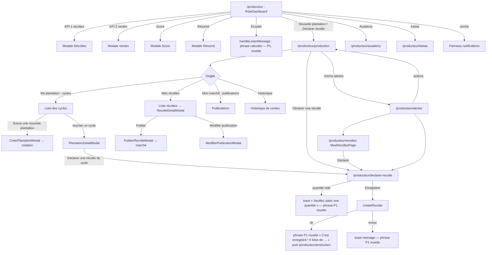
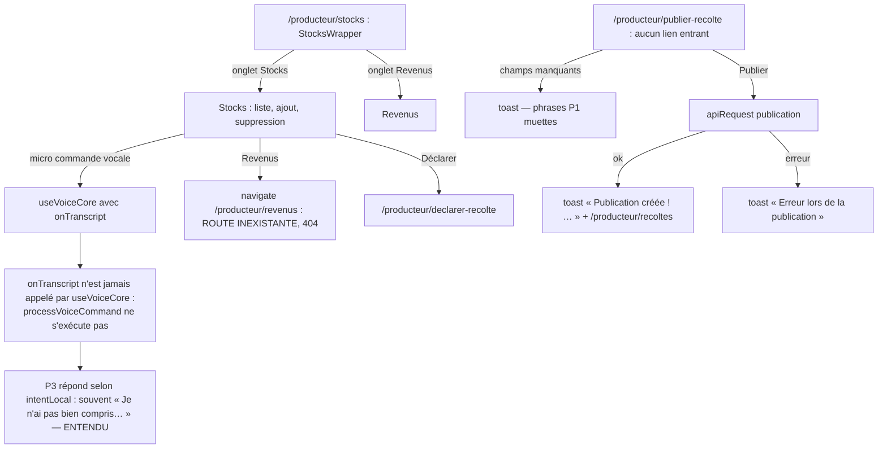
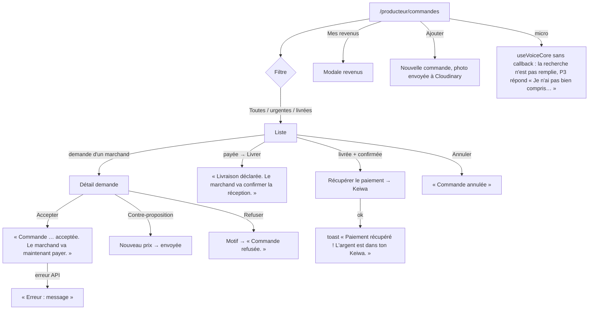

# 02 — Profil PRODUCTEUR

> Code de `main@9fb4655`, chemins relatifs à `frontend_src/src/app/`. **Règle de voix qui gouverne tout ce fichier** : le rôle `producteur` n'est pas `marchand`, donc `AppContext.speak` (P1) et `speakMessage` (P2) se taisent (`contexts/AppContext.tsx:729-730`). Les 94 appels vocaux des composants producteur passent tous par P1 : **aucun n'est entendu**. Seules parlent les instances `useVoiceCore` (P3 : `components/producteur/Stocks.tsx:359`, `components/producteur/CommandesProducteurPage.tsx:614`, et la modale Tantie `components/assistant/TantieSagesseModal.tsx:111`) — le producteur n'a pas `julaba_voice_disabled` (`AppContext.tsx:772`).

## Écrans

Barre basse : **Accueil · Production · Commandes · Moi** (`config/roleConfig.ts:170-173`). Accueil = `RoleDashboard` partagé (`components/shared/RoleDashboard.tsx`), actions principales « Nouvelle plantation » et « Déclarer récolte » qui mènent **toutes deux** à `/producteur/production` (`roleConfig.ts:191-204`).

| Route | Composant | Fichier | routes.tsx | Appels vocaux dans le fichier |
|---|---|---|---|---|
| `/producteur` | AppLayout (layout) | — | `routes.tsx:98` |  |
| `/producteur` | ProducteurHome | `frontend_src/src/app/components/producteur/ProducteurHome.tsx` | `routes.tsx:99` | 1 |
| `/producteur/production` | ProducteurProduction | `frontend_src/src/app/components/producteur/ProducteurProduction.tsx` | `routes.tsx:100` | 9 |
| `/producteur/commandes` | ProducteurCommandes | `frontend_src/src/app/components/producteur/CommandesProducteurPage.tsx` | `routes.tsx:101` | 26 |
| `/producteur/profil` | ProducteurMoi | `frontend_src/src/app/components/producteur/ProducteurMoi.tsx` | `routes.tsx:102` | 0 |
| `/producteur/declarer-recolte` | RecolteForm | `frontend_src/src/app/components/producteur/RecolteForm.tsx` | `routes.tsx:103` | 3 |
| `/producteur/recoltes` | MesRecoltesPage | `frontend_src/src/app/components/producteur/MesRecoltesPage.tsx` | `routes.tsx:104` | 1 |
| `/producteur/stocks` | StocksWrapper | `frontend_src/src/app/components/producteur/StocksWrapper.tsx` | `routes.tsx:105` | 0 |
| `/producteur/publier-recolte` | PublierRecolte | `frontend_src/src/app/components/producteur/PublierRecolte.tsx` | `routes.tsx:106` | 5 |
| `/producteur/academy` | UniversalAcademy | `frontend_src/src/app/components/academy/UniversalAcademy.tsx` | `routes.tsx:107` | 2 |
| `/producteur/keiwa` | WalletPage | `frontend_src/src/app/components/wallet/WalletPage.tsx` | `routes.tsx:108` | 0 |
| `/producteur/keiwa/transfert` | TransfertPage | `frontend_src/src/app/components/wallet/TransfertPage.tsx` | `routes.tsx:109` | 0 |
| `/producteur/keiwa/paiements` | PaiementsPage | `frontend_src/src/app/components/wallet/PaiementsPage.tsx` | `routes.tsx:110` | 0 |
| `/producteur/keiwa/banque` | BanquePage | `frontend_src/src/app/components/wallet/BanquePage.tsx` | `routes.tsx:111` | 0 |
| `/producteur/keiwa/carte` | CartePage | `frontend_src/src/app/components/wallet/CartePage.tsx` | `routes.tsx:112` | 0 |
| `/producteur/keiwa/historique` | HistoriquePage | `frontend_src/src/app/components/wallet/HistoriquePage.tsx` | `routes.tsx:113` | 0 |
| `/producteur/parametres` | ProducteurParametres | `frontend_src/src/app/components/producteur/ProducteurParametres.tsx` | `routes.tsx:114` | 0 |
| `/producteur/alertes` | ProducteurAlertes | `frontend_src/src/app/components/producteur/ProducteurAlertes.tsx` | `routes.tsx:115` | 2 |
| `/producteur/support` | SupportPage | `frontend_src/src/app/components/shared/SupportPage.tsx` | `routes.tsx:116` | 0 |

## Parcours P1 — Accueil, production, récoltes

Sources : `components/producteur/ProducteurHome.tsx:17-119` ; `components/producteur/ProducteurProduction.tsx:152,242-379,425,481-522,677-696,866` ; `components/producteur/RecolteForm.tsx:179-186,255-302` ; `components/producteur/MesRecoltesPage.tsx:154,238,317` ; `components/producteur/ProducteurAlertes.tsx:306-365,475` (météo `services/meteo.service.ts`).

## Parcours P2 — Stocks, revenus, publication

Sources : `components/producteur/StocksWrapper.tsx:48-49,127-128` ; `components/producteur/Stocks.tsx:210` (`processVoiceCommand`), `:359-366` (micro, `onTranscript`), `:551,561,610` ; `hooks/useVoiceCore.ts:88` (option `onTranscript` déclarée, jamais appelée dans le hook) ; `components/producteur/PublierRecolte.tsx:64-133` ; accès à `/producteur/stocks` seulement par lien de notification (`components/shared/NotificationToast.tsx:49`).

## Parcours P3 — Commandes (acheteurs, contre-propositions, livraison, paiement)

Sources : `components/producteur/CommandesProducteurPage.tsx:305-380` (actions et voix), `:500-520` (statuts), `:550-610` (ajout, Cloudinary `:557`), `:612-621` (micro, commentaire « STT via Groq Whisper » périmé), `:640-780,846-910,1019,1546-1674,2122-2130,2427`.

## Voix — synthèse pour le producteur

| Étape | Déclencheur | Phrase prévue par le code | Réellement entendu ? | Source |
|---|---|---|---|---|
| Accueil | bouton écouter | « Tu as N kilogrammes de production. Commence à vendre ! » / « Bravo ! Tu as N kilogrammes produits et M francs CFA de revenus » / « Bonjour {prénom} ! Crée ta première plantation agricole pour démarrer » | **non** (P1, S1) | `ProducteurHome.tsx:53-65` |
| Récolte, quantité vide | Enregistrer | « Dis-moi la quantité que tu as récoltée. » (commentaire : « voix : le producteur ne lit pas le bandeau ») | **non** | `RecolteForm.tsx:263` |
| Récolte enregistrée | succès | « C'est enregistré ! {kg} kilos de {culture}. » | **non** | `RecolteForm.tsx:294` |
| Onglets production | toucher | « Ma Plantation », « Mes récoltes », « Mon Marché », « Mon Historique de ventes » | **non** (clips `ui-070`, `ui-072`, `ui-079`, `ui-078` existent, non joués) | `ProducteurProduction.tsx:298-379` |
| Commande acceptée / refusée / livrée | actions | voir tableau mécanique ci-dessous | **non** | `CommandesProducteurPage.tsx` |
| Micro Stocks / Commandes | toucher le micro | réponses du moteur (« Je n'ai pas bien compris. Redis-moi ça autrement, s'il te plaît. », « Je n'ai rien entendu… », « La dictée n'est disponible que dans l'application… ») | **oui** (P3) | `useVoiceCore.ts:925-962` |
| Modale Tantie | suggestions « Ma récolte vaut combien ? », « Créer une plantation agricole »… | intentLocal ne comprend que vente / dépense / questions de caisse → « Je n'ai pas bien compris… » | **oui** (P3) | `TantieSagesseModal.tsx:36-43,111` |

## Annexe — Routes et appels vocaux (extraction mécanique)

#### `components/producteur/CommandesProducteurPage.tsx` — 26 appel(s) vocal(aux)

| Source | Appel | Phrase dite (texte exact / clé catalogue fr-ci) | Clip Tata au texte identique | Canal et condition |
|---|---|---|---|---|
| `frontend_src/src/app/components/producteur/CommandesProducteurPage.tsx:314` | `speak` | « Commande de ${cmd.acheteurId} acceptée. Le marchand va maintenant payer. » *(gabarit)* | — | AppContext.speak : dit SEULEMENT si rôle = marchand et non muet ; synthèse (jamais le clip ui-*) |
| `frontend_src/src/app/components/producteur/CommandesProducteurPage.tsx:318` | `speak` | « Erreur : ${e.message} » *(gabarit)* | — | AppContext.speak : dit SEULEMENT si rôle = marchand et non muet ; synthèse (jamais le clip ui-*) |
| `frontend_src/src/app/components/producteur/CommandesProducteurPage.tsx:328` | `speak` | « Commande refusée. » | `ui-013.mp3` | AppContext.speak : dit SEULEMENT si rôle = marchand et non muet ; synthèse (jamais le clip ui-*) |
| `frontend_src/src/app/components/producteur/CommandesProducteurPage.tsx:334` | `speak` | « Erreur : ${e.message} » *(gabarit)* | — | AppContext.speak : dit SEULEMENT si rôle = marchand et non muet ; synthèse (jamais le clip ui-*) |
| `frontend_src/src/app/components/producteur/CommandesProducteurPage.tsx:344` | `speak` | « Contre-proposition de ${(nouveauPrix \|\| 0).toLocaleString('fr-FR')} FCFA envoyée au marchand. » *(gabarit)* | — | AppContext.speak : dit SEULEMENT si rôle = marchand et non muet ; synthèse (jamais le clip ui-*) |
| `frontend_src/src/app/components/producteur/CommandesProducteurPage.tsx:351` | `speak` | « Erreur : ${e.message} » *(gabarit)* | — | AppContext.speak : dit SEULEMENT si rôle = marchand et non muet ; synthèse (jamais le clip ui-*) |
| `frontend_src/src/app/components/producteur/CommandesProducteurPage.tsx:360` | `speak` | « Livraison déclarée. Le marchand va confirmer la réception. » | `ui-069.mp3` | AppContext.speak : dit SEULEMENT si rôle = marchand et non muet ; synthèse (jamais le clip ui-*) |
| `frontend_src/src/app/components/producteur/CommandesProducteurPage.tsx:364` | `speak` | « Erreur : ${e.message} » *(gabarit)* | — | AppContext.speak : dit SEULEMENT si rôle = marchand et non muet ; synthèse (jamais le clip ui-*) |
| `frontend_src/src/app/components/producteur/CommandesProducteurPage.tsx:374` | `speak` | « Paiement récupéré ! L'argent est dans ton Keiwa. » | `ui-094.mp3` | AppContext.speak : dit SEULEMENT si rôle = marchand et non muet ; synthèse (jamais le clip ui-*) |
| `frontend_src/src/app/components/producteur/CommandesProducteurPage.tsx:379` | `speak` | « Erreur : ${e.message} » *(gabarit)* | — | AppContext.speak : dit SEULEMENT si rôle = marchand et non muet ; synthèse (jamais le clip ui-*) |
| `frontend_src/src/app/components/producteur/CommandesProducteurPage.tsx:512` | `speak` | « Commande mise à jour : ${statut} » *(gabarit)* | — | AppContext.speak : dit SEULEMENT si rôle = marchand et non muet ; synthèse (jamais le clip ui-*) |
| `frontend_src/src/app/components/producteur/CommandesProducteurPage.tsx:516` | `speak` | *(expression)* `` msg ? `Erreur : ${msg}` : 'Impossible de mettre à jour la commande' `` | — | AppContext.speak : dit SEULEMENT si rôle = marchand et non muet ; synthèse (jamais le clip ui-*) |
| `frontend_src/src/app/components/producteur/CommandesProducteurPage.tsx:602` | `speak` | « Commande de ${newForm.produit} ajoutée » *(gabarit)* | — | AppContext.speak : dit SEULEMENT si rôle = marchand et non muet ; synthèse (jamais le clip ui-*) |
| `frontend_src/src/app/components/producteur/CommandesProducteurPage.tsx:609` | `speak` | *(expression)* `` e?.message ? `Erreur : ${e.message}` : 'Impossible d\'ajouter la commande' `` | — | AppContext.speak : dit SEULEMENT si rôle = marchand et non muet ; synthèse (jamais le clip ui-*) |
| `frontend_src/src/app/components/producteur/CommandesProducteurPage.tsx:650` | `speak` | « Toutes les commandes » | `ui-124.mp3` | AppContext.speak : dit SEULEMENT si rôle = marchand et non muet ; synthèse (jamais le clip ui-*) |
| `frontend_src/src/app/components/producteur/CommandesProducteurPage.tsx:659` | `speak` | « Commandes urgentes » | `ui-015.mp3` | AppContext.speak : dit SEULEMENT si rôle = marchand et non muet ; synthèse (jamais le clip ui-*) |
| `frontend_src/src/app/components/producteur/CommandesProducteurPage.tsx:668` | `speak` | « Mes revenus » | `ui-071.mp3` | AppContext.speak : dit SEULEMENT si rôle = marchand et non muet ; synthèse (jamais le clip ui-*) |
| `frontend_src/src/app/components/producteur/CommandesProducteurPage.tsx:677` | `speak` | « Commandes livrées » | `ui-014.mp3` | AppContext.speak : dit SEULEMENT si rôle = marchand et non muet ; synthèse (jamais le clip ui-*) |
| `frontend_src/src/app/components/producteur/CommandesProducteurPage.tsx:775` | `speak` | « Demande de ${cmd.acheteurId} pour ${cmd.produit} » *(gabarit)* | — | AppContext.speak : dit SEULEMENT si rôle = marchand et non muet ; synthèse (jamais le clip ui-*) |
| `frontend_src/src/app/components/producteur/CommandesProducteurPage.tsx:1546` | `speak` | « Commande marquée comme livrée » | `ui-012.mp3` | AppContext.speak : dit SEULEMENT si rôle = marchand et non muet ; synthèse (jamais le clip ui-*) |
| `frontend_src/src/app/components/producteur/CommandesProducteurPage.tsx:1550` | `speak` | *(expression)* `` msg ? `Erreur : ${msg}` : 'Impossible de marquer comme livrée' `` | — | AppContext.speak : dit SEULEMENT si rôle = marchand et non muet ; synthèse (jamais le clip ui-*) |
| `frontend_src/src/app/components/producteur/CommandesProducteurPage.tsx:1649` | `speak` | « Commande annulée » | `ui-011.mp3` | AppContext.speak : dit SEULEMENT si rôle = marchand et non muet ; synthèse (jamais le clip ui-*) |
| `frontend_src/src/app/components/producteur/CommandesProducteurPage.tsx:1653` | `speak` | « Erreur : ${e.message} » *(gabarit)* | — | AppContext.speak : dit SEULEMENT si rôle = marchand et non muet ; synthèse (jamais le clip ui-*) |
| `frontend_src/src/app/components/producteur/CommandesProducteurPage.tsx:1670` | `speak` | « Commande annulée » | `ui-011.mp3` | AppContext.speak : dit SEULEMENT si rôle = marchand et non muet ; synthèse (jamais le clip ui-*) |
| `frontend_src/src/app/components/producteur/CommandesProducteurPage.tsx:1674` | `speak` | « Erreur : ${e.message} » *(gabarit)* | — | AppContext.speak : dit SEULEMENT si rôle = marchand et non muet ; synthèse (jamais le clip ui-*) |
| `frontend_src/src/app/components/producteur/CommandesProducteurPage.tsx:2428` | `speak` | « Paiement encaissé ! L'argent est dans ton Keiwa. » | — | AppContext.speak : dit SEULEMENT si rôle = marchand et non muet ; synthèse (jamais le clip ui-*) |

#### `components/producteur/CreerPlantationModal.tsx` — 7 appel(s) vocal(aux)

| Source | Appel | Phrase dite (texte exact / clé catalogue fr-ci) | Clip Tata au texte identique | Canal et condition |
|---|---|---|---|---|
| `frontend_src/src/app/components/producteur/CreerPlantationModal.tsx:57` | `speak` | « Choisis d'abord une culture. » | — | AppContext.speak : dit SEULEMENT si rôle = marchand et non muet ; synthèse (jamais le clip ui-*) |
| `frontend_src/src/app/components/producteur/CreerPlantationModal.tsx:62` | `speak` | « Dis-moi le nom de la culture. » | — | AppContext.speak : dit SEULEMENT si rôle = marchand et non muet ; synthèse (jamais le clip ui-*) |
| `frontend_src/src/app/components/producteur/CreerPlantationModal.tsx:78` | `speak` | « C'est fait ! Ta plantation est créée. » | — | AppContext.speak : dit SEULEMENT si rôle = marchand et non muet ; synthèse (jamais le clip ui-*) |
| `frontend_src/src/app/components/producteur/CreerPlantationModal.tsx:90` | `speak` | « Tu dois être connectée. Vérifie ton réseau et réessaie. » | — | AppContext.speak : dit SEULEMENT si rôle = marchand et non muet ; synthèse (jamais le clip ui-*) |
| `frontend_src/src/app/components/producteur/CreerPlantationModal.tsx:93` | `speak` | « Ça n'a pas marché. Réessaie, s'il te plaît. » | — | AppContext.speak : dit SEULEMENT si rôle = marchand et non muet ; synthèse (jamais le clip ui-*) |
| `frontend_src/src/app/components/producteur/CreerPlantationModal.tsx:154` | `speak` | *(expression)* `c.id` | — | AppContext.speak : dit SEULEMENT si rôle = marchand et non muet ; synthèse (jamais le clip ui-*) |
| `frontend_src/src/app/components/producteur/CreerPlantationModal.tsx:248` | `speak` | « ${mois} mois » *(gabarit)* | — | AppContext.speak : dit SEULEMENT si rôle = marchand et non muet ; synthèse (jamais le clip ui-*) |

#### `components/producteur/MesRecoltesPage.tsx` — 1 appel(s) vocal(aux)

| Source | Appel | Phrase dite (texte exact / clé catalogue fr-ci) | Clip Tata au texte identique | Canal et condition |
|---|---|---|---|---|
| `frontend_src/src/app/components/producteur/MesRecoltesPage.tsx:259` | `speak` | « ${recolte.produit}, ${Number(recolte.quantite).toLocaleString()} kg » *(gabarit)* | — | AppContext.speak : dit SEULEMENT si rôle = marchand et non muet ; synthèse (jamais le clip ui-*) |

#### `components/producteur/ModifierPublicationModal.tsx` — 5 appel(s) vocal(aux)

| Source | Appel | Phrase dite (texte exact / clé catalogue fr-ci) | Clip Tata au texte identique | Canal et condition |
|---|---|---|---|---|
| `frontend_src/src/app/components/producteur/ModifierPublicationModal.tsx:57` | `speak` | « Prix invalide » | `ui-099.mp3` | AppContext.speak : dit SEULEMENT si rôle = marchand et non muet ; synthèse (jamais le clip ui-*) |
| `frontend_src/src/app/components/producteur/ModifierPublicationModal.tsx:58` | `speak` | « Quantité invalide » | `ui-104.mp3` | AppContext.speak : dit SEULEMENT si rôle = marchand et non muet ; synthèse (jamais le clip ui-*) |
| `frontend_src/src/app/components/producteur/ModifierPublicationModal.tsx:61` | `speak` | « Modification en cours... » | `ui-075.mp3` | AppContext.speak : dit SEULEMENT si rôle = marchand et non muet ; synthèse (jamais le clip ui-*) |
| `frontend_src/src/app/components/producteur/ModifierPublicationModal.tsx:78` | `speak` | « Publication modifiée avec succès ! » | `ui-102.mp3` | AppContext.speak : dit SEULEMENT si rôle = marchand et non muet ; synthèse (jamais le clip ui-*) |
| `frontend_src/src/app/components/producteur/ModifierPublicationModal.tsx:84` | `speak` | « Erreur lors de la modification » | `ui-042.mp3` | AppContext.speak : dit SEULEMENT si rôle = marchand et non muet ; synthèse (jamais le clip ui-*) |

#### `components/producteur/PlantationDetailModal.tsx` — 1 appel(s) vocal(aux)

| Source | Appel | Phrase dite (texte exact / clé catalogue fr-ci) | Clip Tata au texte identique | Canal et condition |
|---|---|---|---|---|
| `frontend_src/src/app/components/producteur/PlantationDetailModal.tsx:55` | `speak` | « Détails de ta plantation de ${cycle.culture}. Progression ${Math.round(progressPercent)} pourcent. » *(gabarit)* | — | AppContext.speak : dit SEULEMENT si rôle = marchand et non muet ; synthèse (jamais le clip ui-*) |

#### `components/producteur/ProducteurAlertes.tsx` — 2 appel(s) vocal(aux)

| Source | Appel | Phrase dite (texte exact / clé catalogue fr-ci) | Clip Tata au texte identique | Canal et condition |
|---|---|---|---|---|
| `frontend_src/src/app/components/producteur/ProducteurAlertes.tsx:387` | `speak` | *(expression)* `resumeVocalMeteo(meteo)` | — | AppContext.speak : dit SEULEMENT si rôle = marchand et non muet ; synthèse (jamais le clip ui-*) |
| `frontend_src/src/app/components/producteur/ProducteurAlertes.tsx:466` | `speak` | « Alertes basses ignorées » | `ui-001.mp3` | AppContext.speak : dit SEULEMENT si rôle = marchand et non muet ; synthèse (jamais le clip ui-*) |

#### `components/producteur/ProducteurHome.tsx` — 1 appel(s) vocal(aux)

| Source | Appel | Phrase dite (texte exact / clé catalogue fr-ci) | Clip Tata au texte identique | Canal et condition |
|---|---|---|---|---|
| `frontend_src/src/app/components/producteur/ProducteurHome.tsx:64` | `speak` | *(expression)* `message` | — | AppContext.speak : dit SEULEMENT si rôle = marchand et non muet ; synthèse (jamais le clip ui-*) |

#### `components/producteur/ProducteurModals.tsx` — 2 appel(s) vocal(aux)

| Source | Appel | Phrase dite (texte exact / clé catalogue fr-ci) | Clip Tata au texte identique | Canal et condition |
|---|---|---|---|---|
| `frontend_src/src/app/components/producteur/ProducteurModals.tsx:385` | `speak` | « Création de plantation agricole » | `ui-021.mp3` | AppContext.speak : dit SEULEMENT si rôle = marchand et non muet ; synthèse (jamais le clip ui-*) |
| `frontend_src/src/app/components/producteur/ProducteurModals.tsx:447` | `speak` | « Déclaration de récolte » | `ui-030.mp3` | AppContext.speak : dit SEULEMENT si rôle = marchand et non muet ; synthèse (jamais le clip ui-*) |

#### `components/producteur/ProducteurProduction.tsx` — 9 appel(s) vocal(aux)

| Source | Appel | Phrase dite (texte exact / clé catalogue fr-ci) | Clip Tata au texte identique | Canal et condition |
|---|---|---|---|---|
| `frontend_src/src/app/components/producteur/ProducteurProduction.tsx:242` | `speak` | *(expression)* `f.label` | — | AppContext.speak : dit SEULEMENT si rôle = marchand et non muet ; synthèse (jamais le clip ui-*) |
| `frontend_src/src/app/components/producteur/ProducteurProduction.tsx:298` | `speak` | « Ma Plantation » | `ui-070.mp3` | AppContext.speak : dit SEULEMENT si rôle = marchand et non muet ; synthèse (jamais le clip ui-*) |
| `frontend_src/src/app/components/producteur/ProducteurProduction.tsx:325` | `speak` | « Mes récoltes » | `ui-072.mp3` | AppContext.speak : dit SEULEMENT si rôle = marchand et non muet ; synthèse (jamais le clip ui-*) |
| `frontend_src/src/app/components/producteur/ProducteurProduction.tsx:352` | `speak` | « Mon Marché » | `ui-079.mp3` | AppContext.speak : dit SEULEMENT si rôle = marchand et non muet ; synthèse (jamais le clip ui-*) |
| `frontend_src/src/app/components/producteur/ProducteurProduction.tsx:379` | `speak` | « Mon Historique de ventes » | `ui-078.mp3` | AppContext.speak : dit SEULEMENT si rôle = marchand et non muet ; synthèse (jamais le clip ui-*) |
| `frontend_src/src/app/components/producteur/ProducteurProduction.tsx:481` | `speak` | « Suivre une nouvelle plantation » | `ui-119.mp3` | AppContext.speak : dit SEULEMENT si rôle = marchand et non muet ; synthèse (jamais le clip ui-*) |
| `frontend_src/src/app/components/producteur/ProducteurProduction.tsx:522` | `speak` | « Détails de ta plantation de ${cycle.culture} » *(gabarit)* | — | AppContext.speak : dit SEULEMENT si rôle = marchand et non muet ; synthèse (jamais le clip ui-*) |
| `frontend_src/src/app/components/producteur/ProducteurProduction.tsx:683` | `speak` | « Détails de ${cycle?.culture \|\| 'la récolte'} » *(gabarit)* | — | AppContext.speak : dit SEULEMENT si rôle = marchand et non muet ; synthèse (jamais le clip ui-*) |
| `frontend_src/src/app/components/producteur/ProducteurProduction.tsx:695` | `speak` | « Déclarer une récolte » | `ui-031.mp3` | AppContext.speak : dit SEULEMENT si rôle = marchand et non muet ; synthèse (jamais le clip ui-*) |

#### `components/producteur/PublierRecolte.tsx` — 5 appel(s) vocal(aux)

| Source | Appel | Phrase dite (texte exact / clé catalogue fr-ci) | Clip Tata au texte identique | Canal et condition |
|---|---|---|---|---|
| `frontend_src/src/app/components/producteur/PublierRecolte.tsx:74` | `speak` | « Remplis tous les champs obligatoires » | `ui-107.mp3` | AppContext.speak : dit SEULEMENT si rôle = marchand et non muet ; synthèse (jamais le clip ui-*) |
| `frontend_src/src/app/components/producteur/PublierRecolte.tsx:78` | `speak` | « Le stock disponible ne peut pas dépasser la quantité totale de la récolte » | `ui-068.mp3` | AppContext.speak : dit SEULEMENT si rôle = marchand et non muet ; synthèse (jamais le clip ui-*) |
| `frontend_src/src/app/components/producteur/PublierRecolte.tsx:83` | `speak` | « Indique le nom du produit » | `ui-055.mp3` | AppContext.speak : dit SEULEMENT si rôle = marchand et non muet ; synthèse (jamais le clip ui-*) |
| `frontend_src/src/app/components/producteur/PublierRecolte.tsx:122` | `speak` | « Récolte de ${produitName} publiée avec succès sur le marché virtuel » *(gabarit)* | — | AppContext.speak : dit SEULEMENT si rôle = marchand et non muet ; synthèse (jamais le clip ui-*) |
| `frontend_src/src/app/components/producteur/PublierRecolte.tsx:134` | `speak` | « Erreur lors de la publication, réessaie » | `ui-044.mp3` | AppContext.speak : dit SEULEMENT si rôle = marchand et non muet ; synthèse (jamais le clip ui-*) |

#### `components/producteur/PublierRecolteModal.tsx` — 6 appel(s) vocal(aux)

| Source | Appel | Phrase dite (texte exact / clé catalogue fr-ci) | Clip Tata au texte identique | Canal et condition |
|---|---|---|---|---|
| `frontend_src/src/app/components/producteur/PublierRecolteModal.tsx:29` | `speak` | « La quantité doit être supérieure à zéro » | `ui-061.mp3` | AppContext.speak : dit SEULEMENT si rôle = marchand et non muet ; synthèse (jamais le clip ui-*) |
| `frontend_src/src/app/components/producteur/PublierRecolteModal.tsx:33` | `speak` | « La quantité ne peut pas dépasser le stock disponible de ${stockMax} » *(gabarit)* | — | AppContext.speak : dit SEULEMENT si rôle = marchand et non muet ; synthèse (jamais le clip ui-*) |
| `frontend_src/src/app/components/producteur/PublierRecolteModal.tsx:38` | `speak` | « Prix invalide » | `ui-099.mp3` | AppContext.speak : dit SEULEMENT si rôle = marchand et non muet ; synthèse (jamais le clip ui-*) |
| `frontend_src/src/app/components/producteur/PublierRecolteModal.tsx:43` | `speak` | « Publication en cours... » | `ui-101.mp3` | AppContext.speak : dit SEULEMENT si rôle = marchand et non muet ; synthèse (jamais le clip ui-*) |
| `frontend_src/src/app/components/producteur/PublierRecolteModal.tsx:59` | `speak` | « Récolte publiée avec succès ! » | `ui-113.mp3` | AppContext.speak : dit SEULEMENT si rôle = marchand et non muet ; synthèse (jamais le clip ui-*) |
| `frontend_src/src/app/components/producteur/PublierRecolteModal.tsx:63` | `speak` | « Erreur lors de la publication » | `ui-043.mp3` | AppContext.speak : dit SEULEMENT si rôle = marchand et non muet ; synthèse (jamais le clip ui-*) |

#### `components/producteur/RecolteDetailModal.tsx` — 2 appel(s) vocal(aux)

| Source | Appel | Phrase dite (texte exact / clé catalogue fr-ci) | Clip Tata au texte identique | Canal et condition |
|---|---|---|---|---|
| `frontend_src/src/app/components/producteur/RecolteDetailModal.tsx:322` | `speak` | « Modifier la récolte » | `ui-077.mp3` | AppContext.speak : dit SEULEMENT si rôle = marchand et non muet ; synthèse (jamais le clip ui-*) |
| `frontend_src/src/app/components/producteur/RecolteDetailModal.tsx:336` | `speak` | « Publication sur le marché en cours » | `ui-103.mp3` | AppContext.speak : dit SEULEMENT si rôle = marchand et non muet ; synthèse (jamais le clip ui-*) |

#### `components/producteur/RecolteForm.tsx` — 3 appel(s) vocal(aux)

| Source | Appel | Phrase dite (texte exact / clé catalogue fr-ci) | Clip Tata au texte identique | Canal et condition |
|---|---|---|---|---|
| `frontend_src/src/app/components/producteur/RecolteForm.tsx:263` | `speak` | « Dis-moi la quantité que tu as récoltée. » | — | AppContext.speak : dit SEULEMENT si rôle = marchand et non muet ; synthèse (jamais le clip ui-*) |
| `frontend_src/src/app/components/producteur/RecolteForm.tsx:294` | `speak` | « C'est enregistré ! ${quantiteEnKg} kilos de ${cultureName}. » *(gabarit)* | — | AppContext.speak : dit SEULEMENT si rôle = marchand et non muet ; synthèse (jamais le clip ui-*) |
| `frontend_src/src/app/components/producteur/RecolteForm.tsx:301` | `speak` | « Ça n'a pas marché. Réessaie, s'il te plaît. » | — | AppContext.speak : dit SEULEMENT si rôle = marchand et non muet ; synthèse (jamais le clip ui-*) |

#### `components/producteur/Revenus.tsx` — 1 appel(s) vocal(aux)

| Source | Appel | Phrase dite (texte exact / clé catalogue fr-ci) | Clip Tata au texte identique | Canal et condition |
|---|---|---|---|---|
| `frontend_src/src/app/components/producteur/Revenus.tsx:105` | `speak` | *(expression)* `` revenuTotal > 0 ? `Tu as gagné ${revenuTotal.toLocaleString('fr-FR')} francs en tout.` : "Tu n'as pas encore de revenu." `` | — | AppContext.speak : dit SEULEMENT si rôle = marchand et non muet ; synthèse (jamais le clip ui-*) |

#### `components/producteur/Stocks.tsx` — 23 appel(s) vocal(aux)

| Source | Appel | Phrase dite (texte exact / clé catalogue fr-ci) | Clip Tata au texte identique | Canal et condition |
|---|---|---|---|---|
| `frontend_src/src/app/components/producteur/Stocks.tsx:162` | `speak` | « Bienvenue ${user.prenoms} dans ta gestion de production. Je peux t'aider à gérer tes récoltes. Que veux-tu faire ? » *(gabarit)* | — | AppContext.speak : dit SEULEMENT si rôle = marchand et non muet ; synthèse (jamais le clip ui-*) |
| `frontend_src/src/app/components/producteur/Stocks.tsx:217` | `speak` | « D'accord ! Dis-moi ce que tu veux faire : ajouter une récolte, modifier une quantité, ou consulter ta production » | — | AppContext.speak : dit SEULEMENT si rôle = marchand et non muet ; synthèse (jamais le clip ui-*) |
| `frontend_src/src/app/components/producteur/Stocks.tsx:221` | `speak` | « D'accord ! Je reste là si tu as besoin » | — | AppContext.speak : dit SEULEMENT si rôle = marchand et non muet ; synthèse (jamais le clip ui-*) |
| `frontend_src/src/app/components/producteur/Stocks.tsx:245` | `speak` | « Parfait ! ${quantity} kg de ${name} ajouté à ta production » *(gabarit)* | — | AppContext.speak : dit SEULEMENT si rôle = marchand et non muet ; synthèse (jamais le clip ui-*) |
| `frontend_src/src/app/components/producteur/Stocks.tsx:250` | `speak` | « Production mise à jour ! ${stock.name} : ${stock.quantity + quantity} ${stock.unit} » *(gabarit)* | — | AppContext.speak : dit SEULEMENT si rôle = marchand et non muet ; synthèse (jamais le clip ui-*) |
| `frontend_src/src/app/components/producteur/Stocks.tsx:257` | `speak` | « D'accord, action annulée » | — | AppContext.speak : dit SEULEMENT si rôle = marchand et non muet ; synthèse (jamais le clip ui-*) |
| `frontend_src/src/app/components/producteur/Stocks.tsx:268` | `speak` | « Tu as ${stock.quantity} ${stock.unit} de ${stock.name} en stock » *(gabarit)* | — | AppContext.speak : dit SEULEMENT si rôle = marchand et non muet ; synthèse (jamais le clip ui-*) |
| `frontend_src/src/app/components/producteur/Stocks.tsx:271` | `speak` | « Je n'ai pas trouvé ce produit dans ta production » | — | AppContext.speak : dit SEULEMENT si rôle = marchand et non muet ; synthèse (jamais le clip ui-*) |
| `frontend_src/src/app/components/producteur/Stocks.tsx:279` | `speak` | « La valeur totale de ta production est de ${(totalValue \|\| 0).toLocaleString()} francs CFA » *(gabarit)* | — | AppContext.speak : dit SEULEMENT si rôle = marchand et non muet ; synthèse (jamais le clip ui-*) |
| `frontend_src/src/app/components/producteur/Stocks.tsx:285` | `speak` | « Tu as ${stocks.length} produits différents en production » *(gabarit)* | — | AppContext.speak : dit SEULEMENT si rôle = marchand et non muet ; synthèse (jamais le clip ui-*) |
| `frontend_src/src/app/components/producteur/Stocks.tsx:293` | `speak` | « Toute ta production est au-dessus du seuil. Tout va bien ! » | `ui-123.mp3` | AppContext.speak : dit SEULEMENT si rôle = marchand et non muet ; synthèse (jamais le clip ui-*) |
| `frontend_src/src/app/components/producteur/Stocks.tsx:295` | `speak` | « Tu as ${lowStocks.length} produits en stock bas : ${lowStocks.map(s => s.name).join(', ')} » *(gabarit)* | — | AppContext.speak : dit SEULEMENT si rôle = marchand et non muet ; synthèse (jamais le clip ui-*) |
| `frontend_src/src/app/components/producteur/Stocks.tsx:307` | `speak` | « Tu veux ajouter ${quantity} ${stock.unit} de ${stock.name} à ta production actuelle de ${stock.quantity} ${stock.unit}. Je confirme ? » *(gabarit)* | — | AppContext.speak : dit SEULEMENT si rôle = marchand et non muet ; synthèse (jamais le clip ui-*) |
| `frontend_src/src/app/components/producteur/Stocks.tsx:315` | `speak` | « Tu veux ajouter ${quantity} kg de ${productName} à ta production. Je confirme ? » *(gabarit)* | — | AppContext.speak : dit SEULEMENT si rôle = marchand et non muet ; synthèse (jamais le clip ui-*) |
| `frontend_src/src/app/components/producteur/Stocks.tsx:326` | `speak` | « Voici tes légumes en production » | `ui-133.mp3` | AppContext.speak : dit SEULEMENT si rôle = marchand et non muet ; synthèse (jamais le clip ui-*) |
| `frontend_src/src/app/components/producteur/Stocks.tsx:330` | `speak` | « Voici tes fruits en production » | `ui-132.mp3` | AppContext.speak : dit SEULEMENT si rôle = marchand et non muet ; synthèse (jamais le clip ui-*) |
| `frontend_src/src/app/components/producteur/Stocks.tsx:334` | `speak` | « Voici tes céréales en production » | `ui-131.mp3` | AppContext.speak : dit SEULEMENT si rôle = marchand et non muet ; synthèse (jamais le clip ui-*) |
| `frontend_src/src/app/components/producteur/Stocks.tsx:338` | `speak` | « Voici tes tubercules en production » | `ui-134.mp3` | AppContext.speak : dit SEULEMENT si rôle = marchand et non muet ; synthèse (jamais le clip ui-*) |
| `frontend_src/src/app/components/producteur/Stocks.tsx:342` | `speak` | « Voici tous tes produits en production » | `ui-135.mp3` | AppContext.speak : dit SEULEMENT si rôle = marchand et non muet ; synthèse (jamais le clip ui-*) |
| `frontend_src/src/app/components/producteur/Stocks.tsx:351` | `speak` | « Voici ${stock.name} » *(gabarit)* | — | AppContext.speak : dit SEULEMENT si rôle = marchand et non muet ; synthèse (jamais le clip ui-*) |
| `frontend_src/src/app/components/producteur/Stocks.tsx:355` | `speak` | « Je n'ai pas compris. Demande-moi d'ajouter une récolte, de consulter ta production, ou de filtrer par catégorie » | — | AppContext.speak : dit SEULEMENT si rôle = marchand et non muet ; synthèse (jamais le clip ui-*) |
| `frontend_src/src/app/components/producteur/Stocks.tsx:457` | `speak` | « ${newStock.name} ajouté avec succès » *(gabarit)* | — | AppContext.speak : dit SEULEMENT si rôle = marchand et non muet ; synthèse (jamais le clip ui-*) |
| `frontend_src/src/app/components/producteur/Stocks.tsx:486` | `speak` | « ${stock?.name} supprimé de la production » *(gabarit)* | — | AppContext.speak : dit SEULEMENT si rôle = marchand et non muet ; synthèse (jamais le clip ui-*) |
