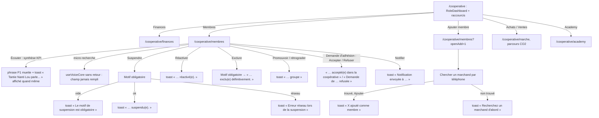
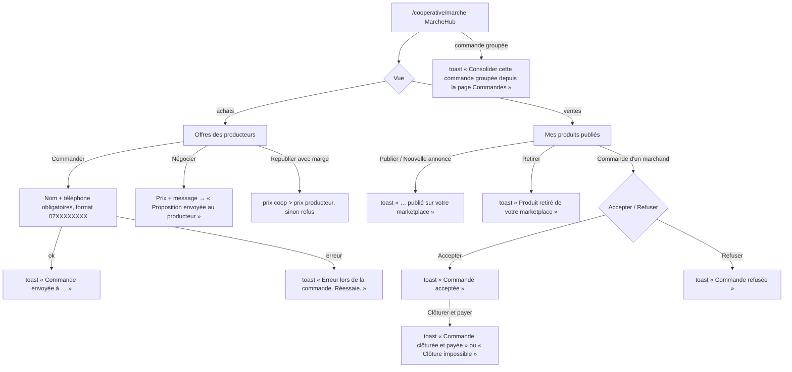
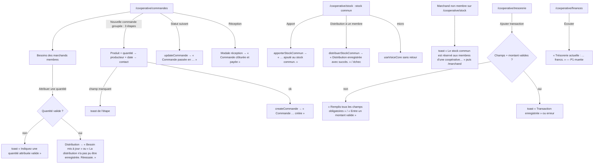

# 03 — Profil COOPÉRATIVE (rôle base `cooperateur`, rôle interface `cooperative`)

> Code de `main@9fb4655`, chemins relatifs à `frontend_src/src/app/`. Normalisation `cooperateur → cooperative` : `types/constants.ts:28-32`. **Voix** : rôle ≠ `marchand` ⇒ les 24 appels P1 des écrans coopérative sont muets (`contexts/AppContext.tsx:729-730`) — **sauf** quand c'est un *marchand membre* qui ouvre `/cooperative/stock` (accès croisé `types/constants.ts:128-130`) : là, les phrases de `Stock.tsx` sont dites. Trois micros de recherche (`Membres.tsx:381`, `MarcheHub.tsx:872`, `Stock.tsx:147`) montent `useVoiceCore` avec `onTranscript`, option **jamais appelée** par le hook (`hooks/useVoiceCore.ts:88`) : la recherche n'est jamais remplie ; le moteur (P3) répond lui-même, à voix haute.

## Écrans

Barre basse : **Accueil · Marché · Membres · Moi** (`config/roleConfig.ts:236-239`) ; actions principales de l'accueil vers `/cooperative/marche` (`roleConfig.ts:255-270`, avec `state.vue = achats | ventes`, `components/shared/RoleDashboard.tsx:578-644`).

| Route | Composant | Fichier | routes.tsx | Appels vocaux dans le fichier |
|---|---|---|---|---|
| `/cooperative` | AppLayout (layout) | — | `routes.tsx:119` |  |
| `/cooperative` | CooperativeHome | `frontend_src/src/app/components/cooperative/CooperativeHome.tsx` | `routes.tsx:120` | 1 |
| `/cooperative/membres` | Membres | `frontend_src/src/app/components/cooperative/Membres.tsx` | `routes.tsx:121` | 6 |
| `/cooperative/finances` | FinancesCooperative | `frontend_src/src/app/components/cooperative/FinancesCooperative.tsx` | `routes.tsx:122` | 1 |
| `/cooperative/profil` | CooperativeProfil | `frontend_src/src/app/components/cooperative/CooperativeProfil.tsx` | `routes.tsx:123` | 0 |
| `/cooperative/stock` | Stock | `frontend_src/src/app/components/cooperative/Stock.tsx` | `routes.tsx:124` | 3 |
| `/cooperative/tresorerie` | TresorerieCooperative | `frontend_src/src/app/components/cooperative/TresorerieCooperative.tsx` | `routes.tsx:125` | 3 |
| `/cooperative/marche` | MarcheHub | `frontend_src/src/app/components/cooperative/MarcheHub.tsx` | `routes.tsx:126` | 5 |
| `/cooperative/commandes` | Commandes | `frontend_src/src/app/components/cooperative/Commandes.tsx` | `routes.tsx:127` | 5 |
| `/cooperative/academy` | UniversalAcademy | `frontend_src/src/app/components/academy/UniversalAcademy.tsx` | `routes.tsx:128` | 2 |
| `/cooperative/keiwa` | WalletPage | `frontend_src/src/app/components/wallet/WalletPage.tsx` | `routes.tsx:129` | 0 |
| `/cooperative/keiwa/transfert` | TransfertPage | `frontend_src/src/app/components/wallet/TransfertPage.tsx` | `routes.tsx:130` | 0 |
| `/cooperative/keiwa/paiements` | PaiementsPage | `frontend_src/src/app/components/wallet/PaiementsPage.tsx` | `routes.tsx:131` | 0 |
| `/cooperative/keiwa/banque` | BanquePage | `frontend_src/src/app/components/wallet/BanquePage.tsx` | `routes.tsx:132` | 0 |
| `/cooperative/keiwa/carte` | CartePage | `frontend_src/src/app/components/wallet/CartePage.tsx` | `routes.tsx:133` | 0 |
| `/cooperative/keiwa/historique` | HistoriquePage | `frontend_src/src/app/components/wallet/HistoriquePage.tsx` | `routes.tsx:134` | 0 |
| `/cooperative/parametres` | CooperativeParametres | `frontend_src/src/app/components/cooperative/CooperativeParametres.tsx` | `routes.tsx:135` | 0 |
| `/cooperative/support` | SupportPage | `frontend_src/src/app/components/shared/SupportPage.tsx` | `routes.tsx:136` | 0 |

## Parcours CO1 — Accueil et membres

Sources : `components/cooperative/CooperativeHome.tsx:59,107-115,159` ; `components/cooperative/Membres.tsx:274-286,381-395,398-611,980-1008,1715`.

## Parcours CO2 — Marché (achats aux producteurs, ventes aux marchands)

Sources : `components/cooperative/MarcheHub.tsx:872-1004` (micro, commandes, retrait, acceptation, clôture), `:1368`, `:1445,1633-1754,1934,2067-2116,2282`.

## Parcours CO3 — Commandes groupées, besoins des marchands, stock commun, trésorerie

Sources : `components/cooperative/Commandes.tsx:172-386,551,888,1205-1206,1363-1364` ; `components/cooperative/Stock.tsx:99,147-233,357` (API `services/api/cooperatives-api.ts`) ; refus d'accès croisé `components/layout/AppLayout.tsx:62-69` ; `components/cooperative/TresorerieCooperative.tsx:96-137,261-277` ; `components/cooperative/FinancesCooperative.tsx:85,249,495,575`.

## Voix — synthèse

| Étape | Déclencheur | Phrase prévue | Entendue ? | Source |
|---|---|---|---|---|
| Membres, écouter | bouton haut-parleur | « Vous avez {actifs} membres actifs, {suspendus} suspendus, et {enAttente} en attente de confirmation. Le volume total ce {mois/an/historique} est de {x} millions de francs CFA. » + toast « Tantie Nanti Lou parle... » | **non** (P1) — le toast affirme le contraire | `Membres.tsx:391-395` |
| Actions membres, marché, commandes, trésorerie | voir tableau mécanique | — | **non** pour un responsable de coopérative ; **oui** sur `/cooperative/stock` pour un marchand membre | — |
| Micros de recherche | toucher | réponses P3 du moteur (« Je n'ai pas bien compris… », « Je n'ai rien entendu… », dictée web indisponible) | **oui** | `useVoiceCore.ts:925-962` |

## Annexe — Routes et appels vocaux (extraction mécanique)

#### `components/cooperative/Commandes.tsx` — 5 appel(s) vocal(aux)

| Source | Appel | Phrase dite (texte exact / clé catalogue fr-ci) | Clip Tata au texte identique | Canal et condition |
|---|---|---|---|---|
| `frontend_src/src/app/components/cooperative/Commandes.tsx:296` | `speak` | « La distribution n'a pas marché. Réessaie, s'il te plaît. » | — | AppContext.speak : dit SEULEMENT si rôle = marchand et non muet ; synthèse (jamais le clip ui-*) |
| `frontend_src/src/app/components/cooperative/Commandes.tsx:300` | `speak` | « Besoin mis à jour. » | `ui-003.mp3` | AppContext.speak : dit SEULEMENT si rôle = marchand et non muet ; synthèse (jamais le clip ui-*) |
| `frontend_src/src/app/components/cooperative/Commandes.tsx:358` | `speak` | « Commande groupée pour ${newProduit} créée. » *(gabarit)* | — | AppContext.speak : dit SEULEMENT si rôle = marchand et non muet ; synthèse (jamais le clip ui-*) |
| `frontend_src/src/app/components/cooperative/Commandes.tsx:383` | `speak` | « Statut mis à jour : ${STATUT_CONFIG[nextStatut].label} » *(gabarit)* | — | AppContext.speak : dit SEULEMENT si rôle = marchand et non muet ; synthèse (jamais le clip ui-*) |
| `frontend_src/src/app/components/cooperative/Commandes.tsx:1364` | `speak` | « C'est fait ! La commande est clôturée et payée. » | — | AppContext.speak : dit SEULEMENT si rôle = marchand et non muet ; synthèse (jamais le clip ui-*) |

#### `components/cooperative/CooperativeHome.tsx` — 1 appel(s) vocal(aux)

| Source | Appel | Phrase dite (texte exact / clé catalogue fr-ci) | Clip Tata au texte identique | Canal et condition |
|---|---|---|---|---|
| `frontend_src/src/app/components/cooperative/CooperativeHome.tsx:59` | `speak` | *(expression)* `message` | — | AppContext.speak : dit SEULEMENT si rôle = marchand et non muet ; synthèse (jamais le clip ui-*) |

#### `components/cooperative/FinancesCooperative.tsx` — 1 appel(s) vocal(aux)

| Source | Appel | Phrase dite (texte exact / clé catalogue fr-ci) | Clip Tata au texte identique | Canal et condition |
|---|---|---|---|---|
| `frontend_src/src/app/components/cooperative/FinancesCooperative.tsx:249` | `speak` | « Trésorerie actuelle : ${(soldeActuel \|\| 0).toLocaleString('fr-FR')} francs. » *(gabarit)* | — | AppContext.speak : dit SEULEMENT si rôle = marchand et non muet ; synthèse (jamais le clip ui-*) |

#### `components/cooperative/MarcheHub.tsx` — 5 appel(s) vocal(aux)

| Source | Appel | Phrase dite (texte exact / clé catalogue fr-ci) | Clip Tata au texte identique | Canal et condition |
|---|---|---|---|---|
| `frontend_src/src/app/components/cooperative/MarcheHub.tsx:936` | `speak` | « Commande de ${modalCommande.produit} envoyée. » *(gabarit)* | — | AppContext.speak : dit SEULEMENT si rôle = marchand et non muet ; synthèse (jamais le clip ui-*) |
| `frontend_src/src/app/components/cooperative/MarcheHub.tsx:954` | `speak` | « Le produit a été retiré de votre marketplace. » | `ui-067.mp3` | AppContext.speak : dit SEULEMENT si rôle = marchand et non muet ; synthèse (jamais le clip ui-*) |
| `frontend_src/src/app/components/cooperative/MarcheHub.tsx:968` | `speak` | « La commande du marchand a été acceptée. » | `ui-060.mp3` | AppContext.speak : dit SEULEMENT si rôle = marchand et non muet ; synthèse (jamais le clip ui-*) |
| `frontend_src/src/app/components/cooperative/MarcheHub.tsx:1634` | `speak` | « ${produitAPublier.produit} est maintenant visible par tous les marchands. » *(gabarit)* | — | AppContext.speak : dit SEULEMENT si rôle = marchand et non muet ; synthèse (jamais le clip ui-*) |
| `frontend_src/src/app/components/cooperative/MarcheHub.tsx:1692` | `speak` | « ${produit.produit} est maintenant visible par tous les marchands. » *(gabarit)* | — | AppContext.speak : dit SEULEMENT si rôle = marchand et non muet ; synthèse (jamais le clip ui-*) |

#### `components/cooperative/Membres.tsx` — 6 appel(s) vocal(aux)

| Source | Appel | Phrase dite (texte exact / clé catalogue fr-ci) | Clip Tata au texte identique | Canal et condition |
|---|---|---|---|---|
| `frontend_src/src/app/components/cooperative/Membres.tsx:393` | `speak` | *(expression)* `msg` | — | AppContext.speak : dit SEULEMENT si rôle = marchand et non muet ; synthèse (jamais le clip ui-*) |
| `frontend_src/src/app/components/cooperative/Membres.tsx:418` | `speak` | « ${selectedMembre?.prenom} ${selectedMembre?.nom} a été suspendu. Une notification a été envoyée. » *(gabarit)* | — | AppContext.speak : dit SEULEMENT si rôle = marchand et non muet ; synthèse (jamais le clip ui-*) |
| `frontend_src/src/app/components/cooperative/Membres.tsx:449` | `speak` | « ${m.prenom} ${m.nom} a été réactivé » *(gabarit)* | — | AppContext.speak : dit SEULEMENT si rôle = marchand et non muet ; synthèse (jamais le clip ui-*) |
| `frontend_src/src/app/components/cooperative/Membres.tsx:484` | `speak` | « ${selectedMembre?.prenom} a été exclu définitivement de la coopérative » *(gabarit)* | — | AppContext.speak : dit SEULEMENT si rôle = marchand et non muet ; synthèse (jamais le clip ui-*) |
| `frontend_src/src/app/components/cooperative/Membres.tsx:523` | `speak` | « ${m.prenom} ${m.nom} a rejoint la coopérative » *(gabarit)* | — | AppContext.speak : dit SEULEMENT si rôle = marchand et non muet ; synthèse (jamais le clip ui-*) |
| `frontend_src/src/app/components/cooperative/Membres.tsx:537` | `speak` | « La demande de ${m.prenom} ${m.nom} a été refusée » *(gabarit)* | — | AppContext.speak : dit SEULEMENT si rôle = marchand et non muet ; synthèse (jamais le clip ui-*) |

#### `components/cooperative/Stock.tsx` — 3 appel(s) vocal(aux)

| Source | Appel | Phrase dite (texte exact / clé catalogue fr-ci) | Clip Tata au texte identique | Canal et condition |
|---|---|---|---|---|
| `frontend_src/src/app/components/cooperative/Stock.tsx:188` | `speak` | « ${produit} ajouté au stock commun. » *(gabarit)* | — | AppContext.speak : dit SEULEMENT si rôle = marchand et non muet ; synthèse (jamais le clip ui-*) |
| `frontend_src/src/app/components/cooperative/Stock.tsx:229` | `speak` | « La distribution n'a pas marché. Réessaie, s'il te plaît. » | — | AppContext.speak : dit SEULEMENT si rôle = marchand et non muet ; synthèse (jamais le clip ui-*) |
| `frontend_src/src/app/components/cooperative/Stock.tsx:233` | `speak` | « Distribution enregistrée avec succès. » | — | AppContext.speak : dit SEULEMENT si rôle = marchand et non muet ; synthèse (jamais le clip ui-*) |

#### `components/cooperative/TresorerieCooperative.tsx` — 3 appel(s) vocal(aux)

| Source | Appel | Phrase dite (texte exact / clé catalogue fr-ci) | Clip Tata au texte identique | Canal et condition |
|---|---|---|---|---|
| `frontend_src/src/app/components/cooperative/TresorerieCooperative.tsx:96` | `speak` | « Remplis tous les champs obligatoires » | `ui-107.mp3` | AppContext.speak : dit SEULEMENT si rôle = marchand et non muet ; synthèse (jamais le clip ui-*) |
| `frontend_src/src/app/components/cooperative/TresorerieCooperative.tsx:102` | `speak` | « Entre un montant valide » | `ui-036.mp3` | AppContext.speak : dit SEULEMENT si rôle = marchand et non muet ; synthèse (jamais le clip ui-*) |
| `frontend_src/src/app/components/cooperative/TresorerieCooperative.tsx:125` | `speak` | « Transaction ${typeTransaction === 'entree' ? 'entrée' : 'sortie'} de ${(montant \|\| 0).toLocaleString()} francs CFA enregistrée » *(gabarit)* | — | AppContext.speak : dit SEULEMENT si rôle = marchand et non muet ; synthèse (jamais le clip ui-*) |
