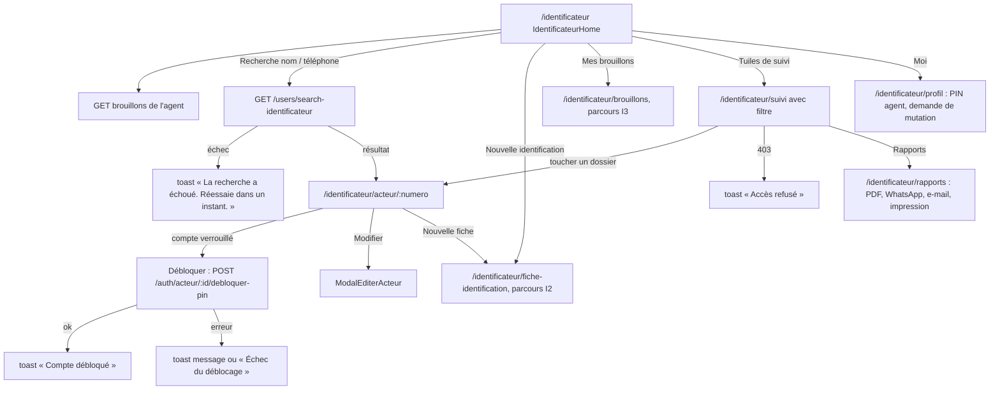
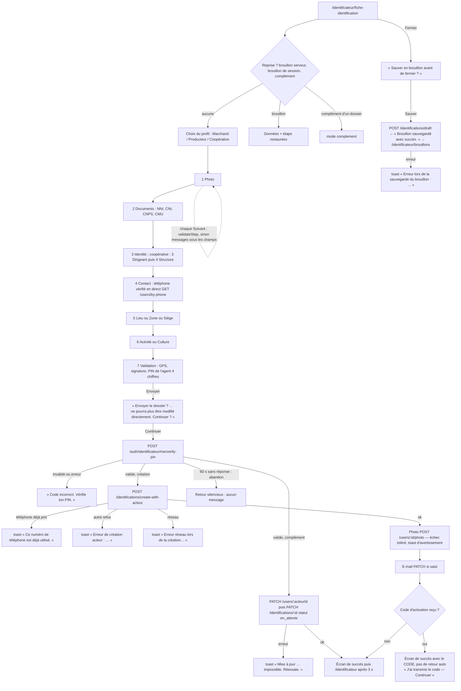
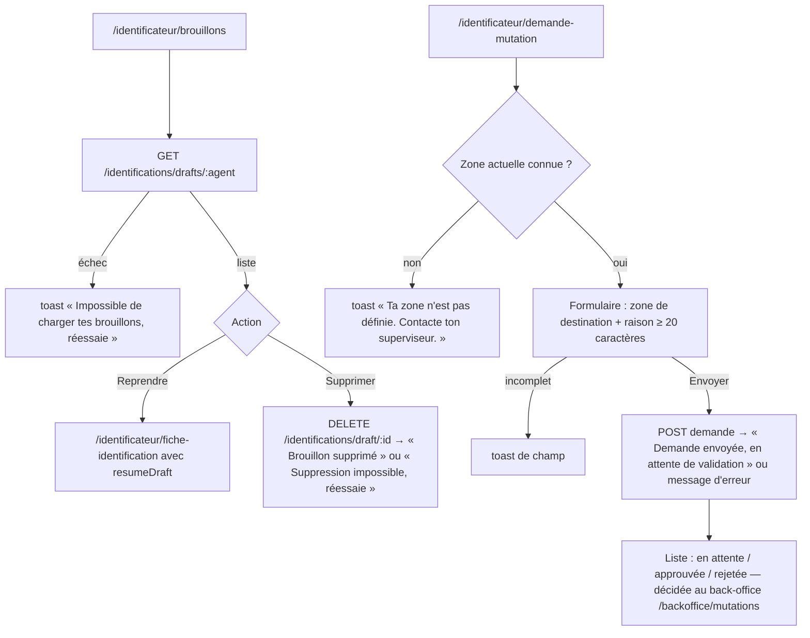

# 04 — Profil IDENTIFICATEUR (agent terrain)

> Code de `main@9fb4655`, chemins relatifs à `frontend_src/src/app/`. **Voix : aucune.** Les 16 composants `components/identificateur/` ne contiennent aucun appel vocal (extraction mécanique : 0) ; le rôle reçoit `julaba_voice_disabled` (`contexts/AppContext.tsx:772-782`) qui coupe aussi `useVoiceCore` ; et `IdentificateurLayout` ne monte pas la modale Tantie. Toutes les informations, erreurs comprises, sont **écrites** (toasts, messages de champ).

**Garde d'accès** : `IdentificateurLayout` (`components/identificateur/IdentificateurLayout.tsx`) ne vérifie **ni l'authentification ni le rôle** (contrairement à `AppLayout.tsx:47-71` et `InstitutionLayout.tsx:318`). Toute personne qui saisit `/identificateur/...` voit les écrans ; seules les réponses serveur (401/403) la bloquent ensuite.

## Écrans

Barre basse : **Accueil · Acteurs · Suivi · Moi** (`config/roleConfig.ts:368-371`) — « Acteurs » mène à `/identificateur/identifications`, « Suivi » mène à `/identificateur/rapports` (et non à `/identificateur/suivi`). Masquée sur la fiche (`IdentificateurLayout.tsx:16`). Routes sans lien entrant trouvé : `/identificateur/acteurs`, `/identificateur/statistiques`, `/identificateur/dashboard` (recherche de chaînes dans tout le code).

| Route | Composant | Fichier | routes.tsx | Appels vocaux dans le fichier |
|---|---|---|---|---|
| `/identificateur` | IdentificateurLayout (layout) | — | `routes.tsx:163` |  |
| `/identificateur` | IdentificateurHome | `frontend_src/src/app/components/identificateur/IdentificateurHome.tsx` | `routes.tsx:164` | 0 |
| `/identificateur/identification` | FicheIdentificationDynamique | `frontend_src/src/app/components/identificateur/FicheIdentificationDynamique.tsx` | `routes.tsx:165` | 0 |
| `/identificateur/suivi` | SuiviIdentifications | `frontend_src/src/app/components/identificateur/SuiviIdentifications.tsx` | `routes.tsx:166` | 0 |
| `/identificateur/brouillons` | MesBrouillons | `frontend_src/src/app/components/identificateur/MesBrouillons.tsx` | `routes.tsx:167` | 0 |
| `/identificateur/acteurs` | Identifications | `frontend_src/src/app/components/identificateur/Identifications.tsx` | `routes.tsx:168` | 0 |
| `/identificateur/profil` | IdentificateurProfil | `frontend_src/src/app/components/identificateur/IdentificateurProfil.tsx` | `routes.tsx:169` | 0 |
| `/identificateur/acteur/:numero` | ActeurDetails | `frontend_src/src/app/components/identificateur/ActeurDetails.tsx` | `routes.tsx:170` | 0 |
| `/identificateur/demande-mutation` | DemandeMutation | `frontend_src/src/app/components/identificateur/DemandeMutation.tsx` | `routes.tsx:171` | 0 |
| `/identificateur/identifications` | Identifications | `frontend_src/src/app/components/identificateur/Identifications.tsx` | `routes.tsx:172` | 0 |
| `/identificateur/statistiques` | IdentificateurStats | `frontend_src/src/app/components/identificateur/IdentificateurStats.tsx` | `routes.tsx:173` | 0 |
| `/identificateur/rapports` | RapportsIdentificateur | `frontend_src/src/app/components/identificateur/RapportsIdentificateur.tsx` | `routes.tsx:174` | 0 |
| `/identificateur/dashboard` | IdentificateurDashboard | `frontend_src/src/app/components/identificateur/IdentificateurDashboard.tsx` | `routes.tsx:175` | 0 |
| `/identificateur/fiche-identification` | FicheIdentificationDynamique | `frontend_src/src/app/components/identificateur/FicheIdentificationDynamique.tsx` | `routes.tsx:176` | 0 |
| `/identificateur/academy` | UniversalAcademy | `frontend_src/src/app/components/academy/UniversalAcademy.tsx` | `routes.tsx:177` | 2 |
| `/identificateur/keiwa` | WalletPage | `frontend_src/src/app/components/wallet/WalletPage.tsx` | `routes.tsx:178` | 0 |
| `/identificateur/keiwa/transfert` | TransfertPage | `frontend_src/src/app/components/wallet/TransfertPage.tsx` | `routes.tsx:179` | 0 |
| `/identificateur/keiwa/paiements` | PaiementsPage | `frontend_src/src/app/components/wallet/PaiementsPage.tsx` | `routes.tsx:180` | 0 |
| `/identificateur/keiwa/banque` | BanquePage | `frontend_src/src/app/components/wallet/BanquePage.tsx` | `routes.tsx:181` | 0 |
| `/identificateur/keiwa/carte` | CartePage | `frontend_src/src/app/components/wallet/CartePage.tsx` | `routes.tsx:182` | 0 |
| `/identificateur/keiwa/historique` | HistoriquePage | `frontend_src/src/app/components/wallet/HistoriquePage.tsx` | `routes.tsx:183` | 0 |
| `/identificateur/parametres` | IdentificateurParametres | `frontend_src/src/app/components/identificateur/IdentificateurParametres.tsx` | `routes.tsx:184` | 0 |
| `/identificateur/support` | SupportPage | `frontend_src/src/app/components/shared/SupportPage.tsx` | `routes.tsx:185` | 0 |

## Parcours I1 — Accueil de l'agent

Sources : `components/identificateur/IdentificateurHome.tsx:52,139-204,333` ; `components/identificateur/SuiviIdentifications.tsx:183,255,476,907` ; `components/identificateur/ActeurDetails.tsx:405-424,692,707` (déblocage du verrou de connexion des marchandes : c'est l'issue humaine du verrou décrit dans `00-entree-auth.md` C) ; `components/identificateur/RapportsIdentificateur.tsx:340-508`.

## Parcours I2 — Fiche d'identification (7 étapes, 8 pour une coopérative)

Sources (`components/identificateur/FicheIdentificationDynamique.tsx`) : configuration des étapes `:55-125` (marchand `:72-78`, producteur `:93-99`, coopérative `:114-121`) ; restauration `:845-1000` (complément `sessionStorage complement_dossier` `:847-858`, brouillon de session `:977-1000`, sauvegarde auto 500 ms `:1006-1023`) ; vérification du téléphone `:1050-1080` ; `validateStep` `:1380-1490` (finalisation `:1480-1487`) ; navigation d'étapes `:1492-1510` ; brouillon serveur `:1539-1611` ; soumission `:1615-1955` (PIN `:1634-1661`, complément `:1677-1766`, création `:1768-1872`, photo `:1874-1902`, succès `:1920-1947`, abandon silencieux sur `AbortError` `:1645,1715,1743,1843,1868,1950` avec minuteur 60 s `:1629`) ; choix du profil `:1958-1965` ; écran de succès `:2061-2250` (code `:2115`) ; confirmation `:2598-2631` ; fermeture `:2714`. Complément lancé depuis `components/shared/FicheActeurDetailModal.tsx:405-420` après PIN agent `:441-520`.

## Parcours I3 — Brouillons et mutation

Sources : `components/identificateur/MesBrouillons.tsx:196-290` ; `components/identificateur/DemandeMutation.tsx:28-33,78,118-160,292,321-324`.

## Voix — identificateur

| Étape | Déclencheur | Phrase dite | Texte affiché | Condition |
|---|---|---|---|---|
| Tous les écrans | — | **aucune** | toasts et messages de champ cités dans les diagrammes | 0 appel vocal (`components/identificateur/`), `julaba_voice_disabled` |

Les clips `ui-038.mp3` (« Erreur de synchronisation. Fiche sauvegardée localement. »), `ui-050`/`ui-051` (« Fiche mise à jour [et synchronisée] »), `ui-053` (« Identité mise à jour »), `ui-056` (« Informations personnelles enregistrées avec succès ») ont été enregistrés pour ce métier et ne sont joués par aucun chemin ([`annexe-clips.md`](annexe-clips.md)) ; il n'existe d'ailleurs **aucune file hors ligne** pour la fiche (brouillon de session seulement).
