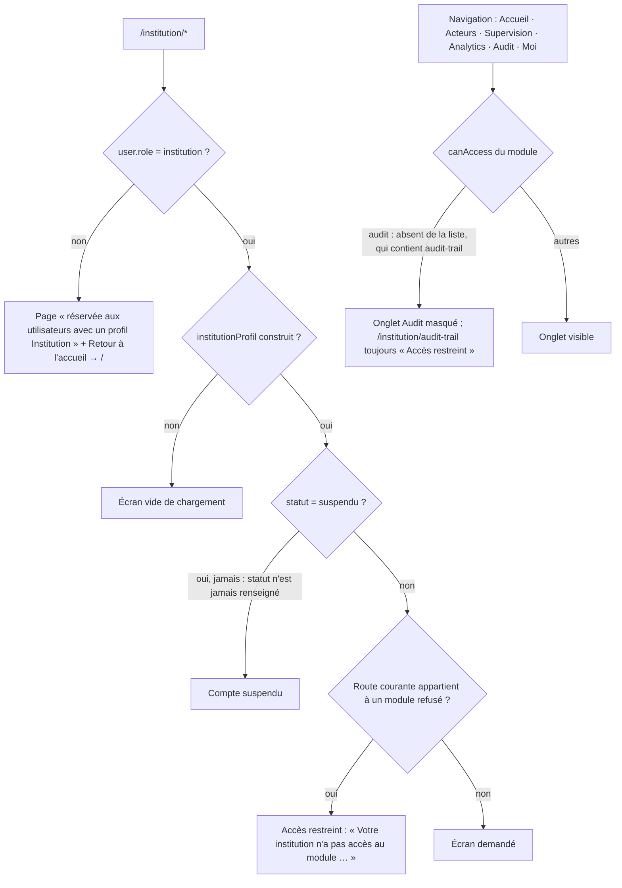
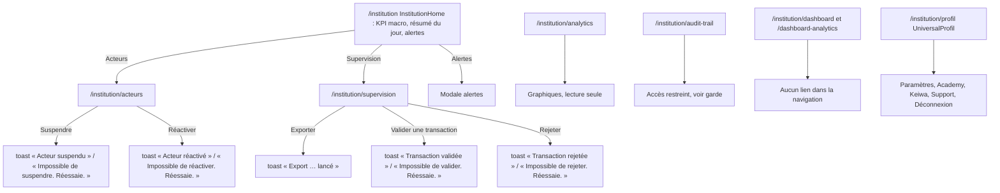

# 05 — Profil INSTITUTION

> Code de `main@9fb4655`, chemins relatifs à `frontend_src/src/app/`. **Voix : aucune** — 0 appel vocal dans `components/institution/`, `julaba_voice_disabled` posé pour ce rôle (`contexts/AppContext.tsx:772-782`), pas de modale Tantie (layout propre). Le bouton « écouter » de l'accueil anime 4 s un état « parle » **sans aucun son** (`components/institution/InstitutionHome.tsx:64-67`).

## Garde, modules et navigation

Sources : `components/institution/InstitutionLayout.tsx:17-35` (`MODULE_ROUTES`, `ALL_NAV_ITEMS`, Audit `:23,33`), `:312-418` (gardes : rôle `:318`, profil `:361`, suspendu `:380`, module bloqué `:390-402,429-430`) ; `contexts/InstitutionAccessContext.tsx:25-29` (modules **codés en dur côté client** : `dashboard, analytics, acteurs, supervision, parametres, profil, audit-trail, academy, keiwa, support`), `:48-56` (profil sans `statut`). La barre `bottomBar` de `config/roleConfig.ts:435-438` n'est pas utilisée par ce layout.

## Écrans

| Route | Composant | Fichier | routes.tsx | Appels vocaux dans le fichier |
|---|---|---|---|---|
| `/institution` | InstitutionLayout (layout) | — | `routes.tsx:139` |  |
| `/institution` | InstitutionHome | `frontend_src/src/app/components/institution/InstitutionHome.tsx` | `routes.tsx:140` | 0 |
| `/institution/analytics` | Analytics | `frontend_src/src/app/components/institution/Analytics.tsx` | `routes.tsx:141` | 0 |
| `/institution/acteurs` | InstitutionActeurs | `frontend_src/src/app/components/institution/InstitutionActeurs.tsx` | `routes.tsx:142` | 0 |
| `/institution/supervision` | InstitutionSupervision | `frontend_src/src/app/components/institution/InstitutionSupervision.tsx` | `routes.tsx:143` | 0 |
| `/institution/parametres` | InstitutionParametres | `frontend_src/src/app/components/institution/InstitutionParametres.tsx` | `routes.tsx:144` | 0 |
| `/institution/profil` | InstitutionProfil | `frontend_src/src/app/components/institution/InstitutionProfil.tsx` | `routes.tsx:145` | 0 |
| `/institution/dashboard` | Dashboard | `frontend_src/src/app/components/institution/Dashboard.tsx` | `routes.tsx:146` | 0 |
| `/institution/dashboard-analytics` | DashboardAnalytics | `frontend_src/src/app/components/institution/DashboardAnalytics.tsx` | `routes.tsx:147` | 0 |
| `/institution/audit-trail` | AuditTrail | `frontend_src/src/app/components/institution/AuditTrail.tsx` | `routes.tsx:148` | 0 |
| `/institution/academy` | UniversalAcademy | `frontend_src/src/app/components/academy/UniversalAcademy.tsx` | `routes.tsx:149` | 2 |
| `/institution/keiwa` | WalletPage | `frontend_src/src/app/components/wallet/WalletPage.tsx` | `routes.tsx:150` | 0 |
| `/institution/keiwa/transfert` | TransfertPage | `frontend_src/src/app/components/wallet/TransfertPage.tsx` | `routes.tsx:151` | 0 |
| `/institution/keiwa/paiements` | PaiementsPage | `frontend_src/src/app/components/wallet/PaiementsPage.tsx` | `routes.tsx:152` | 0 |
| `/institution/keiwa/banque` | BanquePage | `frontend_src/src/app/components/wallet/BanquePage.tsx` | `routes.tsx:153` | 0 |
| `/institution/keiwa/carte` | CartePage | `frontend_src/src/app/components/wallet/CartePage.tsx` | `routes.tsx:154` | 0 |
| `/institution/keiwa/historique` | HistoriquePage | `frontend_src/src/app/components/wallet/HistoriquePage.tsx` | `routes.tsx:155` | 0 |
| `/institution/support` | SupportPage | `frontend_src/src/app/components/shared/SupportPage.tsx` | `routes.tsx:156` | 0 |

## Parcours IN1 — Supervision des acteurs et des transactions

Sources : `components/institution/InstitutionHome.tsx:55-75,615,645` ; `components/institution/InstitutionActeurs.tsx:142-154,410` ; `components/institution/InstitutionSupervision.tsx:193,665-684` ; `components/institution/AuditTrail.tsx:127` ; `components/shared/UniversalProfil.tsx:132-133`.

## Voix — institution

| Étape | Déclencheur | Phrase dite | Texte affiché | Condition |
|---|---|---|---|---|
| Tous les écrans | — | **aucune** | toasts cités | 0 appel vocal, `julaba_voice_disabled` |
| Accueil « écouter » | bouton | **rien** (animation « parle » 4 s) | indicateur de parole | `InstitutionHome.tsx:64-67` |
