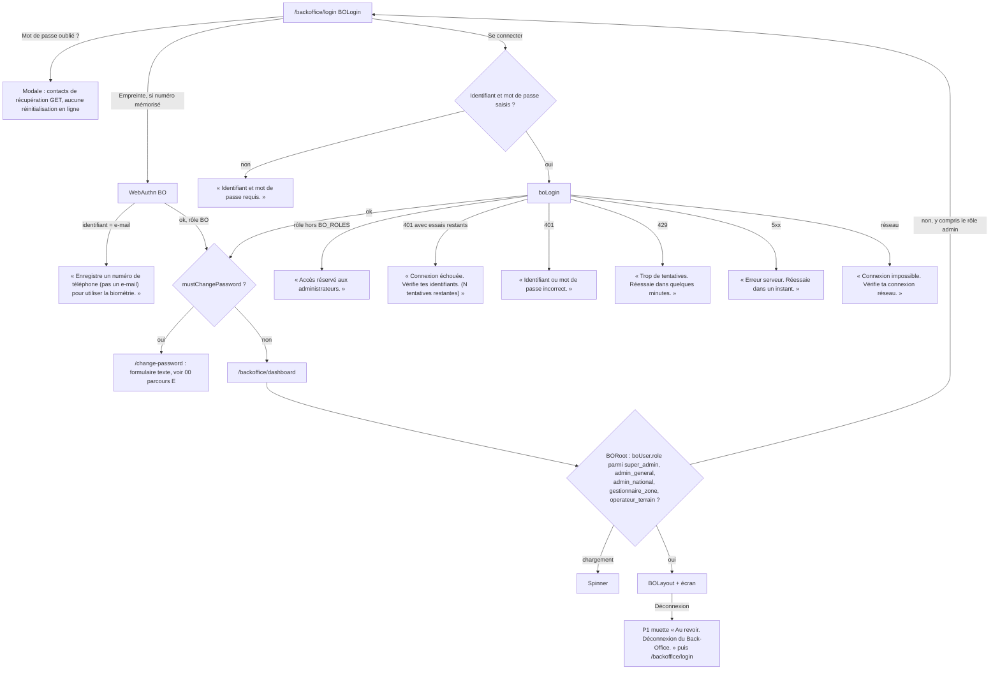
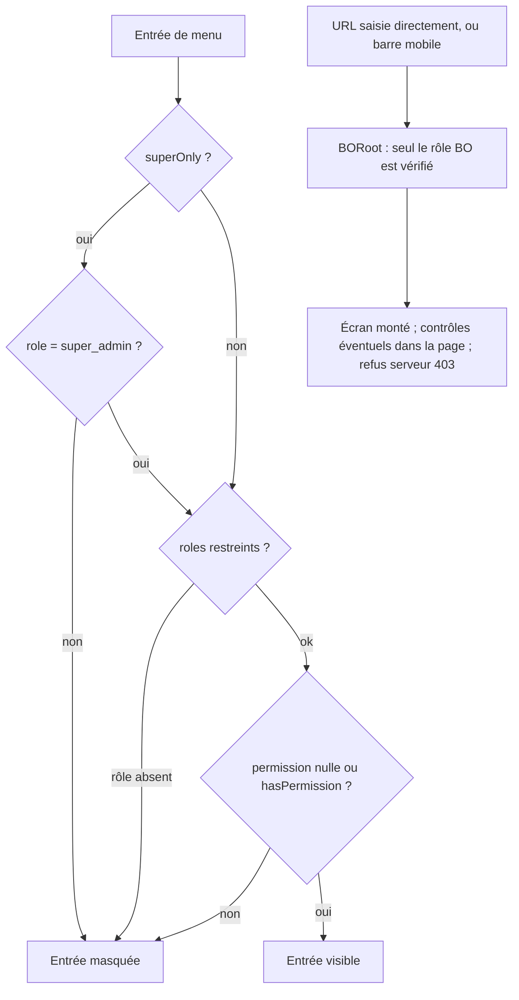
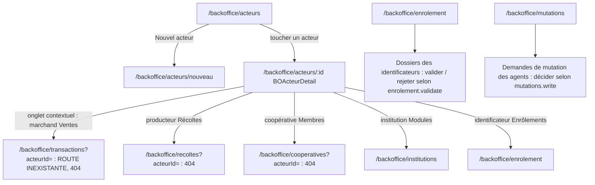

# 06 — BACK-OFFICE (`/backoffice/*`)

> Code de `main@9fb4655`, chemins relatifs à `frontend_src/src/app/`. **Voix** : le back-office n'a pas d'utilisateur `AppContext` de rôle `marchand` ⇒ les appels P1 (`BOLogin.tsx:275`, `BOLayout.tsx:850,1058`, `BONotifications.tsx:251`) sont muets ; seul `BOProfil.tsx:276-280` appelle l'`audioManager` en direct (P6) et parle : « Déconnexion en cours » (`:313`), en synthèse (le clip `ui-032.mp3` au même texte n'est pas joué).

## Parcours BO1 — Connexion au back-office

Sources : `components/backoffice/BOLogin.tsx:135-140,145-195,200-279,394-397,554` ; `services/backoffice-api.ts:103` (`boLogin`) ; `types/constants.ts:93-100` (`BO_ROLES` **avec** `admin`) ; `components/backoffice/BORoot.tsx` (`ROLES` **sans** `admin`) ; `contexts/BackOfficeContext.tsx:296` (restauration de session, liste sans `admin`) ; `components/backoffice/BOLayout.tsx:848-866` (déconnexion).

Écart : un compte de rôle `admin` passe `BOLogin` (présent dans `BO_ROLES`) puis est renvoyé par `BORoot` vers `/backoffice/login` (absent de `ROLES`) — boucle de connexion sans message.

## Rôles et permissions

- Rôles BO : `super_admin` (tout, `BackOfficeContext.tsx:760-768`), `admin_general`, `admin_national`, `gestionnaire_zone`, `operateur_terrain`.
- Arbre des permissions : `config/bo-permissions.ts` (`BO_PERMISSION_TREE`, 21 modules, `superOnly` pour `utilisateurs` et `parametres`) ; périmètres max `ROLE_SCOPES` et valeurs par défaut `ROLE_DEFAULTS` (`bo-permissions.ts`, fin de fichier) ; à l'exécution : `user.boPermissions[clé] === true`, sinon table de repli `BO_SCREEN_PERMISSIONS` (`BackOfficeContext.tsx:189,767`).
- **Le menu filtre, la route ne garde pas** : `BOLayout` masque les entrées (`BOLayout.tsx:652-659,882-889`) mais aucun garde de route n'empêche d'ouvrir l'URL ; la barre basse mobile `MOBILE_BOTTOM` (Tableau de bord, Acteurs, Supervision, Support, Profil) n'est **pas filtrée** (`BOLayout.tsx:186-192,1412`). La protection réelle repose sur les contrôles internes des pages (colonne « contrôles dans la page ») et sur le serveur.

Matrice générée (menu `BOLayout.tsx:80-183`, routes `routes.tsx:188-223`, périmètres `bo-permissions.ts`) — « oui (défaut) » = coché par défaut à la création du compte, « oui (à cocher) » = autorisé mais décoché par défaut :

| Groupe | Entrée du menu | Route | Composant (routes.tsx) | Permission exigée par le menu (BOLayout.tsx) | Réservé | Contrôles de droits DANS la page | admin_general | admin_national | gestionnaire_zone | operateur_terrain |
|---|---|---|---|---|---|---|---|---|---|---|
| — | Tableau de bord | `/backoffice/dashboard` | BODashboard (`routes.tsx:191`) | aucune (`BOLayout.tsx:82-85`) | — | 12 | oui | oui | oui | oui |
| Opérations terrain | Acteurs | `/backoffice/acteurs` | BOActeurs (`routes.tsx:192`) | `acteurs.read` (`BOLayout.tsx:95`) | — | 7 | oui | oui | oui (défaut) | oui (défaut) |
| Opérations terrain | Enrôlement | `/backoffice/enrolement` | BOEnrolement (`routes.tsx:195`) | `enrolement.read` (`BOLayout.tsx:96`) | — | 20 | oui | oui | oui (défaut) | oui (défaut) |
| Opérations terrain | Supervision | `/backoffice/supervision` | BOSupervision (`routes.tsx:196`) | `supervision.read` (`BOLayout.tsx:97`) | — | 0 | oui | oui | oui (défaut) | oui (défaut) |
| Opérations terrain | Zones & Territoires | `/backoffice/zones` | BOZones (`routes.tsx:197`) | `zones.read` (`BOLayout.tsx:98`) | — | 9 | oui | oui | oui (défaut) | non |
| Opérations terrain | Carte des Acteurs | `/backoffice/carte` | BOCarteActeurs (`routes.tsx:198`) | `acteurs.read` (`BOLayout.tsx:99`) | — | 0 | oui | oui | oui (défaut) | oui (défaut) |
| Opérations terrain | Modération | `/backoffice/moderation` | BOModeration (`routes.tsx:209`) | `moderation.read` (`BOLayout.tsx:100`) | — | 2 | oui | oui | oui (défaut) | oui (défaut) |
| Opérations terrain | Mutations | `/backoffice/mutations` | BOMutations (`routes.tsx:210`) | `mutations.read` (`BOLayout.tsx:101`) | — | 3 | oui | oui | oui (défaut) | oui (à cocher) |
| Plateforme | Marketplace | `/backoffice/marketplace` | BOMarketplace (`routes.tsx:217`) | `marketplace.read` (`BOLayout.tsx:112`) | — | 0 | oui | oui | non | non |
| Plateforme | Livraison | `/backoffice/livraison` | BOLivraison (`routes.tsx:218`) | `livraison.read` (`BOLayout.tsx:113`) | — | 0 | oui | oui | non | non |
| Plateforme | Communication | `/backoffice/communication` | BOCommunication (`routes.tsx:219`) | `communication.read` (`BOLayout.tsx:114`) | — | 2 | oui | oui | non | non |
| Plateforme | Contenus | `/backoffice/contenus` | BOContenus (`routes.tsx:211`) | `contenus.read` (`BOLayout.tsx:115`) | — | 2 | oui | oui | non | non |
| Keiwa Wallet | Tableau de bord | `/backoffice/keiwa` | BOKeiwa (`routes.tsx:222`) | aucune (`BOLayout.tsx:125`) | — | 0 | oui | oui | oui | oui |
| Administration | Utilisateurs BO | `/backoffice/utilisateurs` | BOUtilisateurs (`routes.tsx:203`) | `utilisateurs.read` (`BOLayout.tsx:136`) | super_admin seul | 8 | non (superOnly) | non (superOnly) | non (superOnly) | non (superOnly) |
| Administration | Institutions | `/backoffice/institutions` | BOInstitutions (`routes.tsx:204`) | `utilisateurs.read` (`BOLayout.tsx:137`) | super_admin seul | 3 | non (superOnly) | non (superOnly) | non (superOnly) | non (superOnly) |
| Administration | Config Institution | `/backoffice/config-institution` | BOConfigInstitution (`routes.tsx:221`) | `parametres.read` (`BOLayout.tsx:138`) | super_admin seul | 1 | non (superOnly) | non (superOnly) | non (superOnly) | non (superOnly) |
| Administration | Audit & Logs | `/backoffice/audit` | BOAudit (`routes.tsx:202`) | `audit.read` (`BOLayout.tsx:139`) | — | 0 | oui | oui | oui (défaut) | oui (défaut) |
| Intelligence | Monitoring IA | `/backoffice/monitoring-ia` | BOMonitoringIA (`routes.tsx:212`) | `monitoring_ia.read` (`BOLayout.tsx:150`) | super_admin seul | 1 | non (superOnly) | non (superOnly) | non (superOnly) | non (superOnly) |
| Intelligence | Event Monitor | `/backoffice/event-monitor` | EventMonitor (`routes.tsx:213`) | `audit.read` (`BOLayout.tsx:151`) | super_admin seul | 1 | non (superOnly) | non (superOnly) | non (superOnly) | non (superOnly) |
| Intelligence | Analytics produit | `/backoffice/analytics` | BOAnalyticsProduit (`routes.tsx:214`) | `analytics_produit.read` (`BOLayout.tsx:152`) | super_admin seul | 1 | non (superOnly) | non (superOnly) | non (superOnly) | non (superOnly) |
| Intelligence | Score Financier | `/backoffice/score-financier` | BOScoreFinancier (`routes.tsx:215`) | `audit.read` (`BOLayout.tsx:153`) | super_admin seul | 1 | non (superOnly) | non (superOnly) | non (superOnly) | non (superOnly) |
| Intelligence | Clés API | `/backoffice/api-keys` | BOApiKeys (`routes.tsx:216`) | `audit.read` (`BOLayout.tsx:154`) | super_admin seul | 1 | non (superOnly) | non (superOnly) | non (superOnly) | non (superOnly) |
| Intelligence | Rapports | `/backoffice/rapports` | BORapports (`routes.tsx:206`) | `audit.read` (`BOLayout.tsx:155`) | rôles : 'admin_general' | 1 | oui | non (roles) | non (roles) | non (roles) |
| Formation | Julaba Academy | `/backoffice/academy` | BOAcademy (`routes.tsx:199`) | `academy.read` (`BOLayout.tsx:166`) | — | 2 | oui | oui | oui (défaut) | oui (à cocher) |
| Formation | Missions | `/backoffice/missions` | BOMissions (`routes.tsx:200`) | `missions.read` (`BOLayout.tsx:167`) | — | 2 | oui | oui | non | non |
| Système | Tâches planifiées | `/backoffice/cron` | BOCronDashboard (`routes.tsx:220`) | `cron.read` (`BOLayout.tsx:178`) | — | 0 | oui | oui | non | non |
| Système | Notifications | `/backoffice/notifications` | BONotifications (`routes.tsx:207`) | aucune (`BOLayout.tsx:179`) | — | 1 | oui | oui | oui | oui |
| Système | Support | `/backoffice/support` | BOSupport (`routes.tsx:208`) | aucune (`BOLayout.tsx:180`) | — | 0 | oui | oui | oui | oui |
| Système | Paramètres | `/backoffice/parametres` | BOParametres (`routes.tsx:201`) | `parametres.read` (`BOLayout.tsx:181`) | — | 2 | non | non | non | non |
| hors menu | — | `/backoffice/profil` | BOProfil (`routes.tsx:205`) | — | — | 0 | — | — | — | — |
| hors menu | — | `/backoffice/acteurs/nouveau` | NouvelActeurPage (`routes.tsx:193`) | — | — | 0 | — | — | — | — |
| hors menu | — | `/backoffice/acteurs/:id` | BOActeurDetail (`routes.tsx:194`) | — | — | 10 | — | — | — | — |

Remarques sur la matrice : l'entrée « Paramètres » n'a pas `superOnly` mais exige `parametres.read`, clé réservée au super-admin par `bo-permissions.ts` — elle n'est donc visible que du super-admin ; dix écrans n'ont **aucun** contrôle de droits interne (Supervision, Carte, Marketplace, Livraison, Tâches planifiées, Keiwa, Audit, Support, Profil, Nouvel acteur — comptage 0 ci-dessus) et sont ouverts à tout rôle BO par l'URL.

## Parcours BO2 — Fiche acteur et liens contextuels

Sources : `components/backoffice/BOActeurDetail.tsx:91-98,886-890` ; `utils/role-config.ts:79-95` (`getContextualTabLabel`) ; `components/backoffice/BOEnrolement.tsx` (20 contrôles de droits) ; `components/backoffice/BOMutations.tsx`.

## Voix — back-office

| Étape | Déclencheur | Phrase prévue | Entendue ? | Source |
|---|---|---|---|---|
| Échec de connexion | toute erreur | « Connexion refusée. Vérifie tes identifiants. » (clip `ui-016` existant) | **non** (P1, aucun utilisateur marchand) | `BOLogin.tsx:275` |
| Avatar / accueil | toucher | « Bonjour {prénom}. Vous êtes connecté en tant que {rôle}. Il y a N tickets en attente. Comment puis-je vous aider ? » | **non** | `BOLayout.tsx:1058` |
| Déconnexion (menu) | Déconnexion | « Au revoir. Déconnexion du Back-Office. » (clip `ui-002` existant) | **non** | `BOLayout.tsx:850` |
| Notifications | bouton | « Vous avez N notifications non lues. Dont M critiques nécessitant votre attention immédiate. » | **non** | `BONotifications.tsx:251` |
| Déconnexion (profil) | Déconnexion | « Déconnexion en cours » | **oui** (P6, synthèse ; muet si `voiceMuted`) | `BOProfil.tsx:276-280,313` |
| Profil, autres | — | appels `speak(text)` du profil | **oui** (P6) | `BOProfil.tsx:279` |

## Annexe — Routes et appels vocaux (extraction mécanique)

| Route | Composant | Fichier | routes.tsx | Appels vocaux dans le fichier |
|---|---|---|---|---|
| `/backoffice/login` | BOLogin | — | `routes.tsx:188` |  |
| `/backoffice` | BORoot (layout) | — | `routes.tsx:189` |  |
| `/backoffice` | → redirection /backoffice/dashboard | — | `routes.tsx:190` |  |
| `/backoffice/dashboard` | BODashboard | `frontend_src/src/app/components/backoffice/BODashboard.tsx` | `routes.tsx:191` | 0 |
| `/backoffice/acteurs` | BOActeurs | `frontend_src/src/app/components/backoffice/BOActeurs.tsx` | `routes.tsx:192` | 0 |
| `/backoffice/acteurs/nouveau` | NouvelActeurPage | `frontend_src/src/app/components/backoffice/NouvelActeurPage.tsx` | `routes.tsx:193` | 0 |
| `/backoffice/acteurs/:id` | BOActeurDetail | `frontend_src/src/app/components/backoffice/BOActeurDetail.tsx` | `routes.tsx:194` | 0 |
| `/backoffice/enrolement` | BOEnrolement | `frontend_src/src/app/components/backoffice/BOEnrolement.tsx` | `routes.tsx:195` | 0 |
| `/backoffice/supervision` | BOSupervision | `frontend_src/src/app/components/backoffice/BOSupervision.tsx` | `routes.tsx:196` | 0 |
| `/backoffice/zones` | BOZones | `frontend_src/src/app/components/backoffice/BOZones.tsx` | `routes.tsx:197` | 0 |
| `/backoffice/carte` | BOCarteActeurs | `frontend_src/src/app/components/backoffice/BOCarteActeurs.tsx` | `routes.tsx:198` | 0 |
| `/backoffice/academy` | BOAcademy | `frontend_src/src/app/components/backoffice/BOAcademy.tsx` | `routes.tsx:199` | 0 |
| `/backoffice/missions` | BOMissions | `frontend_src/src/app/components/backoffice/BOMissions.tsx` | `routes.tsx:200` | 0 |
| `/backoffice/parametres` | BOParametres | `frontend_src/src/app/components/backoffice/BOParametres.tsx` | `routes.tsx:201` | 0 |
| `/backoffice/audit` | BOAudit | `frontend_src/src/app/components/backoffice/BOAudit.tsx` | `routes.tsx:202` | 0 |
| `/backoffice/utilisateurs` | BOUtilisateurs | `frontend_src/src/app/components/backoffice/BOUtilisateurs.tsx` | `routes.tsx:203` | 0 |
| `/backoffice/institutions` | BOInstitutions | `frontend_src/src/app/components/backoffice/BOInstitutions.tsx` | `routes.tsx:204` | 0 |
| `/backoffice/profil` | BOProfil | `frontend_src/src/app/components/backoffice/BOProfil.tsx` | `routes.tsx:205` | 2 |
| `/backoffice/rapports` | BORapports | `frontend_src/src/app/components/backoffice/BORapports.tsx` | `routes.tsx:206` | 0 |
| `/backoffice/notifications` | BONotifications | `frontend_src/src/app/components/backoffice/BONotifications.tsx` | `routes.tsx:207` | 1 |
| `/backoffice/support` | BOSupport | `frontend_src/src/app/components/backoffice/BOSupport.tsx` | `routes.tsx:208` | 0 |
| `/backoffice/moderation` | BOModeration | `frontend_src/src/app/components/backoffice/BOModeration.tsx` | `routes.tsx:209` | 0 |
| `/backoffice/mutations` | BOMutations | `frontend_src/src/app/components/backoffice/BOMutations.tsx` | `routes.tsx:210` | 0 |
| `/backoffice/contenus` | BOContenus | `frontend_src/src/app/components/backoffice/BOContenus.tsx` | `routes.tsx:211` | 0 |
| `/backoffice/monitoring-ia` | BOMonitoringIA | `frontend_src/src/app/components/backoffice/BOMonitoringIA.tsx` | `routes.tsx:212` | 0 |
| `/backoffice/event-monitor` | EventMonitor | `frontend_src/src/app/components/backoffice/EventMonitor.tsx` | `routes.tsx:213` | 0 |
| `/backoffice/analytics` | BOAnalyticsProduit | `frontend_src/src/app/components/backoffice/BOAnalyticsProduit.tsx` | `routes.tsx:214` | 0 |
| `/backoffice/score-financier` | BOScoreFinancier | `frontend_src/src/app/components/backoffice/BOScoreFinancier.tsx` | `routes.tsx:215` | 0 |
| `/backoffice/api-keys` | BOApiKeys | `frontend_src/src/app/components/backoffice/BOApiKeys.tsx` | `routes.tsx:216` | 0 |
| `/backoffice/marketplace` | BOMarketplace | `frontend_src/src/app/components/backoffice/BOMarketplace.tsx` | `routes.tsx:217` | 0 |
| `/backoffice/livraison` | BOLivraison | `frontend_src/src/app/components/backoffice/BOLivraison.tsx` | `routes.tsx:218` | 0 |
| `/backoffice/communication` | BOCommunication | `frontend_src/src/app/components/backoffice/BOCommunication.tsx` | `routes.tsx:219` | 0 |
| `/backoffice/cron` | BOCronDashboard | `frontend_src/src/app/components/backoffice/BOCronDashboard.tsx` | `routes.tsx:220` | 0 |
| `/backoffice/config-institution` | BOConfigInstitution | `frontend_src/src/app/components/backoffice/BOConfigInstitution.tsx` | `routes.tsx:221` | 0 |
| `/backoffice/keiwa` | BOKeiwa | `frontend_src/src/app/components/backoffice/BOKeiwa.tsx` | `routes.tsx:222` | 0 |

#### `components/backoffice/BOLayout.tsx` — 2 appel(s) vocal(aux)

| Source | Appel | Phrase dite (texte exact / clé catalogue fr-ci) | Clip Tata au texte identique | Canal et condition |
|---|---|---|---|---|
| `frontend_src/src/app/components/backoffice/BOLayout.tsx:850` | `speak` | « Au revoir. Déconnexion du Back-Office. » | `ui-002.mp3` | AppContext.speak : dit SEULEMENT si rôle = marchand et non muet ; synthèse (jamais le clip ui-*) |
| `frontend_src/src/app/components/backoffice/BOLayout.tsx:1058` | `speak` | « Bonjour ${boUser.prenom \|\| boUser.firstName}. Vous êtes connecté en tant que ${ROLE_LABELS[boUser.role]}. Il y a ${nouveauxCount} ticket${nouveauxCount > 1 ? 's' : ''} en attente. Comment puis-je vous aider ? » *(gabarit)* | — | AppContext.speak : dit SEULEMENT si rôle = marchand et non muet ; synthèse (jamais le clip ui-*) |

#### `components/backoffice/BOLogin.tsx` — 1 appel(s) vocal(aux)

| Source | Appel | Phrase dite (texte exact / clé catalogue fr-ci) | Clip Tata au texte identique | Canal et condition |
|---|---|---|---|---|
| `frontend_src/src/app/components/backoffice/BOLogin.tsx:275` | `speak` | « Connexion refusée. Vérifie tes identifiants. » | `ui-016.mp3` | AppContext.speak : dit SEULEMENT si rôle = marchand et non muet ; synthèse (jamais le clip ui-*) |

#### `components/backoffice/BONotifications.tsx` — 1 appel(s) vocal(aux)

| Source | Appel | Phrase dite (texte exact / clé catalogue fr-ci) | Clip Tata au texte identique | Canal et condition |
|---|---|---|---|---|
| `frontend_src/src/app/components/backoffice/BONotifications.tsx:251` | `speak` | *(expression)* `` `Vous avez ${unreadCount} notifications non lues. ${criticalCount > 0 ? `Dont ${criticalCount} critiques nécessitant votre attention immédia `` | — | AppContext.speak : dit SEULEMENT si rôle = marchand et non muet ; synthèse (jamais le clip ui-*) |

#### `components/backoffice/BOProfil.tsx` — 2 appel(s) vocal(aux)

| Source | Appel | Phrase dite (texte exact / clé catalogue fr-ci) | Clip Tata au texte identique | Canal et condition |
|---|---|---|---|---|
| `frontend_src/src/app/components/backoffice/BOProfil.tsx:279` | `speak` | *(expression)* `text` | — | audioManager.speak direct (sans garde de rôle) → synthèse |
| `frontend_src/src/app/components/backoffice/BOProfil.tsx:313` | `speak` | « Déconnexion en cours » | `ui-032.mp3` | audioManager.speak direct (sans garde de rôle) → synthèse |
