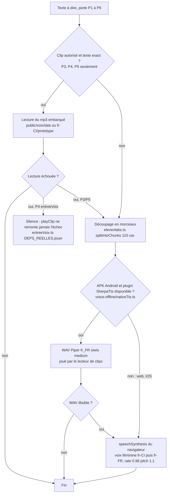
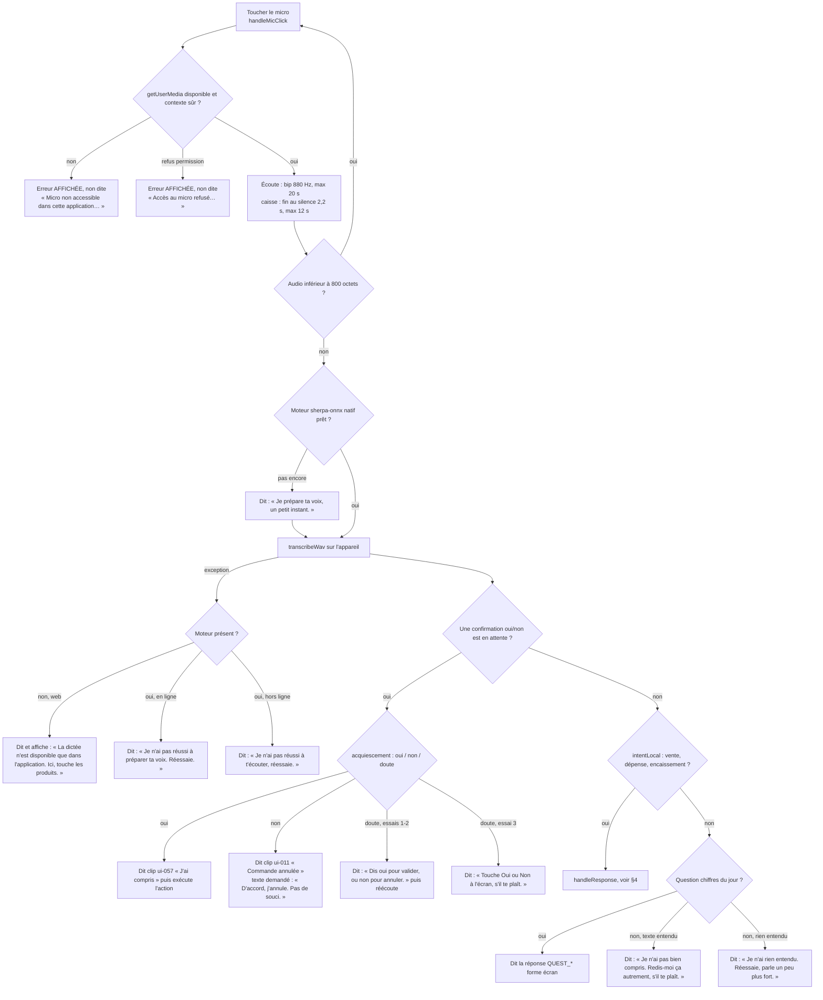
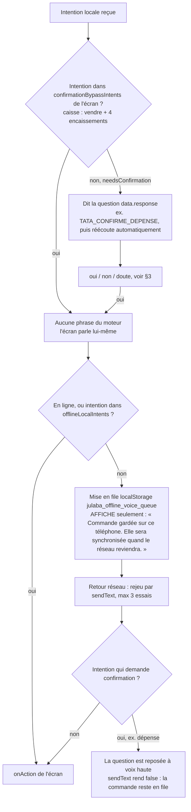

# 07 — Moteur voix transverse (TTS, clips, ASR, langues, silences)

> Constaté sur le code de `main@9fb4655`. Chemins relatifs à `frontend_src/src/app/` sauf mention. Les docs (`docs/REGLE-VOICE-FIRST.md`, `docs/voix/`, `docs/INTEGRATION_VOIX_OFFLINE.md`) n'ont servi qu'à orienter la lecture : là où elles divergent du code, c'est le code qui est décrit et l'écart est noté.

## 1. Les portes par lesquelles l'application parle

Il n'existe pas UNE fonction « dire » : six portes coexistent, avec des règles différentes. C'est la clé de lecture de tous les tableaux « Voix » des autres fichiers (colonne *Canal*).

| Porte | Définition | Clip Tata ? | Garde de rôle | Autres conditions de silence |
|---|---|---|---|---|
| **P1 `AppContext.speak(texte)`** — porte de 90 % des écrans | `contexts/AppContext.tsx:726-751` → `audioManager.speak` (`:741`) | **Jamais** : `audioManager.speak` → `realStartTts` (`services/audioManager.ts:90-161`) ne consulte aucun index de clips | **Oui** : se tait si `user.role !== 'marchand'` (`AppContext.tsx:729-730`), donc avant connexion aussi (user nul) | `voiceMuted` (`:731-732`, clé `julaba_voice_muted`, `:308`) ; texte vide |
| **P2 `speakMessage(clé, vars)`** | `i18n/voice/speakMessage.ts:77-99` → résolution `runtime.resoudreMessage` → `RENDU_VOIX_LOCALE` (`i18n/voice/renduVoixLocale.ts:32-69`) → voix de référence = **P1** (`:40`) | Non (passe par P1) | Oui (hérite de P1) | Niveau « essentiel » : tait toute clé non `critiqueArgent` (`i18n/voice/niveauVoix.ts:82-85`, tracé `TTS_IGNOREE`, `speakMessage.ts:81-87`) |
| **P3 `useVoiceCore.ttsSpeak(texte, lang, clé?)`** | `hooks/useVoiceCore.ts:240-287` | **Oui** : clé `TATA_CLIPS` (`services/tataVoice.ts:31-40`) puis texte exact normalisé (`services/tataUiClips.ts:296-314`), sinon synthèse dans le même créneau (`audioManager.speakClipOrText`, `audioManager.ts:358-370`) | **Non** | `localStorage.julaba_voice_disabled === 'true'` (`useVoiceCore.ts:242-243`) — posé pour `identificateur` et `institution` (`AppContext.tsx:771-782`) ; langue ≠ français → silence + évènement `julaba:voice-pack-missing` (`useVoiceCore.ts:280-287`) |
| **P4 Entrée avant connexion** | `services/paroleEntree.ts` (`parlerAvantConnexion`, écrans `akwaba`/`onboarding`/`connexion` seulement) ; `services/entreeVoix.ts` (`direEntree`, `direEntreeTexte`) ; `services/entreeVoixAvantConnexion.ts` | Oui si autorisé : `atteste` ou `lotA`, ou `prototype` **et** `VITE_JULABA_VOICE_PREVIEW=true` (`entreeVoix.ts` `urlClipEntree`) | Contourne P1 (rôle nul autorisé sur les 3 écrans d'entrée) | `direEntreeTexte` : **aucun repli parlé** si le texte n'a pas de clip exact → silence (`entreeVoix.ts` fin de fichier, `raison: 'coupe'`) |
| **P5 `speakClipOrText` direct** | `components/auth/ActivationScreen.tsx:11-16`, `components/auth/ChangePasswordScreen.tsx:96-102`, `pages/CollecteVoix.tsx:28-31` | Oui (texte exact) sinon synthèse | Non | `guidageVocal()` vérifié par l'appelant |
| **P6 `audioManager` direct** | `contexts/ObjectifContext.tsx:21-23,92,102` (`speakAuto`), `components/shared/ModeAccesSwitcher.tsx:21-22`, `components/backoffice/BOProfil.tsx:276-280`, `contexts/RapportHebdoContext.tsx:51` (`playClip` base64) | Non (sauf base64) | **Non** | `setVoiceMuted` global (`audioManager.ts:250-253`) |

Règles communes de l'orchestre `services/audioManager.ts` (en-tête `:1-28`, code `:255-320`) : une seule source à la fois ; une demande `user` coupe tout ; une `auto` est abandonnée si quelque chose joue ; anti-répétition par `dedupeKey` (défaut 8 s, `:47`) ; « la plus récente gagne ». Changement d'écran : `AppLayout` annule la voix de l'ancien écran (`components/layout/AppLayout.tsx:84-87`) — *non* monté pour `/institution`, `/identificateur`, `/backoffice` (layouts propres).

### Synthèse (quand ce n'est pas un clip)

Sources : `audioManager.ts:90-161` (boucle par morceau, `:114` synthèse native, `:135` repli navigateur), `services/elevenlabs.ts:86-140` (choix de voix `:98`, `rate/pitch` `:131-132`), plugin natif `android/app/src/main/java/com/julaba/app/SherpaTtsPlugin.kt` (modèle `vits-piper-fr_FR-siwis-medium`, en-tête).

**Constat** : l'en-tête du plugin natif dit « les phrases fixes restent servies par les clips, qui sont la vraie voix de Tata » ; dans le code, les phrases des écrans passent par P1/P2 qui n'appellent jamais le lecteur de clips. Les phrases fixes des écrans sont donc dites par la voix Piper « siwis » (APK) ou la voix du navigateur, même quand un clip Tata au texte identique existe (127 appels concernés, voir §6).

## 2. Clips embarqués

| Lot | Emplacement | Nombre | Index | Joué par |
|---|---|---|---|---|
| Voix humaine « ui-NNN » | `frontend_src/public/voix/tata/ui-*.mp3` | 137 fichiers (128 indexés + `ui-086` + 8 orphelins non indexés) | `services/tataUiClips.ts:16-152` | P3/P5 par texte exact ; 8 clés seulement dans `TATA_CLIPS` (`tataVoice.ts:31-40`) dont **2** réellement demandées (`bien_recu`, `annule`, `useVoiceCore.ts:788,799`) |
| Lot A synthèse ivoirienne (`chiffre-*`, `core-*`, `login-*`, `stk-*`, `vente-*`, `crd-*`, `dep-*`, `wlt-*`) | `public/voix/tata/` | 83 | `tataUiClips.ts:190-291` | P4 pour 16 `login-*` (`entreeVoix.ts`), sinon seulement par texte exact via P3/P5 |
| Prototypes « Tantie » | `frontend_src/public/voix/fr-CI/prototype/*.mp3` | 15 | `public/voix/fr-CI/prototype/manifest.json`, `entreeVoix.ts`, `onboardingVoix.ts`, `accueilMarchandVoix.ts` | **Uniquement** si `VITE_JULABA_VOICE_PREVIEW=true` au build (défaut `false`, `.github/workflows/apk.yml:73-75`) |
| Intros `intro-*.mp3` | référencées `services/onboardingVoix.ts:28-91` | 0 fichier présent | — | jamais (non `atteste`) ; 7 fichiers absents du disque (`registre-tata-fr-ci.json` `intros_manquantes`) |

Bilan mesuré (script de la séance, détail : [`annexe-clips.md`](annexe-clips.md)) : **235 mp3**, dont **37 atteignables** par un chemin du code (22 sans drapeau + 15 prototypes sous drapeau) ; **198 jamais joués**.

## 3. Reconnaissance vocale (ASR) et compréhension

Sources : `useVoiceCore.ts:1004-1075` (micro, messages `:1025,1063-1068` — `setError` sans `ttsSpeak`), `:838-865` (capture), `:875-889` (moteur), `:893-912` (confirmation), `:914-927` (intentLocal, questions, incompris), `:928-963` (exception) ; seuils caisse `services/ecouteCaisse.ts:59,63,127` ; moteur unique sherpa-onnx `voice-offline/offlineStt.ts:1-19`, sonde `:41-72` ; plugins natifs `android/app/src/main/java/com/julaba/app/SherpaSttPlugin.kt`, `MainActivity.java:13-14`.

Grammaires (texte entendu → intention), toutes déclarées par locale (`i18n/voice/locales/fr-ci/intents.ts`) :

| Intention | Phrases reconnues (fr-ci) | Source | Effet |
|---|---|---|---|
| `INT_ANNULER_VALIDATION` | mots : non, annule, annuler, attends, attend, arrete, arreter, pas encore, laisse — **testée en premier** | `fr-ci/intents.ts` ; ordre `voice-offline/grammaireEncaissement.ts:141-144` | abandonne la relecture d'encaissement |
| `INT_OUI_VALIDE` | phrase ENTIÈRE parmi : « oui valide », « oui je valide », « ouais valide », « ouais je valide », « valide oui », « oui c'est bon valide », « oui on valide », « oui valide ca » | `fr-ci/intents.ts` ; `grammaireEncaissement.ts:149` | seule porte vocale vers un paiement |
| `INT_ENCAISSER` | encaisse, encaisser, encaissement, encaissons, « termine/finis la vente » | idem `:151` | relecture du compte, jamais de paiement |
| `INT_COMBIEN_DOIT` | « combien elle/il doit », « elle doit combien », « ça fait combien », « c'est combien », « (le/mon) total » | idem `:153` | lecture seule |
| `INT_VENTE` / `INT_DEPENSE` / `INT_SOLDE`… | listes de `voice-offline/vocabulaire.ts` (`INTENTIONS_MAP`) | `fr-ci/intents.ts` (`motsPour`) | vente → panier ; dépense → confirmation |
| oui / non du moteur | `INT_LIGNE_CONFIRMATION` / `INT_LIGNE_REFUS` (`services/grammaireCorrection.ts`) | `voice-offline/grammaireAcquiescement.ts:61-69` | confirme / annule l'action en attente |
| Questions du jour | `services/intentionsCaisse.ts` (`detecterQuestion`) | réponses `:97-122` | lecture seule |

## 4. Confirmation et exécution d'une intention (toutes surfaces qui montent `useVoiceCore`)

Sources : `useVoiceCore.ts:607-726` (`executeAction`, bypass `:623`, confirmation locale `:676-685`, dispatch `:689-712`), `:728-768` (`handleResponse`), `:773-801` (oui/non), rejeu `:463-473` et `hooks/useOfflineVoiceQueue.ts` (`MAX_RETRIES = 3`, file conservée au-delà) ; `voice-offline/offlineVoiceDispatch.ts` (message de file).

## 5. Langues

| Préférence (`hooks/useLangPref.ts`) | Locale (`i18n/voice/registry.ts:79-83`) | Disponible au build livré ? | Ce qui est dit |
|---|---|---|---|
| `french` | `fr-ci` (catalogue complet, `locales/fr-ci/messages.ts:27-31`, aucune surcharge) | oui (`LANGUE_PRETE`, `useLangPref.ts:42-46`) | catalogue `frActuel` |
| `dioula` | `dyu-ci` (`locales/dyu-ci/index.ts`, messages vides sauf build d'essai) | non ; sélectionnable seulement si `__JULABA_VOIX_DYU__` (`i18n/voice/drapeauxDeTest.ts:105-126`, `useLangPref.ts` `langueDisponible`) | P2 : décor en dioula, **tout montant en français** (`i18n/voice/voixParLocale.ts`) ; P3 : **silence** + message « Le pack vocal Dioula n'est pas encore installé… » (`useVoiceCore.ts:398-410`) |
| `bambara` | `bm` | non | idem dioula (P3 silencieux) |
| — | `bci`, `any` enregistrées (`registry.ts:89-95`) ; 20 locales « provisoires » listées (`registry.ts:49-71`) | non | — |

Packs vocaux distants : désactivés, `services/voicePacksRuntime.ts` renvoie toujours `null` (« Aucun clip distant n'est autorisé au runtime »).

## 6. Règles « voice-first » et quand l'application se tait

La règle (`docs/REGLE-VOICE-FIRST.md`) : « Aucune information importante ne doit exister uniquement sous forme de texte ». Conditions de silence relevées dans le code :

| # | Condition | Effet | Source |
|---|---|---|---|
| S1 | Rôle connecté ≠ `marchand` | P1 et P2 muets : **toute** la voix des écrans producteur, coopérative, institution, identificateur, back-office | `AppContext.tsx:729-730` |
| S2 | Personne connectée (écrans d'entrée, `/non-enregistre`, `/activation`, `/change-password` hors P4/P5) | P1 muet | idem |
| S3 | Rôle `identificateur` ou `institution` | P3 muet aussi (`julaba_voice_disabled`) | `AppContext.tsx:771-782`, `useVoiceCore.ts:242-243` |
| S4 | Muet choisi (`julaba_voice_muted`) | tout muet | `AppContext.tsx:308,731,754` |
| S5 | Profil d'accès « Je lis et j'écris » (`lecture`) | toutes les phrases gardées par `guidageVocal()` ; NB : l'écran de connexion passe le mode *effectif* (`LoginPassword.tsx:210`), donc en mode « auto » penchant clavier il se tait aussi, contrairement à la règle écrite `utils/accessMode.ts:115-126` | `utils/accessMode.ts:123-131` |
| S6 | Niveau de voix « essentiel » | tait les clés non argent (P2 seulement) | `niveauVoix.ts:82-85` |
| S7 | Écran de connexion, phrase sans clip exact | silence (pas de repli synthèse) | `entreeVoix.ts` `direEntreeTexte` ; `LoginPassword.tsx:298-302` |
| S8 | Clip prototype sans `VITE_JULABA_VOICE_PREVIEW` | consignes P4 retombent en synthèse ; **erreurs** P4 (`parle`) muettes | `entreeVoix.ts` `urlClipEntree` |
| S9 | Langue dioula/bambara sur P3 | silence | `useVoiceCore.ts:280-287` |
| S10 | Autoplay refusé avant le premier geste | tracé `play-refuse` ; `useAudioUnlockFallback` rejoue la consigne d'activation seulement | `audioManager.ts:211`, `hooks/useAudioUnlockFallback.ts` |
| S11 | Réseau perdu / revenu | annonces **commentées** (« boucle audio ») : rien n'est dit | `AppContext.tsx:788,792` |
| S12 | Phrases « je réfléchis » | affichées seulement, jamais dites | `useVoiceCore.ts:144-166,490-497` |

## 7. Phrases propres au moteur (`hooks/useVoiceCore.ts`)

| Étape | Déclencheur | Phrase EXACTE dite | Clip réellement joué | Texte affiché au même moment | Condition |
|---|---|---|---|---|---|
| Préparation moteur | 1re dictée, moteur pas prêt | « Je prépare ta voix, un petit instant. » (`:884`) | aucun (synthèse) | « Je prépare ta voix… » | APK |
| Confirmation acceptée | « oui » ou bouton Oui | « J'ai compris » (`:788`, clé `bien_recu`) | `ui-057.mp3` « J'ai compris » | — | — |
| Confirmation refusée | « non » ou bouton Non | demandé : « D'accord, j'annule. Pas de souci. » (`:799`, clé `annule`) | **`ui-011.mp3` « Commande annulée »** (la clé prime sur le texte, `:270`) | — | écart dit ≠ demandé |
| Doute 1-2 | réponse ni oui ni non | « Dis oui pour valider, ou non pour annuler. » (`:906`) | aucun (`core-err-03` a un autre texte) | boutons Oui/Non | — |
| Doute 3 | idem | « Touche Oui ou Non à l'écran, s'il te plaît. » (`:909`) | aucun (`core-err-04` a un autre texte) | boutons Oui/Non | — |
| Incompris | texte non reconnu | « Je n'ai pas bien compris. Redis-moi ça autrement, s'il te plaît. » (`:925`, `:994`, clé `pas_compris`) | aucun : clé **absente** de `TATA_CLIPS` et `core-err-01` a un autre texte | — | — |
| Rien entendu | transcription vide | « Je n'ai rien entendu. Réessaie, parle un peu plus fort. » (`:926`, clé `rien_entendu`) | aucun (clé absente ; `core-err-02` autre texte) | — | — |
| Échec texte | exception `sendText` | « Je n'ai pas réussi, réessaie. » (`:998`) | aucun | — | — |
| Accusé générique | intention non bypassée sans `response` | une de « C'est fait ! », « Bien reçu ! », « D'accord ! », « Je note ça ! », « C'est noté ! », « Voilà ! », « Ça marche ! », « Top ! », « C'est enregistré ! » ; après 3 ventes : « Bravo, continue comme ça ! », « Super, tu travailles bien ! », « Excellent ! », « Tu gères bien ! », « C'est du bon travail ! » (`:168-186`, `:657-659`) | aucun (`core-ack-*` ont d'autres textes) | idem en machine à écrire | — |
| Erreur d'enregistrement | `onAction` jette | le message de l'erreur (`:714`) | — | message | — |
| Moteur indisponible | voir §3 | trois messages (`:956-962`) | — | même texte, carte d'erreur | — |

Annexe générée de tous les appels vocaux des composants partagés (portefeuille, academy, assistant, paramètres…) : voir §8.

## 8. Appels vocaux des composants transverses (extraction mécanique)

Méthode : chaque appel `speak(`, `speakMessage(`, `dire(`, `parle(`, `ttsSpeak(`… du code non testé, avec son premier argument. « Clip au texte identique » = un mp3 de `tataUiClips.ts` porte exactement ce texte (après normalisation) ; il n'est **joué** que si le canal l'autorise (colonne *Canal*).

#### `components/academy/UniversalAcademy.tsx` — 2 appel(s) vocal(aux)

| Source | Appel | Phrase dite (texte exact / clé catalogue fr-ci) | Clip Tata au texte identique | Canal et condition |
|---|---|---|---|---|
| `frontend_src/src/app/components/academy/UniversalAcademy.tsx:316` | `speak` | *(expression)* `msg` | — | AppContext.speak : dit SEULEMENT si rôle = marchand et non muet ; synthèse (jamais le clip ui-*) |
| `frontend_src/src/app/components/academy/UniversalAcademy.tsx:880` | `speak` | *(expression)* `q.question` | — | AppContext.speak : dit SEULEMENT si rôle = marchand et non muet ; synthèse (jamais le clip ui-*) |

#### `components/layout/Sidebar.tsx` — 1 appel(s) vocal(aux)

| Source | Appel | Phrase dite (texte exact / clé catalogue fr-ci) | Clip Tata au texte identique | Canal et condition |
|---|---|---|---|---|
| `frontend_src/src/app/components/layout/Sidebar.tsx:55` | `speak` | « À bientôt sur Jùlaba » | `ui-137.mp3` | AppContext.speak : dit SEULEMENT si rôle = marchand et non muet ; synthèse (jamais le clip ui-*) |

#### `components/marketplace/Marketplace.tsx` — 1 appel(s) vocal(aux)

| Source | Appel | Phrase dite (texte exact / clé catalogue fr-ci) | Clip Tata au texte identique | Canal et condition |
|---|---|---|---|---|
| `frontend_src/src/app/components/marketplace/Marketplace.tsx:71` | `speak` | « ${item.productName}, ${item.quantity} kilogrammes à ${item.price} francs CFA le kilo. Vendeur: ${item.sellerName}, score ${item.sellerScore} sur 100 » *(gabarit)* | — | AppContext.speak : dit SEULEMENT si rôle = marchand et non muet ; synthèse (jamais le clip ui-*) |

#### `components/shared/DocumentsCertificationsModalUniversal.tsx` — 3 appel(s) vocal(aux)

| Source | Appel | Phrase dite (texte exact / clé catalogue fr-ci) | Clip Tata au texte identique | Canal et condition |
|---|---|---|---|---|
| `frontend_src/src/app/components/shared/DocumentsCertificationsModalUniversal.tsx:133` | `speak` | « Ouverture des détails de la carte d'identité » | `ui-086.mp3` | AppContext.speak : dit SEULEMENT si rôle = marchand et non muet ; synthèse (jamais le clip ui-*) |
| `frontend_src/src/app/components/shared/DocumentsCertificationsModalUniversal.tsx:155` | `speak` | « Ouverture des détails de la certification JULABA » | `ui-087.mp3` | AppContext.speak : dit SEULEMENT si rôle = marchand et non muet ; synthèse (jamais le clip ui-*) |
| `frontend_src/src/app/components/shared/DocumentsCertificationsModalUniversal.tsx:177` | `speak` | « Ouverture des détails de l'attestation d'activité » | — | AppContext.speak : dit SEULEMENT si rôle = marchand et non muet ; synthèse (jamais le clip ui-*) |

#### `components/shared/FicheActeurDetailModal.tsx` — 1 appel(s) vocal(aux)

| Source | Appel | Phrase dite (texte exact / clé catalogue fr-ci) | Clip Tata au texte identique | Canal et condition |
|---|---|---|---|---|
| `frontend_src/src/app/components/shared/FicheActeurDetailModal.tsx:155` | `speak` | « Fiche de ${acteur.prenoms} ${acteur.nom}, ${cfg.label} » *(gabarit)* | — | AppContext.speak : dit SEULEMENT si rôle = marchand et non muet ; synthèse (jamais le clip ui-*) |

#### `components/shared/FinancialScoreDetailModal.tsx` — 1 appel(s) vocal(aux)

| Source | Appel | Phrase dite (texte exact / clé catalogue fr-ci) | Clip Tata au texte identique | Canal et condition |
|---|---|---|---|---|
| `frontend_src/src/app/components/shared/FinancialScoreDetailModal.tsx:184` | `speak` | *(expression)* `buildSpeechSummary(data)` | — | AppContext.speak : dit SEULEMENT si rôle = marchand et non muet ; synthèse (jamais le clip ui-*) |

#### `components/shared/InboxNegociations.tsx` — 6 appel(s) vocal(aux)

| Source | Appel | Phrase dite (texte exact / clé catalogue fr-ci) | Clip Tata au texte identique | Canal et condition |
|---|---|---|---|---|
| `frontend_src/src/app/components/shared/InboxNegociations.tsx:107` | `speak` | « Demande acceptée » | `ui-023.mp3` | AppContext.speak : dit SEULEMENT si rôle = marchand et non muet ; synthèse (jamais le clip ui-*) |
| `frontend_src/src/app/components/shared/InboxNegociations.tsx:112` | `speak` | *(expression)* `msg` | — | AppContext.speak : dit SEULEMENT si rôle = marchand et non muet ; synthèse (jamais le clip ui-*) |
| `frontend_src/src/app/components/shared/InboxNegociations.tsx:126` | `speak` | « Contre-proposition envoyée » | `ui-020.mp3` | AppContext.speak : dit SEULEMENT si rôle = marchand et non muet ; synthèse (jamais le clip ui-*) |
| `frontend_src/src/app/components/shared/InboxNegociations.tsx:131` | `speak` | *(expression)* `msg` | — | AppContext.speak : dit SEULEMENT si rôle = marchand et non muet ; synthèse (jamais le clip ui-*) |
| `frontend_src/src/app/components/shared/InboxNegociations.tsx:141` | `speak` | « Demande refusée » | `ui-024.mp3` | AppContext.speak : dit SEULEMENT si rôle = marchand et non muet ; synthèse (jamais le clip ui-*) |
| `frontend_src/src/app/components/shared/InboxNegociations.tsx:146` | `speak` | *(expression)* `msg` | — | AppContext.speak : dit SEULEMENT si rôle = marchand et non muet ; synthèse (jamais le clip ui-*) |

#### `components/shared/ModeAccesSwitcher.tsx` — 2 appel(s) vocal(aux)

| Source | Appel | Phrase dite (texte exact / clé catalogue fr-ci) | Clip Tata au texte identique | Canal et condition |
|---|---|---|---|---|
| `frontend_src/src/app/components/shared/ModeAccesSwitcher.tsx:22` | `speak` | *(expression)* `texte` | — | audioManager.speak direct (sans garde de rôle) → synthèse |
| `frontend_src/src/app/components/shared/ModeAccesSwitcher.tsx:31` | `dire` | *(expression)* `texte + ' C\'est fait.'` | — | audioManager.speak direct (sans garde de rôle) → synthèse |

#### `components/shared/ProfilUnifieModal.tsx` — 7 appel(s) vocal(aux)

| Source | Appel | Phrase dite (texte exact / clé catalogue fr-ci) | Clip Tata au texte identique | Canal et condition |
|---|---|---|---|---|
| `frontend_src/src/app/components/shared/ProfilUnifieModal.tsx:266` | `speak` | « Identité mise à jour » | `ui-053.mp3` | AppContext.speak : dit SEULEMENT si rôle = marchand et non muet ; synthèse (jamais le clip ui-*) |
| `frontend_src/src/app/components/shared/ProfilUnifieModal.tsx:289` | `speak` | « Contact mis à jour » | `ui-018.mp3` | AppContext.speak : dit SEULEMENT si rôle = marchand et non muet ; synthèse (jamais le clip ui-*) |
| `frontend_src/src/app/components/shared/ProfilUnifieModal.tsx:305` | `speak` | « Format de fichier invalide. Utilise une image. » | `ui-052.mp3` | AppContext.speak : dit SEULEMENT si rôle = marchand et non muet ; synthèse (jamais le clip ui-*) |
| `frontend_src/src/app/components/shared/ProfilUnifieModal.tsx:309` | `speak` | « Image trop lourde. Maximum 2 mégaoctets. » | `ui-054.mp3` | AppContext.speak : dit SEULEMENT si rôle = marchand et non muet ; synthèse (jamais le clip ui-*) |
| `frontend_src/src/app/components/shared/ProfilUnifieModal.tsx:315` | `speak` | « Photo modifiée » | `ui-097.mp3` | AppContext.speak : dit SEULEMENT si rôle = marchand et non muet ; synthèse (jamais le clip ui-*) |
| `frontend_src/src/app/components/shared/ProfilUnifieModal.tsx:587` | `speak` | « Verso de la carte » | `ui-130.mp3` | AppContext.speak : dit SEULEMENT si rôle = marchand et non muet ; synthèse (jamais le clip ui-*) |
| `frontend_src/src/app/components/shared/ProfilUnifieModal.tsx:588` | `speak` | « Téléchargement de la carte » | `ui-127.mp3` | AppContext.speak : dit SEULEMENT si rôle = marchand et non muet ; synthèse (jamais le clip ui-*) |

#### `components/shared/ReceptionPaiementModal.tsx` — 4 appel(s) vocal(aux)

| Source | Appel | Phrase dite (texte exact / clé catalogue fr-ci) | Clip Tata au texte identique | Canal et condition |
|---|---|---|---|---|
| `frontend_src/src/app/components/shared/ReceptionPaiementModal.tsx:100` | `speak` | « Réception confirmée. Passons au paiement. » | `ui-112.mp3` | AppContext.speak : dit SEULEMENT si rôle = marchand et non muet ; synthèse (jamais le clip ui-*) |
| `frontend_src/src/app/components/shared/ReceptionPaiementModal.tsx:120` | `speak` | « Paiement de ${montantFormate} validé par ${modePaiement}. » *(gabarit)* | — | AppContext.speak : dit SEULEMENT si rôle = marchand et non muet ; synthèse (jamais le clip ui-*) |
| `frontend_src/src/app/components/shared/ReceptionPaiementModal.tsx:127` | `speak` | *(expression)* `msg` | — | AppContext.speak : dit SEULEMENT si rôle = marchand et non muet ; synthèse (jamais le clip ui-*) |
| `frontend_src/src/app/components/shared/ReceptionPaiementModal.tsx:312` | `speak` | « Signalement de problème » | `ui-117.mp3` | AppContext.speak : dit SEULEMENT si rôle = marchand et non muet ; synthèse (jamais le clip ui-*) |

#### `components/shared/RoleDashboard.tsx` — 5 appel(s) vocal(aux)

| Source | Appel | Phrase dite (texte exact / clé catalogue fr-ci) | Clip Tata au texte identique | Canal et condition |
|---|---|---|---|---|
| `frontend_src/src/app/components/shared/RoleDashboard.tsx:170` | `speak` | *(expression)* `message` | — | AppContext.speak : dit SEULEMENT si rôle = marchand et non muet ; synthèse (jamais le clip ui-*) |
| `frontend_src/src/app/components/shared/RoleDashboard.tsx:307` | `speak` | *(expression)* `isJourneeExpanded ? 'Journée réduite' : 'Détails de la journée'` | — | AppContext.speak : dit SEULEMENT si rôle = marchand et non muet ; synthèse (jamais le clip ui-*) |
| `frontend_src/src/app/components/shared/RoleDashboard.tsx:421` | `speak` | « Combien tu as en caisse ce matin ? » | `ui-010.mp3` | AppContext.speak : dit SEULEMENT si rôle = marchand et non muet ; synthèse (jamais le clip ui-*) |
| `frontend_src/src/app/components/shared/RoleDashboard.tsx:475` | `speak` | « Bienvenue sur le terminal de vente. Ajoute tes produits au panier » | `ui-004.mp3` | AppContext.speak : dit SEULEMENT si rôle = marchand et non muet ; synthèse (jamais le clip ui-*) |
| `frontend_src/src/app/components/shared/RoleDashboard.tsx:547` | `speak` | « Ouverture de ton Wallet Jùlaba » | `ui-084.mp3` | AppContext.speak : dit SEULEMENT si rôle = marchand et non muet ; synthèse (jamais le clip ui-*) |

#### `components/shared/ScoreResumeCard.tsx` — 1 appel(s) vocal(aux)

| Source | Appel | Phrase dite (texte exact / clé catalogue fr-ci) | Clip Tata au texte identique | Canal et condition |
|---|---|---|---|---|
| `frontend_src/src/app/components/shared/ScoreResumeCard.tsx:218` | `speakScore` | *(expression)* `` | — | AppContext.speak : dit SEULEMENT si rôle = marchand et non muet ; synthèse (jamais le clip ui-*) |

#### `components/shared/UniversalParametres.tsx` — 4 appel(s) vocal(aux)

| Source | Appel | Phrase dite (texte exact / clé catalogue fr-ci) | Clip Tata au texte identique | Canal et condition |
|---|---|---|---|---|
| `frontend_src/src/app/components/shared/UniversalParametres.tsx:631` | `speak` | « Paramètres sauvegardés » | `ui-095.mp3` | AppContext.speak : dit SEULEMENT si rôle = marchand et non muet ; synthèse (jamais le clip ui-*) |
| `frontend_src/src/app/components/shared/UniversalParametres.tsx:751` | `speak` | *(expression)* `v ? t('REGLAGE_VOIX_ESSENTIEL') : t('REGLAGE_VOIX_COMPLET')` | — | AppContext.speak : dit SEULEMENT si rôle = marchand et non muet ; synthèse (jamais le clip ui-*) |
| `frontend_src/src/app/components/shared/UniversalParametres.tsx:936` | `speak` | « Export en cours » | `ui-049.mp3` | AppContext.speak : dit SEULEMENT si rôle = marchand et non muet ; synthèse (jamais le clip ui-*) |
| `frontend_src/src/app/components/shared/UniversalParametres.tsx:1075` | `speak` | « Déconnexion en cours » | `ui-032.mp3` | AppContext.speak : dit SEULEMENT si rôle = marchand et non muet ; synthèse (jamais le clip ui-*) |

#### `components/ui/UniversalKPI.tsx` — 1 appel(s) vocal(aux)

| Source | Appel | Phrase dite (texte exact / clé catalogue fr-ci) | Clip Tata au texte identique | Canal et condition |
|---|---|---|---|---|
| `frontend_src/src/app/components/ui/UniversalKPI.tsx:227` | `speak` | *(expression)* `` `${label} : ${lu} ${suffixe}`.trim() `` | — | AppContext.speak : dit SEULEMENT si rôle = marchand et non muet ; synthèse (jamais le clip ui-*) |

#### `components/wallet/RechargeWalletModal.tsx` — 14 appel(s) vocal(aux)

| Source | Appel | Phrase dite (texte exact / clé catalogue fr-ci) | Clip Tata au texte identique | Canal et condition |
|---|---|---|---|---|
| `frontend_src/src/app/components/wallet/RechargeWalletModal.tsx:77` | `speak` | « ${MOBILE_MONEY_PROVIDERS.find(p => p.id === selectedProvider)?.name} sélectionné » *(gabarit)* | — | AppContext.speak : dit SEULEMENT si rôle = marchand et non muet ; synthèse (jamais le clip ui-*) |
| `frontend_src/src/app/components/wallet/RechargeWalletModal.tsx:84` | `speak` | « ${(selectedMontant \|\| 0).toLocaleString()} francs CFA » *(gabarit)* | — | AppContext.speak : dit SEULEMENT si rôle = marchand et non muet ; synthèse (jamais le clip ui-*) |
| `frontend_src/src/app/components/wallet/RechargeWalletModal.tsx:91` | `speak` | « Saisir un autre montant » | `ui-114.mp3` | AppContext.speak : dit SEULEMENT si rôle = marchand et non muet ; synthèse (jamais le clip ui-*) |
| `frontend_src/src/app/components/wallet/RechargeWalletModal.tsx:99` | `speak` | « Le montant minimum est de 200 FCFA » | `ui-065.mp3` | AppContext.speak : dit SEULEMENT si rôle = marchand et non muet ; synthèse (jamais le clip ui-*) |
| `frontend_src/src/app/components/wallet/RechargeWalletModal.tsx:105` | `speak` | « Le montant doit être un multiple de 100 francs » | `ui-063.mp3` | AppContext.speak : dit SEULEMENT si rôle = marchand et non muet ; synthèse (jamais le clip ui-*) |
| `frontend_src/src/app/components/wallet/RechargeWalletModal.tsx:110` | `speak` | « ${(montantNum \|\| 0).toLocaleString()} francs CFA » *(gabarit)* | — | AppContext.speak : dit SEULEMENT si rôle = marchand et non muet ; synthèse (jamais le clip ui-*) |
| `frontend_src/src/app/components/wallet/RechargeWalletModal.tsx:127` | `speak` | « Numéro Mobile Money invalide. Dix chiffres requis » | `ui-082.mp3` | AppContext.speak : dit SEULEMENT si rôle = marchand et non muet ; synthèse (jamais le clip ui-*) |
| `frontend_src/src/app/components/wallet/RechargeWalletModal.tsx:143` | `speak` | « Tu vas être redirigé vers Wave pour confirmer le paiement » | `ui-126.mp3` | AppContext.speak : dit SEULEMENT si rôle = marchand et non muet ; synthèse (jamais le clip ui-*) |
| `frontend_src/src/app/components/wallet/RechargeWalletModal.tsx:145` | `speak` | « Demande envoyée. Confirme sur ton téléphone ${selectedProviderData?.name} » *(gabarit)* | — | AppContext.speak : dit SEULEMENT si rôle = marchand et non muet ; synthèse (jamais le clip ui-*) |
| `frontend_src/src/app/components/wallet/RechargeWalletModal.tsx:151` | `speak` | « Paiement en cours — confirme sur ton téléphone » | `ui-093.mp3` | AppContext.speak : dit SEULEMENT si rôle = marchand et non muet ; synthèse (jamais le clip ui-*) |
| `frontend_src/src/app/components/wallet/RechargeWalletModal.tsx:156` | `speak` | « Erreur lors du rechargement » | `ui-045.mp3` | AppContext.speak : dit SEULEMENT si rôle = marchand et non muet ; synthèse (jamais le clip ui-*) |
| `frontend_src/src/app/components/wallet/RechargeWalletModal.tsx:170` | `speak` | « Retour au choix du service » | `ui-110.mp3` | AppContext.speak : dit SEULEMENT si rôle = marchand et non muet ; synthèse (jamais le clip ui-*) |
| `frontend_src/src/app/components/wallet/RechargeWalletModal.tsx:175` | `speak` | « Retour au choix du montant » | `ui-109.mp3` | AppContext.speak : dit SEULEMENT si rôle = marchand et non muet ; synthèse (jamais le clip ui-*) |
| `frontend_src/src/app/components/wallet/RechargeWalletModal.tsx:197` | `speak` | « Paiement confirmé ! Ton Keiwa est rechargé. » | `ui-092.mp3` | AppContext.speak : dit SEULEMENT si rôle = marchand et non muet ; synthèse (jamais le clip ui-*) |

#### `components/wallet/WalletCard.tsx` — 5 appel(s) vocal(aux)

| Source | Appel | Phrase dite (texte exact / clé catalogue fr-ci) | Clip Tata au texte identique | Canal et condition |
|---|---|---|---|---|
| `frontend_src/src/app/components/wallet/WalletCard.tsx:40` | `speak` | *(expression)* `showBalance ? 'Solde masqué' : 'Solde affiché'` | — | AppContext.speak : dit SEULEMENT si rôle = marchand et non muet ; synthèse (jamais le clip ui-*) |
| `frontend_src/src/app/components/wallet/WalletCard.tsx:45` | `speak` | « Ouverture du Wallet Jùlaba » | `ui-088.mp3` | AppContext.speak : dit SEULEMENT si rôle = marchand et non muet ; synthèse (jamais le clip ui-*) |
| `frontend_src/src/app/components/wallet/WalletCard.tsx:50` | `speak` | *(expression)* `isExpanded ? 'Mon argent fermé' : 'Mon argent ouvert'` | — | AppContext.speak : dit SEULEMENT si rôle = marchand et non muet ; synthèse (jamais le clip ui-*) |
| `frontend_src/src/app/components/wallet/WalletCard.tsx:55` | `speak` | « Ouvre le formulaire de rechargement Mobile Money » | `ui-089.mp3` | AppContext.speak : dit SEULEMENT si rôle = marchand et non muet ; synthèse (jamais le clip ui-*) |
| `frontend_src/src/app/components/wallet/WalletCard.tsx:60` | `speak` | « Ouvre le formulaire de retrait Mobile Money » | `ui-090.mp3` | AppContext.speak : dit SEULEMENT si rôle = marchand et non muet ; synthèse (jamais le clip ui-*) |

#### `components/wallet/WithdrawWalletModal.tsx` — 15 appel(s) vocal(aux)

| Source | Appel | Phrase dite (texte exact / clé catalogue fr-ci) | Clip Tata au texte identique | Canal et condition |
|---|---|---|---|---|
| `frontend_src/src/app/components/wallet/WithdrawWalletModal.tsx:71` | `speak` | « ${MOBILE_MONEY_PROVIDERS.find(p => p.id === selectedProvider)?.name} sélectionné » *(gabarit)* | — | AppContext.speak : dit SEULEMENT si rôle = marchand et non muet ; synthèse (jamais le clip ui-*) |
| `frontend_src/src/app/components/wallet/WithdrawWalletModal.tsx:79` | `speak` | « Solde insuffisant » | `ui-118.mp3` | AppContext.speak : dit SEULEMENT si rôle = marchand et non muet ; synthèse (jamais le clip ui-*) |
| `frontend_src/src/app/components/wallet/WithdrawWalletModal.tsx:86` | `speak` | « ${(selectedMontant \|\| 0).toLocaleString()} francs CFA » *(gabarit)* | — | AppContext.speak : dit SEULEMENT si rôle = marchand et non muet ; synthèse (jamais le clip ui-*) |
| `frontend_src/src/app/components/wallet/WithdrawWalletModal.tsx:94` | `speak` | « Saisir un autre montant » | `ui-114.mp3` | AppContext.speak : dit SEULEMENT si rôle = marchand et non muet ; synthèse (jamais le clip ui-*) |
| `frontend_src/src/app/components/wallet/WithdrawWalletModal.tsx:102` | `speak` | « Montant invalide » | `ui-080.mp3` | AppContext.speak : dit SEULEMENT si rôle = marchand et non muet ; synthèse (jamais le clip ui-*) |
| `frontend_src/src/app/components/wallet/WithdrawWalletModal.tsx:108` | `speak` | « Le montant doit être un multiple de 100 francs » | `ui-063.mp3` | AppContext.speak : dit SEULEMENT si rôle = marchand et non muet ; synthèse (jamais le clip ui-*) |
| `frontend_src/src/app/components/wallet/WithdrawWalletModal.tsx:114` | `speak` | « Solde insuffisant » | `ui-118.mp3` | AppContext.speak : dit SEULEMENT si rôle = marchand et non muet ; synthèse (jamais le clip ui-*) |
| `frontend_src/src/app/components/wallet/WithdrawWalletModal.tsx:119` | `speak` | « ${(montantNum \|\| 0).toLocaleString()} francs CFA » *(gabarit)* | — | AppContext.speak : dit SEULEMENT si rôle = marchand et non muet ; synthèse (jamais le clip ui-*) |
| `frontend_src/src/app/components/wallet/WithdrawWalletModal.tsx:136` | `speak` | « Numéro Mobile Money invalide. Dix chiffres requis » | `ui-082.mp3` | AppContext.speak : dit SEULEMENT si rôle = marchand et non muet ; synthèse (jamais le clip ui-*) |
| `frontend_src/src/app/components/wallet/WithdrawWalletModal.tsx:153` | `speak` | « Paiement en cours — confirme sur ton téléphone » | `ui-093.mp3` | AppContext.speak : dit SEULEMENT si rôle = marchand et non muet ; synthèse (jamais le clip ui-*) |
| `frontend_src/src/app/components/wallet/WithdrawWalletModal.tsx:157` | `speak` | « Retrait de ${(parseFloat(montant) \|\| 0).toLocaleString()} francs CFA en cours. Confirme sur ton téléphone. » *(gabarit)* | — | AppContext.speak : dit SEULEMENT si rôle = marchand et non muet ; synthèse (jamais le clip ui-*) |
| `frontend_src/src/app/components/wallet/WithdrawWalletModal.tsx:162` | `speak` | « Erreur lors du retrait » | `ui-046.mp3` | AppContext.speak : dit SEULEMENT si rôle = marchand et non muet ; synthèse (jamais le clip ui-*) |
| `frontend_src/src/app/components/wallet/WithdrawWalletModal.tsx:176` | `speak` | « Retour au choix du service » | `ui-110.mp3` | AppContext.speak : dit SEULEMENT si rôle = marchand et non muet ; synthèse (jamais le clip ui-*) |
| `frontend_src/src/app/components/wallet/WithdrawWalletModal.tsx:181` | `speak` | « Retour au choix du montant » | `ui-109.mp3` | AppContext.speak : dit SEULEMENT si rôle = marchand et non muet ; synthèse (jamais le clip ui-*) |
| `frontend_src/src/app/components/wallet/WithdrawWalletModal.tsx:199` | `speak` | « Retrait confirmé ! Ton solde a été mis à jour. » | `ui-111.mp3` | AppContext.speak : dit SEULEMENT si rôle = marchand et non muet ; synthèse (jamais le clip ui-*) |

#### `i18n/voice/contrat-audio.ts` — 1 appel(s) vocal(aux)

| Source | Appel | Phrase dite (texte exact / clé catalogue fr-ci) | Clip Tata au texte identique | Canal et condition |
|---|---|---|---|---|
| `frontend_src/src/app/i18n/voice/contrat-audio.ts:56` | `direTexte` | *(expression)* `formeParleeDuMessage(message)` | — | AppContext.speak : dit SEULEMENT si rôle = marchand et non muet ; synthèse (jamais le clip ui-*) |

#### `i18n/voice/renduVoixLocale.ts` — 2 appel(s) vocal(aux)

| Source | Appel | Phrase dite (texte exact / clé catalogue fr-ci) | Clip Tata au texte identique | Canal et condition |
|---|---|---|---|---|
| `frontend_src/src/app/i18n/voice/renduVoixLocale.ts:40` | `direTexte` | *(expression)* `formeDite(message)` | — | AppContext.speak : dit SEULEMENT si rôle = marchand et non muet ; synthèse (jamais le clip ui-*) |
| `frontend_src/src/app/i18n/voice/renduVoixLocale.ts:57` | `speakDynamic` | *(expression)* `async () => { try { const { voixNativeDisponible, synthetiserAvecVoix } = await import('../../voice-offline/nativeTtsVoix'); if (!(await voi` | — | speakDynamic |

#### `pages/CollecteVoix.tsx` — 5 appel(s) vocal(aux)

| Source | Appel | Phrase dite (texte exact / clé catalogue fr-ci) | Clip Tata au texte identique | Canal et condition |
|---|---|---|---|---|
| `frontend_src/src/app/pages/CollecteVoix.tsx:30` | `speakClipOrText` | *(expression)* `{ clipUrl: clip ?? undefined, text: texte }` | — | speakClipOrText : clip ui-* si texte exact, sinon synthèse ; pas de garde de rôle |
| `frontend_src/src/app/pages/CollecteVoix.tsx:71` | `parle` | *(expression)* `prompt.consigne` | — | speakClipOrText : clip ui-* si texte exact, sinon synthèse ; pas de garde de rôle |
| `frontend_src/src/app/pages/CollecteVoix.tsx:110` | `parle` | *(expression)* `'On refait celle-là. ' + (v.raisons[0] === 'silence (rien d\'audible détecté)' ? 'Je n\'ai rien entendu.' : 'Le son n\'est pas net.')` | — | speakClipOrText : clip ui-* si texte exact, sinon synthèse ; pas de garde de rôle |
| `frontend_src/src/app/pages/CollecteVoix.tsx:128` | `parle` | « Merci ! » | — | speakClipOrText : clip ui-* si texte exact, sinon synthèse ; pas de garde de rôle |
| `frontend_src/src/app/pages/CollecteVoix.tsx:149` | `parle` | *(expression)* `prompt.consigne` | — | speakClipOrText : clip ui-* si texte exact, sinon synthèse ; pas de garde de rôle |
